# บทที่ 1: ดาวน์โหลดและติดตั้ง Arduino IDE

ในบทนี้เราจะเริ่มต้นด้วยการติดตั้งเครื่องมือที่จำเป็นสำหรับการเขียนโปรแกรม ESP32

## วัตถุประสงค์
- ดาวน์โหลดและติดตั้ง Arduino IDE
- เข้าใจส่วนประกอบพื้นฐานของ Arduino IDE
- เตรียมพร้อมสำหรับการเขียนโปรแกรมครั้งแรก

---

## ขั้นตอนที่ 1: ดาวน์โหลด Arduino IDE

### 1.1 เข้าเว็บไซต์ Arduino
ไปที่เว็บไซต์ [https://www.arduino.cc/en/software](https://www.arduino.cc/en/software)

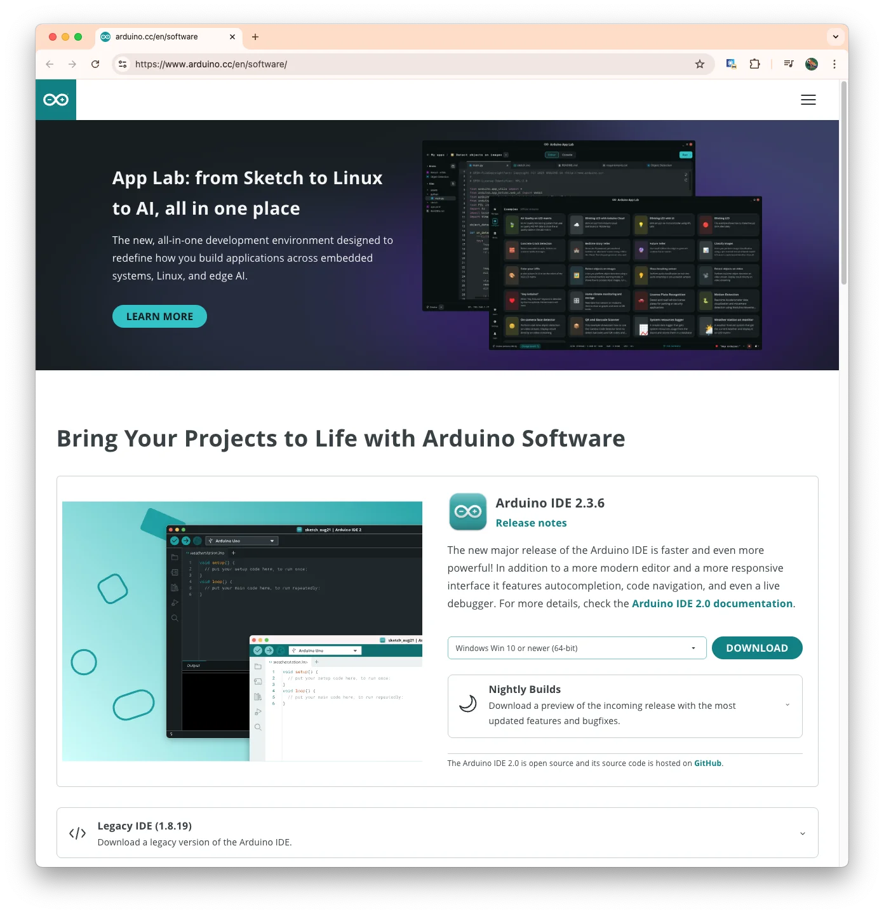

### 1.2 เลือกระบบปฏิบัติการของคุณ

เลือกเวอร์ชันที่เหมาะกับเครื่องคอมพิวเตอร์ของคุณ:
- **Windows** - สำหรับ Windows 10/11
- **macOS** - สำหรับ Mac
- **Linux** - สำหรับระบบ Linux

> 💡 **คำแนะนำ:** แนะนำให้ดาวน์โหลดเวอร์ชัน 2.x ล่าสุด เพราะมี Interface ที่ใช้งานง่ายกว่า

 
### 1.3 กดดาวน์โหลด

- คลิกปุ่ม "DOWNLOAD" หรือ "JUST DOWNLOAD"
- ไม่จำเป็นต้องบริจาค (Donate) ก็สามารถดาวน์โหลดได้ 

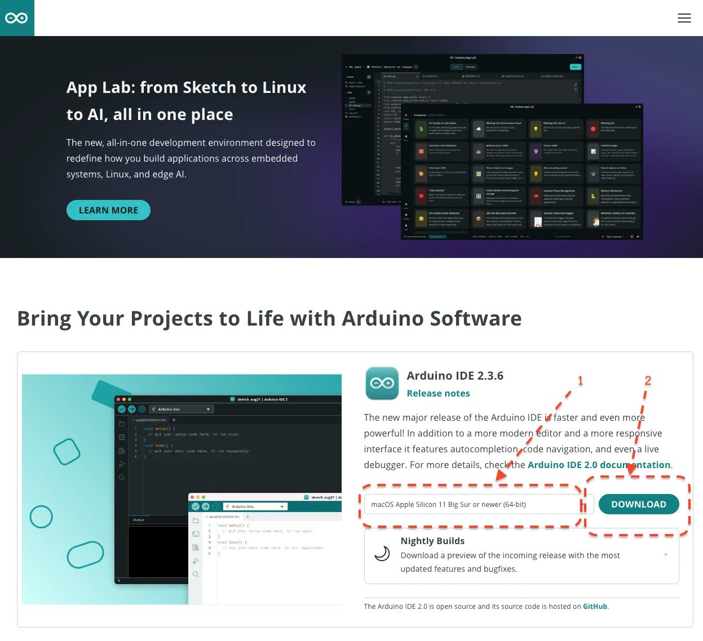

---

## ขั้นตอนที่ 2: ติดตั้ง Arduino IDE

### สำหรับ Windows

1. เปิดไฟล์ `.exe` ที่ดาวน์โหลดมา
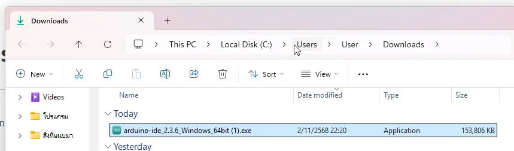

2. คลิก "I Agree" เพื่อยอมรับข้อตกลง
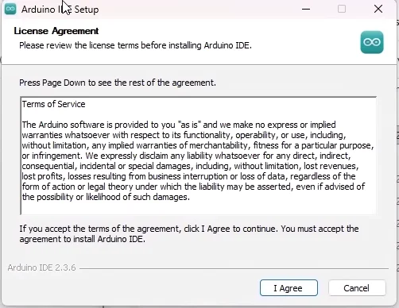
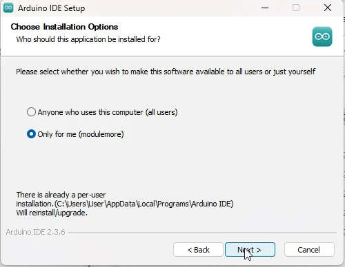

3. เลือก "Install" ทุกตัวเลือก (รวม USB Driver)

4. คลิก "Next" และรอจนการติดตั้งเสร็จสมบูรณ์
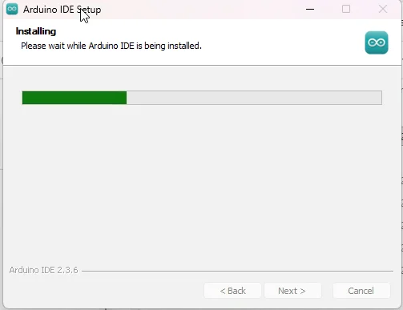

5. คลิก "Close" เมื่อติดตั้งเสร็จ
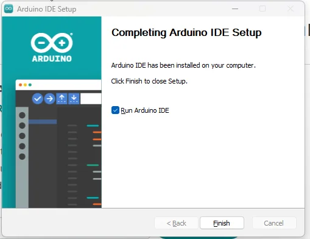 
 
### สำหรับ macOS

1. เปิดไฟล์ `.dmg` ที่ดาวน์โหลดมา
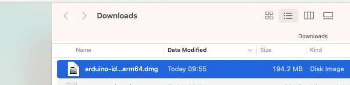 
2. ลากไอคอน Arduino IDE ไปที่โฟลเดอร์ Applications
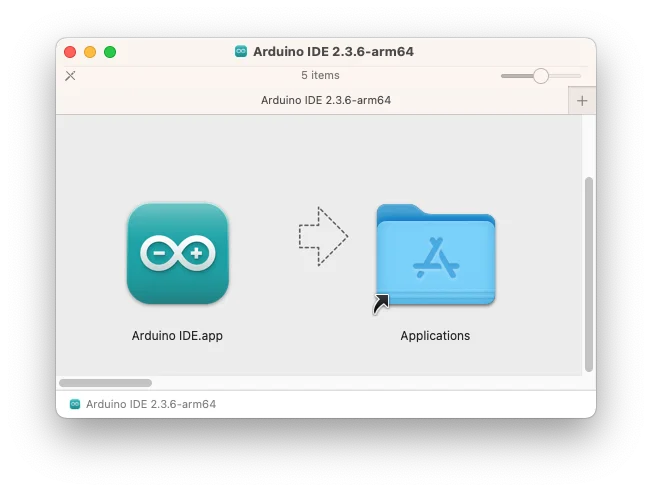
3. เปิด Arduino IDE จาก Applications
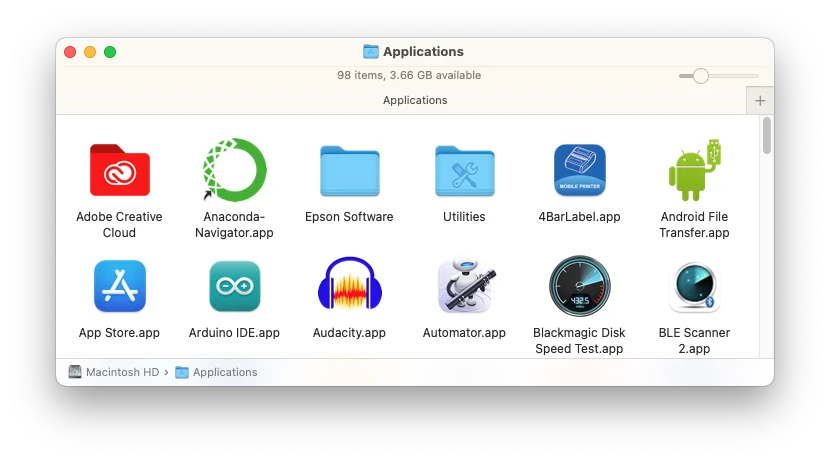   
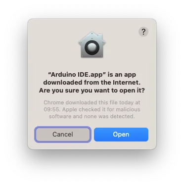
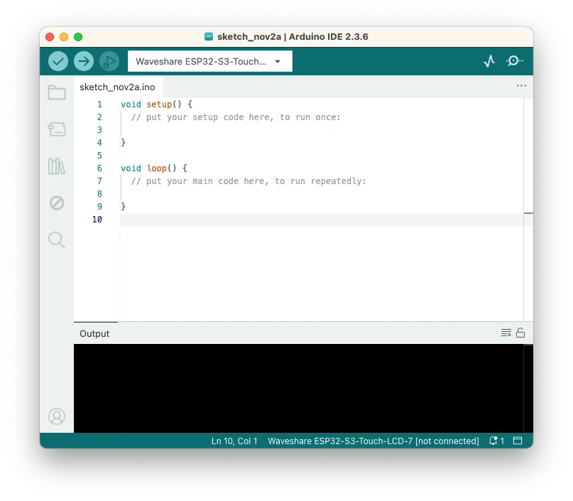

4. ถ้าเจอข้อความเตือน ให้เปิด System Preferences > Security & Privacy แล้วอนุญาต
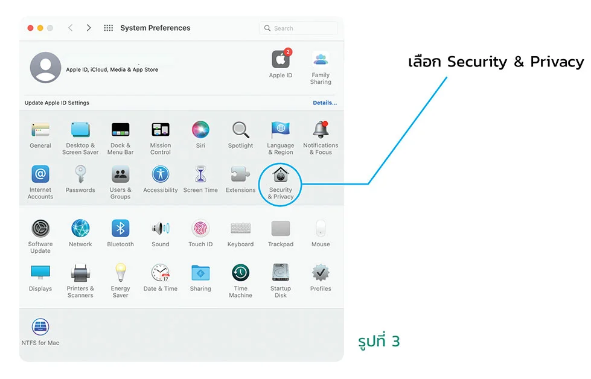
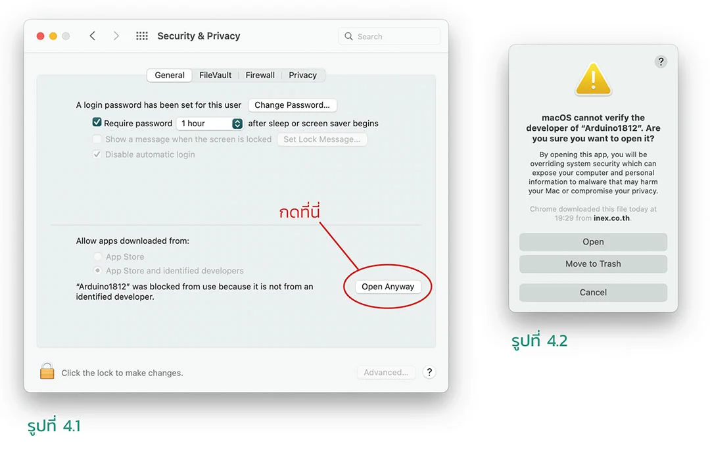

### สำหรับ Linux

```bash
# แตกไฟล์ที่ดาวน์โหลดมา
tar -xf arduino-*.tar.xz

# เข้าไปในโฟลเดอร์
cd arduino-*/

# รันสคริปต์ติดตั้ง
sudo ./install.sh
```

---

## ขั้นตอนที่ 3: รู้จักกับ Arduino IDE

เมื่อเปิด Arduino IDE ขึ้นมาครั้งแรก คุณจะเห็นหน้าจอหลักแบบนี้:
 
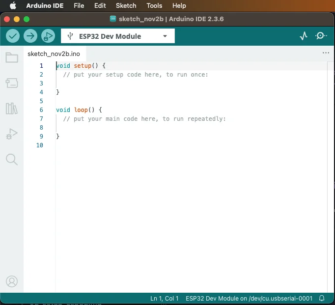

### ส่วนประกอบสำคัญ

```
┌─────────────────────────────────────────┐
│  เมนูบาร์ (File, Edit, Tools...)          │
├─────────────────────────────────────────┤
│  ✓ Verify  →  Upload   [Board Selector] │
├─────────────────────────────────────────┤
│                                         │
│  [พื้นที่เขียนโค้ด]                           │
│                                         │
│  void setup() {                         │
│    // โค้ดตั้งต้น                           │
│  }                                      │
│                                         │
│  void loop() {                          │
│    // โค้ดหลักที่วนซ้ำ                       │
│  }                                      │
│                                         │
├─────────────────────────────────────────┤
│  [Console - แสดงข้อความและข้อผิดพลาด]      │
└─────────────────────────────────────────┘
```

<details markdown="1">
<summary>📖 <b>อธิบายส่วนประกอบแต่ละส่วน</b></summary>

### 1. เมนูบาร์ (Menu Bar)
- **File** - เปิด, บันทึก, หรือสร้างโปรเจคใหม่
- **Edit** - แก้ไข, คัดลอก, ค้นหาโค้ด
- **Sketch** - Compile และ Upload โปรแกรม
- **Tools** - ตั้งค่าบอร์ด, พอร์ต, และเครื่องมืออื่นๆ
- **Help** - คู่มือและเอกสารช่วยเหลือ

### 2. ปุ่มควบคุมหลัก
- **✓ (Verify)** - ตรวจสอบโค้ดว่ามีข้อผิดพลาดหรือไม่
- **→ (Upload)** - อัปโหลดโปรแกรมเข้าบอร์ด
- **Board Selector** - เลือกบอร์ดและพอร์ตที่ใช้งาน

### 3. พื้นที่เขียนโค้ด (Editor)
- พื้นที่สีขาวที่ใช้เขียนโปรแกรม
- มี Syntax Highlighting (แต่ละคำสั่งจะมีสีต่างกัน)
- แสดงเลขบรรทัด (Line Number) ด้านซ้าย

### 4. Console/Output
- แสดงผลการ Compile
- แสดงข้อผิดพลาด (Error)
- แสดงข้อความเตือน (Warning)

</details>

<details markdown="1">
<summary>🔧 <b>ฟังก์ชันพื้นฐานที่ต้องรู้</b></summary>

### `void setup()`
- รันเพียงครั้งเดียวตอนเริ่มโปรแกรม
- ใช้สำหรับตั้งค่าเริ่มต้น เช่น กำหนด pinMode
- เหมือนการเตรียมความพร้อมก่อนเริ่มงานจริง

### `void loop()`
- รันซ้ำไปเรื่อยๆ หลังจาก setup() เสร็จ
- ใส่โค้ดหลักที่ต้องการให้ทำงานอยู่เสมอ
- เหมือนการทำงานที่วนซ้ำไปเรื่อยๆ

**ตัวอย่าง:**
```cpp
void setup() {
  // ทำครั้งเดียวตอนเริ่ม
  pinMode(LED_BUILTIN, OUTPUT);
}

void loop() {
  // ทำซ้ำไปเรื่อยๆ
  digitalWrite(LED_BUILTIN, HIGH);
  delay(1000);
  digitalWrite(LED_BUILTIN, LOW);
  delay(1000);
}
```

</details>

---

## ขั้นตอนที่ 4: ทดสอบว่าติดตั้งสำเร็จ

### 4.1 สร้างโปรเจคใหม่

1. ไปที่ **File** > **New Sketch**
2. จะได้โค้ดพื้นฐานที่มี `setup()` และ `loop()`

### 4.2 ทดลอง Verify

1. คลิกปุ่ม **✓ (Verify)**
2. รอจนแสดงข้อความ "Done compiling"
3. ถ้าไม่มี Error แสดงว่าติดตั้งถูกต้อง


<details markdown="1">
<summary>❗ <b>แก้ปัญหาที่พบบ่อย</b></summary>

### ปัญหา: กดปุ่ม Verify แล้วขึ้น Error
**วิธีแก้:**
- ตรวจสอบว่ามี `{` และ `}` ครบคู่กัน
- ตรวจสอบว่าทุกบรรทัดมี `;` ปิดท้าย (ยกเว้น `{` `}`)
- ดูข้อความ Error ใน Console ด้านล่าง

### ปัญหา: Arduino IDE เปิดไม่ขึ้น
**วิธีแก้:**
- ลองติดตั้งใหม่อีกครั้ง
- ตรวจสอบว่าคอมพิวเตอร์รองรับเวอร์ชันที่ดาวน์โหลด
- ลองดาวน์โหลด Arduino IDE เวอร์ชัน 1.8.x แทน

### ปัญหา: ตัวอักษรแสดงผิดเพี้ยน
**วิธีแก้:**
- ไปที่ **File** > **Preferences**
- เลือก Editor Font ที่รองรับภาษาไทย เช่น "Tahoma" หรือ "Angsana New"

</details>

---

## สรุป

ในบทนี้เราได้:
- ✅ ดาวน์โหลดและติดตั้ง Arduino IDE
- ✅ รู้จักส่วนประกอบหลักของ Arduino IDE
- ✅ เข้าใจฟังก์ชัน `setup()` และ `loop()`
- ✅ ทดสอบว่าโปรแกรมพร้อมใช้งาน

---

## ขั้นตอนถัดไป

ในบทถัดไป เราจะติดตั้ง ESP32 board เข้ากับ Arduino IDE เพื่อให้สามารถเขียนโปรแกรมและอัปโหลดเข้าบอร์ด ESP32 ได้

➡️ [บทถัดไป: Setup ESP32](02-setup-esp32.md)
