# บทที่ 2: ติดตั้ง ESP32 Board

ในบทนี้เราจะติดตั้ง ESP32 เข้ากับ Arduino IDE เพื่อให้สามารถเขียนโปรแกรมและอัปโหลดเข้าบอร์ด ESP32 ได้

## วัตถุประสงค์
- ติดตั้ง ESP32 Board Manager
- เลือกบอร์ด ESP32 ที่ถูกต้อง
- ติดตั้ง USB Driver (ถ้าจำเป็น)
- ตรวจสอบการเชื่อมต่อบอร์ด

---

## ขั้นตอนที่ 1: เตรียม ESP32 Board

### 1.1 รู้จักกับ ESP32

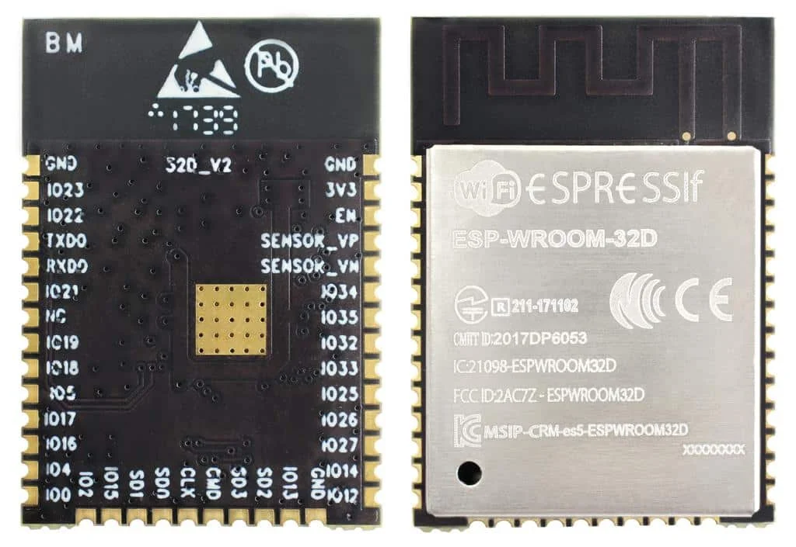
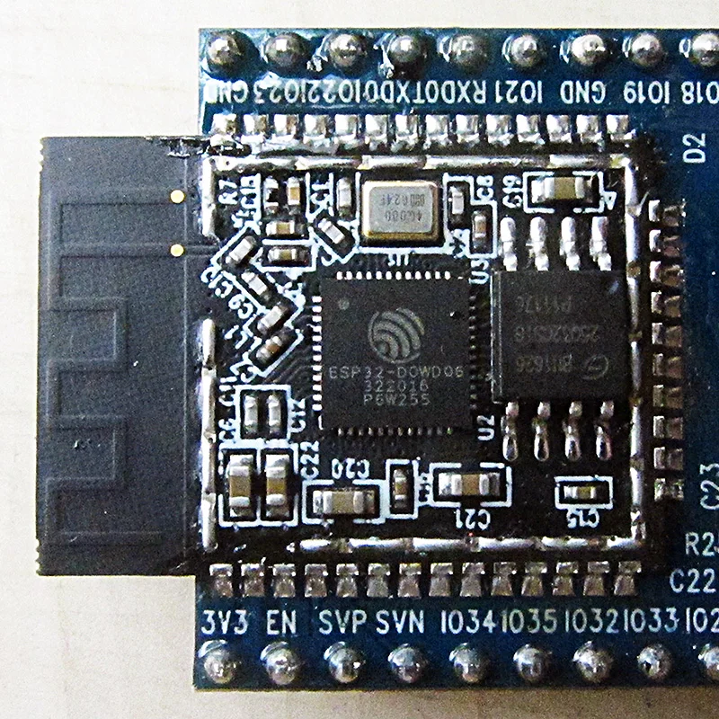

<details>
<summary>📖 <b>ESP32 คืออะไร?</b></summary>

**ESP32** คือไมโครคอนโทรลเลอร์ที่มีความสามารถพิเศษ:
- มี **WiFi** และ **Bluetooth** ในตัว
- ราคาถูก แต่ประสิทธิภาพสูง
- มี GPIO (General Purpose Input/Output) หลายพิน
- รองรับการเขียนโปรแกรมด้วย Arduino IDE

**ส่วนประกอบสำคัญของบอร์ด:**
- **Micro USB Port** - เสียบสาย USB เชื่อมต่อกับคอมพิวเตอร์
- **EN Button** - ปุ่ม Reset บอร์ด
- **BOOT Button** - ปุ่มสำหรับโหลดโปรแกรม
- **LED Builtin** - LED ติดบอร์ดสำหรับทดสอบ
- **GPIO Pins** - ขาสำหรับต่ออุปกรณ์ต่างๆ

</details>

### 1.2 เตรียมสาย USB

เตรียมสาย **Micro USB** หรือ **USB Type-C** (ขึ้นอยู่กับรุ่นบอร์ด)

> ⚠️ **สำคัญ:** ต้องเป็นสายที่รองรับการส่งข้อมูล (Data Cable) ไม่ใช่สายชาร์จอย่างเดียว
 
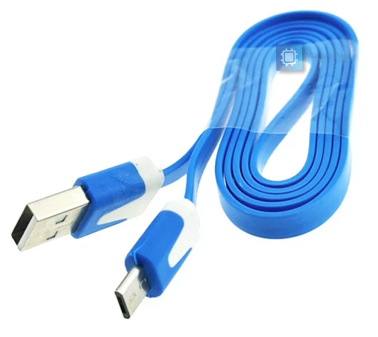
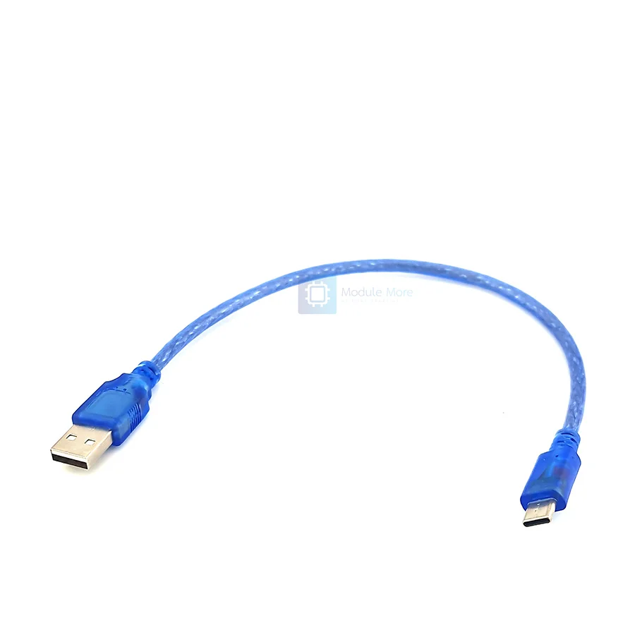

---

## ขั้นตอนที่ 2: เพิ่ม ESP32 Board Manager URL

### 2.1 เปิด Preferences

1. เปิด Arduino IDE
2. ไปที่เมนู:
   - **Windows/Linux:** File > Preferences
   - **macOS:** Arduino IDE > Settings

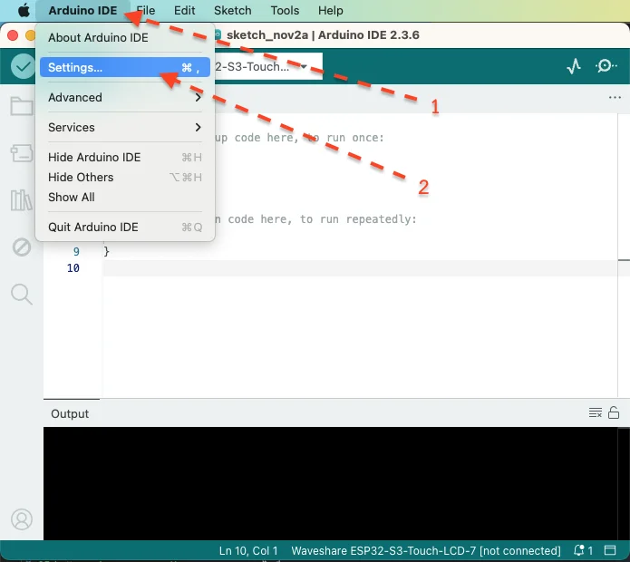

### 2.2 เพิ่ม Board Manager URL

1. หาช่อง **"Additional boards manager URLs:"**
2. คัดลอก URL นี้:

```
https://raw.githubusercontent.com/espressif/arduino-esp32/gh-pages/package_esp32_index.json
```

3. วางใน URL ในช่อง (ถ้ามี URL อยู่แล้ว ให้เพิ่มโดยกด icon ด้านข้างช่องแล้วขึ้นบรรทัดใหม่)

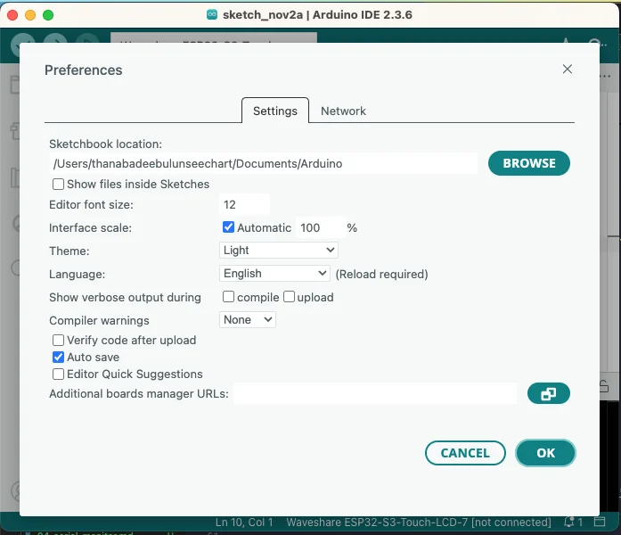

4. กด **OK**

<details>
<summary>🤔 <b>Board Manager URL คืออะไร?</b></summary>

**Board Manager URL** คือที่อยู่ที่บอก Arduino IDE ว่าจะดาวน์โหลดไฟล์สำหรับบอร์ด ESP32 จากที่ไหน

เหมือนการบอกที่อยู่ร้านค้าที่ขายอะไหล่สำหรับรถยี่ห้อนั้นๆ เมื่อ Arduino IDE รู้ที่อยู่แล้ว มันจะสามารถดาวน์โหลดและติดตั้งไฟล์ที่จำเป็นได้

</details>

---

## ขั้นตอนที่ 3: ติดตั้ง ESP32 Board

### 3.1 เปิด Board Manager

1. ไปที่เมนู **Tools** > **Board** > **Boards Manager...**
2. หรือคลิกไอคอนด้านซ้ายมือ (Arduino IDE 2.x)

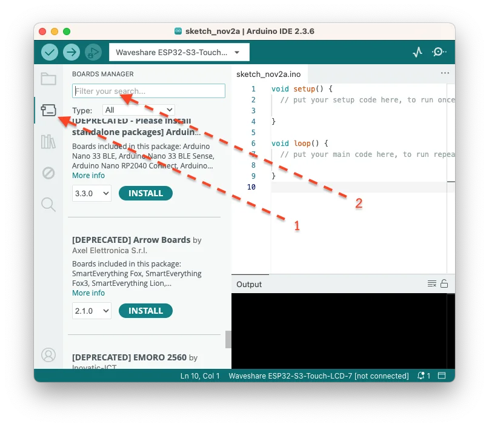

### 3.2 ค้นหาและติดตั้ง ESP32

1. พิมพ์ **"esp32"** ในช่องค้นหา
2. หา **"esp32 by Espressif Systems"**
3. คลิก **Install** (เลือกเวอร์ชันล่าสุด)
4. รอจนดาวน์โหลดและติดตั้งเสร็จ (อาจใช้เวลา 3-5 นาที)

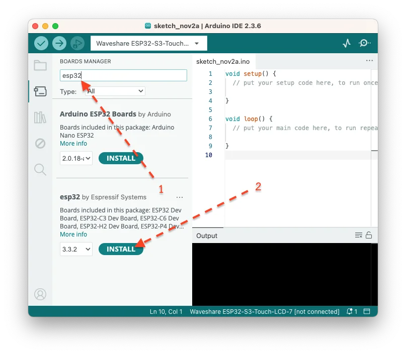

> 💡 **หมายเหตุ:** การติดตั้งต้องใช้ Internet และอาจใช้เวลาพอสมควร

### 3.3 ตรวจสอบการติดตั้ง

เมื่อติดตั้งเสร็จจะแสดงคำว่า **"INSTALLED"** และมีปุ่ม Remove/Update

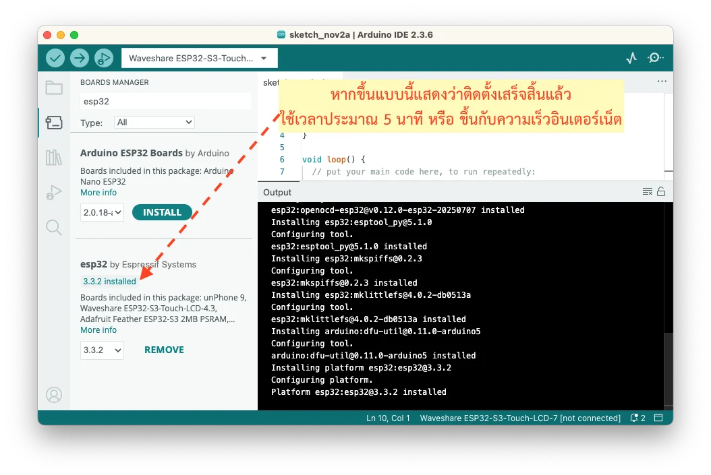

---

## ขั้นตอนที่ 4: เลือก ESP32 Board

### 4.1 เชื่อมต่อบอร์ดกับคอมพิวเตอร์

1. เสียบสาย USB เข้ากับบอร์ด ESP32
2. เสียบอีกด้านเข้ากับคอมพิวเตอร์
3. ดู LED บนบอร์ดควรติด (อาจกระพริบ)

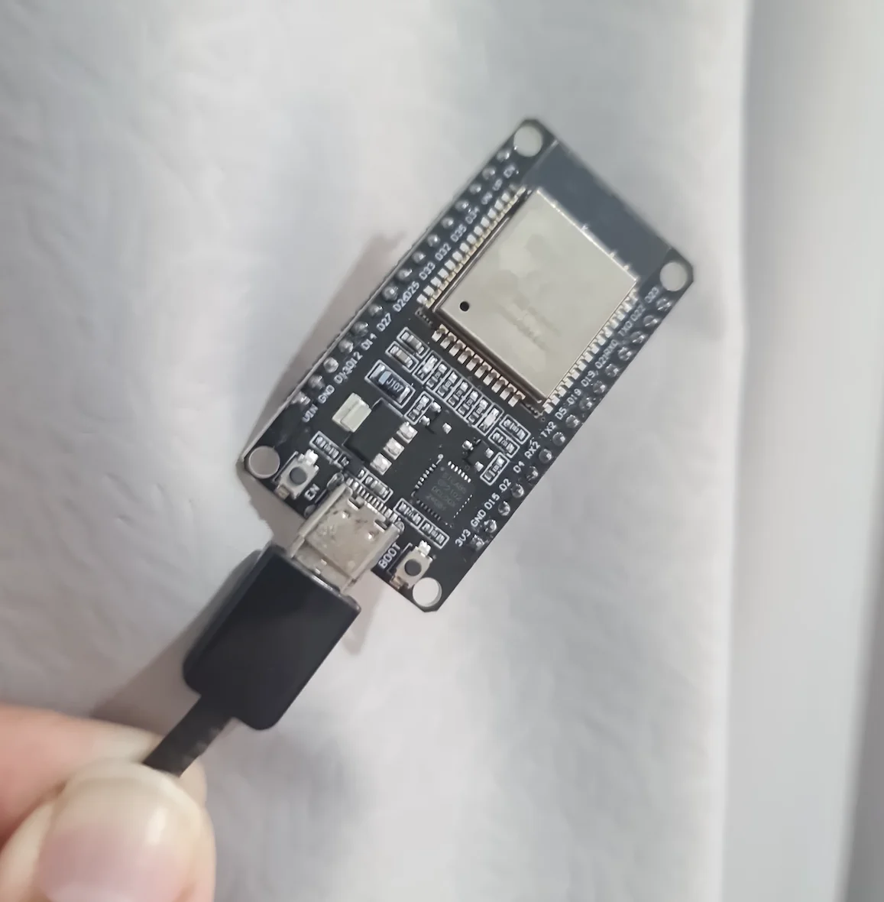

### 4.2 เลือกบอร์ด

1. ไปที่ **Tools** > **Board** > **esp32**
2. เลือกบอร์ดที่ตรงกับที่คุณใช้:
   - **ESP32 Dev Module** (บอร์ดทั่วไป)
   - **ESP32-WROOM-DA Module**
   - **DOIT ESP32 DEVKIT V1**
   - หรือรุ่นอื่นตามที่มี

> 💡 **ไม่แน่ใจ?** ถ้าไม่รู้ว่าบอร์ดเป็นรุ่นไหน ให้เลือก **"ESP32 Dev Module"** (ใช้ได้กับส่วนใหญ่)

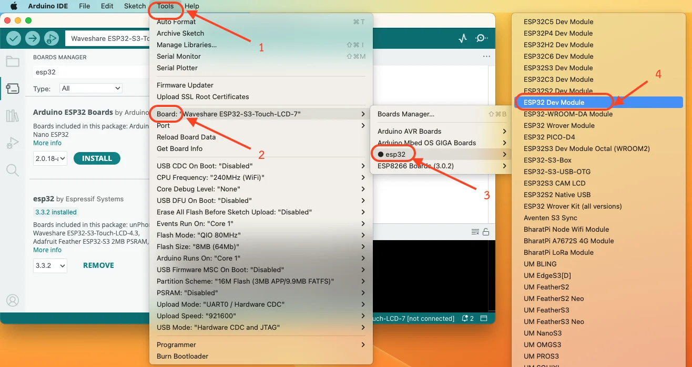

### 4.3 เลือก Port

1. ไปที่ **Tools** > **Port**
2. เลือก Port ที่ปรากฏ:
   - **Windows:** COM3, COM4, ... (ตัวเลขอาจต่างกัน)
   - **macOS:** /dev/cu.usbserial-xxxxx
   - **Linux:** /dev/ttyUSB0 หรือ /dev/ttyACM0

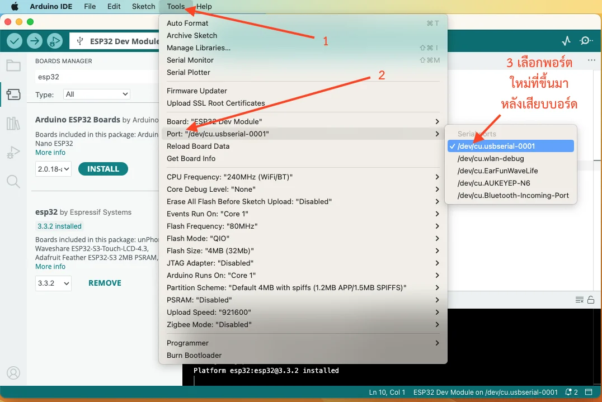

<details>
<summary>❗ <b>ไม่เจอ Port?</b></summary>

ถ้าไม่เห็น Port ปรากฏ แสดงว่าต้องติดตั้ง USB Driver:

### สำหรับ Windows:

**1. ตรวจสอบชิป USB-to-Serial บนบอร์ด:**
- **CP2102** → [ดาวน์โหลด CP210x Driver](https://www.silabs.com/developers/usb-to-uart-bridge-vcp-drivers)
- **CH340** → [ดาวน์โหลด CH340 Driver](https://sparks.gogo.co.nz/ch340.html)

**2. ติดตั้ง Driver:**
1. ดาวน์โหลดไฟล์ตามชิปที่ใช้
2. แตกไฟล์และรัน Setup/Installer
3. ถอดสาย USB และเสียบใหม่
4. เช็ค Port อีกครั้งใน Arduino IDE

### สำหรับ macOS:

```bash
# ติดตั้ง Homebrew (ถ้ายังไม่มี)
/bin/bash -c "$(curl -fsSL https://raw.githubusercontent.com/Homebrew/install/HEAD/install.sh)"

# ติดตั้ง Driver
brew tap mengbo/ch340g-ch34g-ch34x-mac-os-x-driver https://github.com/mengbo/ch340g-ch34g-ch34x-mac-os-x-driver
brew cask install wch-ch34x-usb-serial-driver
```

### สำหรับ Linux:

```bash
# เพิ่ม User เข้า dialout group
sudo usermod -a -G dialout $USER

# Logout และ Login ใหม่
# หรือ reboot เครื่อง
```

</details>

---

## ขั้นตอนที่ 5: ทดสอบการเชื่อมต่อ

### 5.1 สร้างโปรแกรมทดสอบ

เราจะสร้างโปรแกรมทดสอบแบบง่ายที่ส่งข้อความผ่าน Serial Monitor แทนการใช้ LED (เพราะบอร์ด ESP32 บางรุ่นอาจไม่มี LED ในตัว)

1. เปิด Arduino IDE
2. สร้างโปรเจคใหม่ (**File** > **New Sketch**)
3. พิมพ์โค้ดนี้:

```cpp
void setup() {
  Serial.begin(115200);
  delay(1000);
  
  Serial.println("=================================");
  Serial.println("   ESP32 Connection Test");
  Serial.println("=================================");
  Serial.println();
  Serial.println("✓ ESP32 is working!");
  Serial.println("✓ Upload successful!");
  Serial.println();
  Serial.print("Chip Model: ");
  Serial.println(ESP.getChipModel());
  Serial.print("Chip Revision: ");
  Serial.println(ESP.getChipRevision());
  Serial.print("CPU Frequency: ");
  Serial.print(ESP.getCpuFreqMHz());
  Serial.println(" MHz");
  Serial.print("Flash Size: ");
  Serial.print(ESP.getFlashChipSize() / (1024 * 1024));
  Serial.println(" MB");
  Serial.println();
  Serial.println("Starting counter...");
}

void loop() {
  static int counter = 0;
  counter++;
  
  Serial.print("Count: ");
  Serial.print(counter);
  Serial.print(" | Uptime: ");
  Serial.print(millis() / 1000);
  Serial.println(" seconds");
  
  delay(1000);
}
```

<details>
<summary>📖 <b>โค้ดนี้ทำอะไร?</b></summary>

### ส่วน setup()

```cpp
Serial.begin(115200);
```
- เริ่มต้นการสื่อสารผ่าน Serial ที่ความเร็ว 115200 baud
- ใช้สำหรับส่งข้อความไปแสดงบนคอมพิวเตอร์

```cpp
Serial.println("=================================");
```
- พิมพ์ข้อความและขึ้นบรรทัดใหม่

```cpp
ESP.getChipModel()
ESP.getChipRevision()
ESP.getCpuFreqMHz()
ESP.getFlashChipSize()
```
- ฟังก์ชันพิเศษของ ESP32 สำหรับอ่านข้อมูลของชิป
- แสดงรุ่นชิป, เวอร์ชัน, ความเร็ว CPU, และขนาด Flash

### ส่วน loop()

```cpp
static int counter = 0;
counter++;
```
- `static` = ตัวแปรจะเก็บค่าไว้แม้ออกจากฟังก์ชัน
- เพิ่มค่า counter ทุกครั้งที่วนลูป

```cpp
millis() / 1000
```
- `millis()` = เวลาที่ผ่านไปนับจากตอนเริ่มโปรแกรม (มิลลิวินาที)
- หาร 1000 = แปลงเป็นวินาที

**ผลลัพธ์:** โปรแกรมจะแสดงข้อมูล ESP32 และนับเลขทุกๆ 1 วินาที

</details>

### 5.2 Upload โปรแกรม

1. กดปุ่ม **✓ (Verify)** เพื่อตรวจสอบโค้ด
2. ถ้าไม่มี Error ให้กดปุ่ม **→ (Upload)**
3. รอจนขึ้นข้อความ "Connecting..."

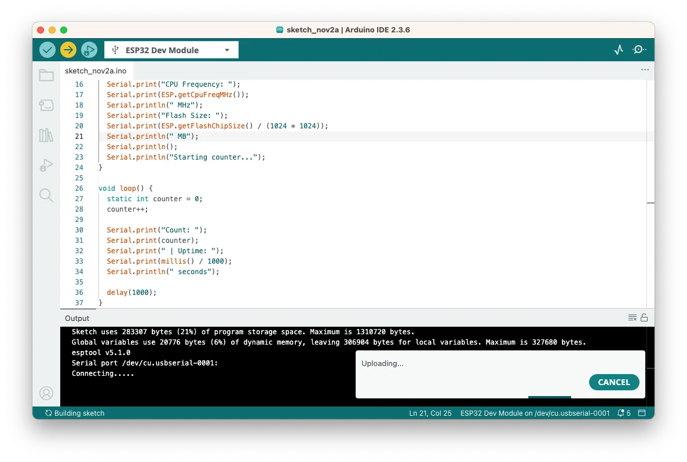 
 
> 💡 **ถ้าค้างที่ "Connecting..."** ให้กดปุ่ม **BOOT** บนบอร์ดค้างไว้จนเริ่ม Upload

4. รอจนแสดงข้อความ **"Hard resetting via RTS pin..."** หรือ **"Done uploading"**

 

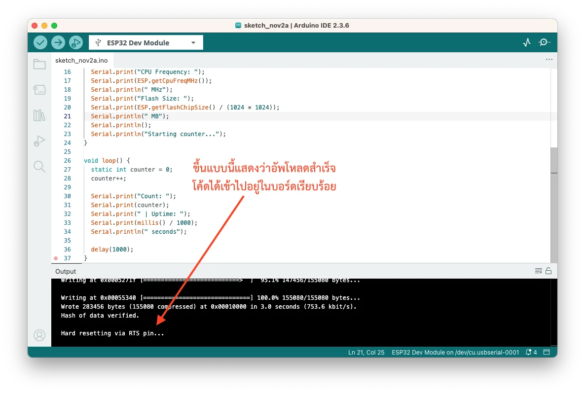

### 5.3 เปิด Serial Monitor เพื่อดูผลลัพธ์

1. คลิกปุ่ม 🔍 **Serial Monitor** มุมขวาบน (หรือกด **Ctrl+Shift+M**)
2. ตั้ง Baud Rate เป็น **115200**
3. จะเห็นข้อความแบบนี้:

```
=================================
   ESP32 Connection Test
=================================

✓ ESP32 is working!
✓ Upload successful!

Chip Model: ESP32-D0WDQ6
Chip Revision: 1
CPU Frequency: 240 MHz
Flash Size: 4 MB

Starting counter...
Count: 1 | Uptime: 1 seconds
Count: 2 | Uptime: 2 seconds
Count: 3 | Uptime: 3 seconds
Count: 4 | Uptime: 4 seconds
...
``` 
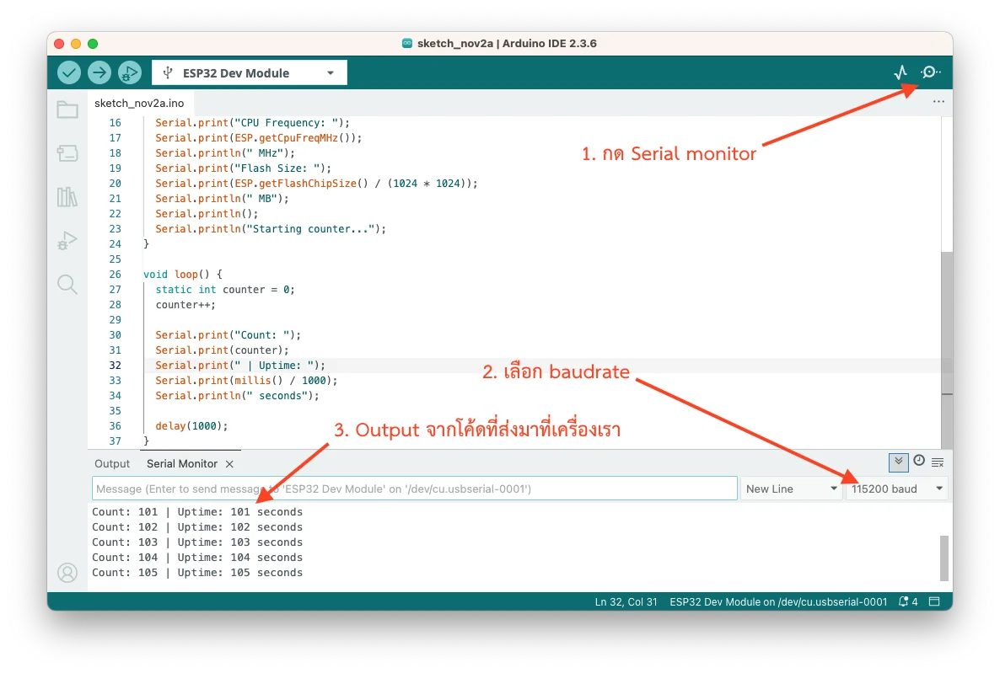

✅ **สำเร็จ!** ESP32 ของคุณพร้อมใช้งานแล้ว

<details>
<summary>❗ <b>แก้ปัญหาการ Upload</b></summary>

### ปัญหา: Upload ไม่สำเร็จ - ค้างที่ "Connecting..."

**วิธีแก้:**
1. กดปุ่ม **BOOT** บนบอร์ดค้างไว้
2. คลิก Upload ใน Arduino IDE
3. เมื่อเห็นข้อความ "Connecting..." ปล่อยปุ่ม BOOT

### ปัญหา: Error "Failed to connect to ESP32"

**วิธีแก้:**
- ตรวจสอบว่าสาย USB เสียบแน่น
- ลองเปลี่ยนสาย USB
- ตรวจสอบว่าเลือก Port ถูกต้อง
- ลอง Reset บอร์ดด้วยการกดปุ่ม EN

### ปัญหา: Error "A fatal error occurred: Failed to write to target RAM"

**วิธีแก้:**
1. ไปที่ **Tools** > **Upload Speed**
2. เปลี่ยนเป็น **115200** (ช้าลง แต่เสถียรกว่า)
3. Upload ใหม่
 

</details>

---

## สรุป

ในบทนี้เราได้:
- ✅ ติดตั้ง ESP32 Board Manager
- ✅ เลือกบอร์ดและ Port ที่ถูกต้อง
- ✅ Upload โปรแกรมเข้าบอร์ด ESP32
- ✅ ทดสอบให้ LED กระพริบสำเร็จ

---

## ขั้นตอนถัดไป

ตอนนี้คุณพร้อมที่จะเริ่มเขียนโปรแกรมแรกของคุณเอง!

➡️ [บทถัดไป: First Program](03-first-program.md)
