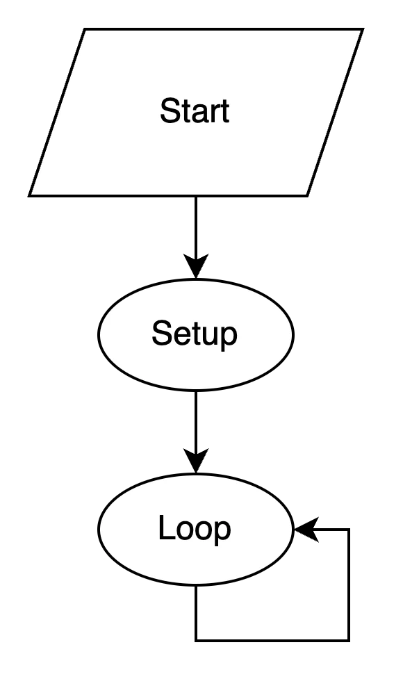
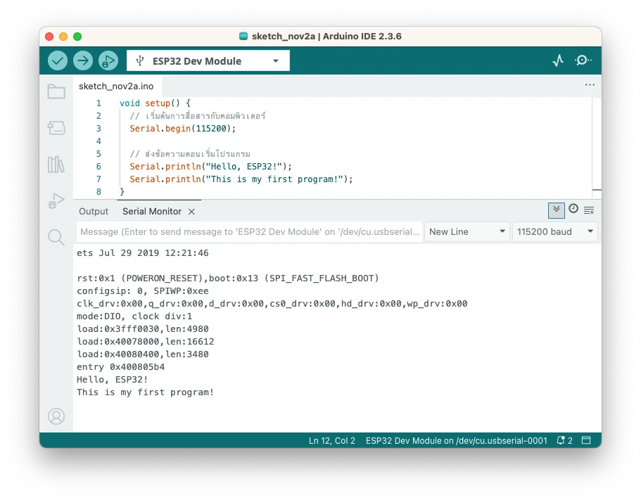
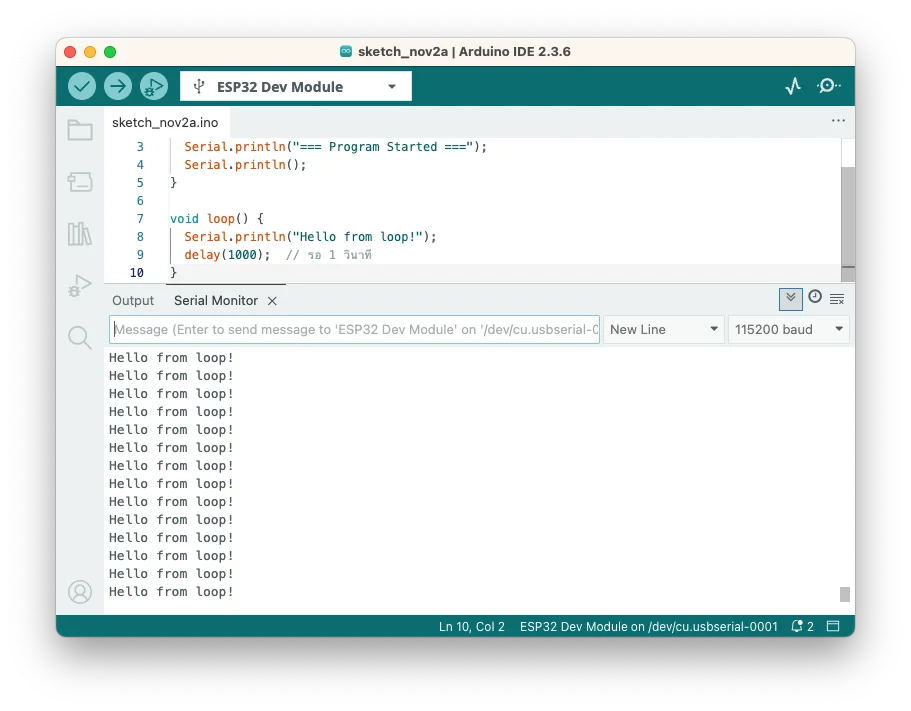
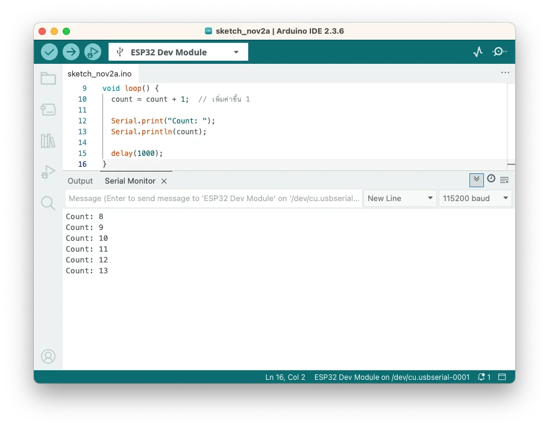

# บทที่ 3: โปรแกรมแรก - ทำความเข้าใจโครงสร้างโค้ด

ในบทนี้เราจะเขียนโปรแกรมแรกของเราเอง และทำความเข้าใจโครงสร้างพื้นฐานของโปรแกรม Arduino

## วัตถุประสงค์
- เข้าใจโครงสร้างโปรแกรม Arduino
- รู้จักกับฟังก์ชันพื้นฐาน
- เขียนและทดสอบโปรแกรมเอง
- เรียนรู้การแก้ไขโค้ดเพื่อปรับพฤติกรรม

---

## โครงสร้างโปรแกรม Arduino

โปรแกรม Arduino ทุกตัวประกอบด้วย 2 ส่วนหลัก:

```cpp
void setup() {
  // ส่วนที่ 1: รันครั้งเดียวตอนเริ่ม
}

void loop() {
  // ส่วนที่ 2: รันซ้ำไปเรื่อยๆ
}
```


 


<details markdown="1">
<summary>📖 <b>ทำไมต้องแยกเป็น setup() และ loop()?</b></summary>

### `void setup()`

คิดว่าเป็น**การเตรียมตัวก่อนทำงาน**

ตัวอย่างในชีวิตจริง:

- ก่อนทำอาหาร → เตรียมเครื่องครัว, ล้างมือ
- ก่อนขับรถ → ปรับกระจก, คาดเข็มขัด
- ก่อนใช้ ESP32 → กำหนด pinMode, เชื่อมต่อ WiFi

**ทำแค่ครั้งเดียว** พอ

### `void loop()`

คิดว่าเป็น**งานประจำที่ต้องทำซ้ำ**

ตัวอย่างในชีวิตจริง:

- พนักงานรักษาความปลอดภัย → ตรวจเฝ้าซ้ำๆ ทุกรอบ
- ใบพัดลม → หมุนซ้ำๆ เรื่อยๆ
- ESP32 → อ่านเซ็นเซอร์, ควบคุมอุปกรณ์, ส่งข้อมูล

**ทำซ้ำไปเรื่อยๆ** ไม่มีวันหยุด

### ทำไมต้องแยก?

ถ้าเราใส่ทุกอย่างใน `loop()`:

- ต้องตั้งค่าซ้ำทุกรอบ (เสียเวลา)
- โค้ดยุ่งเหยิง

แยกออกมาจะ:

- โค้ดอ่านง่าย เข้าใจง่าย
- ทำงานเร็วขึ้น (setup แค่ครั้งเดียว)

</details>

---

## ขั้นตอนที่ 1: โปรแกรมแรก - Hello World

### 1.1 สร้างโปรเจคใหม่

1. เปิด Arduino IDE
2. **File** > **New Sketch**
3. บันทึกโปรเจค: **File** > **Save**
4. ตั้งชื่อ `FirstProgram`

### 1.2 เขียนโค้ดพื้นฐาน

ลบโค้ดเดิมทิ้งแล้วพิมพ์ใหม่:

```arduino
void setup() {
  // เริ่มต้นการสื่อสารกับคอมพิวเตอร์
  Serial.begin(115200);
  
  // ส่งข้อความตอนเริ่มโปรแกรม
  Serial.println("Hello, ESP32!");
  Serial.println("This is my first program!");
}

void loop() {
  // ไม่ต้องทำอะไรตอนนี้
}
```

<details markdown="1">
<summary>📖 <b>อธิบายโค้ดทีละบรรทัด</b></summary>

```cpp
void setup() {
```
- `void` = ฟังก์ชันนี้ไม่ return ค่าอะไรกลับมา
- `setup` = ชื่อฟังก์ชัน (ต้องใช้ชื่อนี้)
- `()` = ไม่มี parameter
- `{` = เริ่มต้นส่วนของ code ใน function

```cpp
  Serial.begin(115200);
```
- `Serial` = ออบเจ็กต์สำหรับสื่อสารกับคอมพิวเตอร์
- `.begin()` = เริ่มต้นการสื่อสาร
- `115200` = ความเร็วในการส่งข้อมูล (baud rate)
- `;` = จบคำสั่ง (ต้องมีทุกบรรทัดคำสั่ง)

```cpp
  Serial.println("Hello, ESP32!");
```
- `.println()` = พิมพ์ข้อความและขึ้นบรรทัดใหม่
- `"Hello, ESP32!"` = ข้อความที่ต้องการแสดง (ต้องอยู่ใน `"..."`)

```cpp
void loop() {
```
- ฟังก์ชันที่จะรันซ้ำไปเรื่อยๆ
- ตอนนี้ไม่ใส่อะไร (ว่างเปล่า)

```cpp
}
```
- ปิด function (ต้องมี `}` คู่กับ `{` เสมอ)

</details>

### 1.3 Upload และทดสอบ

1. เลือกบอร์ดและ Port ให้ถูกต้อง
2. กดปุ่ม **✓ Verify** ตรวจสอบโค้ด
3. กดปุ่ม **→ Upload**
4. รอจน Upload เสร็จ

---

## ขั้นตอนที่ 2: ดูผลลัพธ์ใน Serial Monitor

### 2.1 เปิด Serial Monitor

**วิธีที่ 1:** คลิกปุ่ม 🔍 (Serial Monitor) มุมขวาบน

**วิธีที่ 2:** **Tools** > **Serial Monitor**

**วิธีที่ 3:** กด **Ctrl+Shift+M** (Windows/Linux) หรือ **Cmd+Shift+M** (Mac)

### 2.2 ตั้งค่า Baud Rate

ตรวจสอบว่า Baud Rate ตรงกับในโค้ด (**115200**)

### 2.3 ดูข้อความที่แสดง


  
คุณจะเห็นข้อความ:
```
Hello, ESP32!
This is my first program!
``` 

✅ **สำเร็จ!** คุณได้เขียนโปรแกรมแรกแล้ว

<details markdown="1">
<summary>📖 <b>Serial Monitor คืออะไร?</b></summary>

**Serial Monitor** คือหน้าต่างที่ใช้สำหรับ:
- แสดงข้อความจาก ESP32 → คอมพิวเตอร์
- ส่งข้อความจากคอมพิวเตอร์ → ESP32
- Debug และตรวจสอบการทำงานของโปรแกรม

**เปรียบเทียบ:**
- เหมือน Console ใน Python (`print()`)
- เหมือน `printf()` ใน C
- เหมือน `console.log()` ใน JavaScript

**การใช้งานจริง:**
- ดูค่าจากเซ็นเซอร์
- ตรวจสอบการเชื่อมต่อ WiFi
- Debug หาจุดที่โปรแกรมผิดพลาด

</details>

<details markdown="1">
<summary>❗ <b>ไม่เห็นข้อความใน Serial Monitor?</b></summary>

### ปัญหา: Serial Monitor ว่างเปล่า

**วิธีแก้:**
1. ตรวจสอบว่า Baud Rate ตรงกับในโค้ด (115200)
2. กดปุ่ม **EN** (Reset) บนบอร์ด
3. ปิดและเปิด Serial Monitor ใหม่
4. ตรวจสอบว่าเลือก Port ถูกต้อง

### ปัญหา: แสดงตัวอักษรแปลกๆ

**วิธีแก้:**
- Baud Rate ไม่ตรงกัน → เปลี่ยนให้ตรงกับในโค้ด
- ตัวอย่าง: โค้ดใช้ 115200 แต่ Serial Monitor ตั้งเป็น 9600

### ปัญหา: Serial Monitor เปิดไม่ได้

**วิธีแก้:**
- Port ถูกใช้งานอยู่ → ปิด Serial Monitor แล้วเปิดใหม่
- ถอดสาย USB แล้วเสียบใหม่

</details>

---

## ขั้นตอนที่ 3: เพิ่มความสามารถให้โปรแกรม

### 3.1 แสดงข้อความซ้ำใน loop()

แก้ไขโค้ดเป็น:

```cpp
void setup() {
  Serial.begin(115200);
  Serial.println("=== Program Started ===");
  Serial.println();
}

void loop() {
  Serial.println("Hello from loop!");
  delay(1000);  // รอ 1 วินาที
}
```

**Upload แล้วดู Serial Monitor**

จะเห็นข้อความ "Hello from loop!" แสดงทุกๆ 1 วินาที


 
<details markdown="1">
<summary>📖 <b>ทำไมข้อความถึงแสดงซ้ำไปเรื่อยๆ?</b></summary>

เพราะโค้ดใน `loop()` จะทำงาน**วนซ้ำไม่หยุด**:

```
เริ่มโปรแกรม
  ↓
setup() [รันครั้งเดียว]
  ↓
loop() [แสดง "Hello from loop!"]
  ↓
รอ 1 วินาที
  ↓
loop() [แสดง "Hello from loop!" อีกครั้ง]
  ↓
รอ 1 วินาที
  ↓
loop() [วนซ้ำไปเรื่อยๆ...]
```

ถ้าไม่มี `delay(1000)`:
- ข้อความจะแสดงเร็วมาก (หลายพันครั้งต่อวินาที)
- Serial Monitor จะล้นข้อความ

</details>

### 3.2 นับเลขเพิ่มขึ้น

แก้ไขโค้ดเป็น:

```cpp
int count = 0;  // ตัวแปรเก็บจำนวนครั้ง

void setup() {
  Serial.begin(115200);
  Serial.println("=== Counter Program ===");
  Serial.println();
}

void loop() {
  count = count + 1;  // เพิ่มค่าขึ้น 1
  
  Serial.print("Count: ");
  Serial.println(count);
  
  delay(1000);
}
```

**Upload แล้วดู Serial Monitor**

จะเห็น:
```
=== Counter Program ===

Count: 1
Count: 2
Count: 3
Count: 4
...
```



<details markdown="1">
<summary>📖 <b>ตัวแปรและการนับเลข</b></summary>

### การประกาศตัวแปร

```cpp
int count = 0;
```
- `int` = ประเภทข้อมูลตัวเลขจำนวนเต็ม (integer)
- `count` = ชื่อตัวแปร (ตั้งเองได้)
- `= 0` = กำหนดค่าเริ่มต้นเป็น 0

### การเพิ่มค่า

```cpp
count = count + 1;
```
- อ่านว่า: "นำค่า count ปัจจุบัน มาบวก 1 แล้วเก็บกลับเข้าไปใน count"
- เหมือน `count += 1` หรือ `count++`

**ตัวอย่าง:**
- รอบที่ 1: count = 0 → count = 0 + 1 = 1
- รอบที่ 2: count = 1 → count = 1 + 1 = 2
- รอบที่ 3: count = 2 → count = 2 + 1 = 3

### Serial.print() vs Serial.println()

```cpp
Serial.print("Count: ");    // พิมพ์แต่ไม่ขึ้นบรรทัดใหม่
Serial.println(count);       // พิมพ์และขึ้นบรรทัดใหม่
```

ผลลัพธ์: `Count: 1` (อยู่บรรทัดเดียวกัน)

</details>

---

## ขั้นตอนที่ 4: เรียนรู้ประเภทข้อมูลและตัวแปร

### ประเภทข้อมูลที่ใช้บ่อย

```cpp
// ตัวเลขจำนวนเต็ม
int myNumber = 10;           // -32,768 ถึง 32,767
long bigNumber = 1000000;    // ตัวเลขใหญ่กว่า

// ตัวเลขทศนิยม
float temperature = 25.5;    // มีทศนิยม 6-7 หลัก
double precise = 3.14159265; // มีทศนิยมมากกว่า float

// ข้อความ
String message = "Hello";    // ข้อความ
char letter = 'A';           // อักษรตัวเดียว

// Boolean (จริง/เท็จ)
bool isOn = true;            // true หรือ false
```

<details markdown="1">
<summary>📖 <b>เลือกใช้ตัวแปรอย่างไร?</b></summary>

### การเก็บอุณหภูมิ
```cpp
float temp = 25.5;  // ใช้ float เพราะมีทศนิยม
```

### การนับจำนวน
```cpp
int count = 0;      // ใช้ int เพราะเป็นเลขจำนวนเต็ม
```

### การเก็บสถานะเปิด-ปิด
```cpp
bool ledState = false;  // ใช้ bool เพราะมีแค่ 2 สถานะ
```

### การเก็บข้อความ
```cpp
String name = "ESP32";  // ใช้ String เพราะเป็นข้อความ
```

### เคล็ดลับ:
- ใช้ประเภทที่เล็กที่สุดที่พอใช้งาน → ประหยัด Memory
- ถ้าไม่แน่ใจ ใช้ `int` สำหรับตัวเลข, `String` สำหรับข้อความ

</details>

### ตัวอย่างโปรแกรม: แสดงข้อมูลหลายประเภท

```cpp
int counter = 0;
float voltage = 3.3;
String deviceName = "ESP32";
bool isActive = true;

void setup() {
  Serial.begin(115200);
  Serial.println("=== Device Information ===");
}

void loop() {
  counter++;
  
  Serial.println("--- Status Update ---");
  Serial.print("Device: ");
  Serial.println(deviceName);
  Serial.print("Counter: ");
  Serial.println(counter);
  Serial.print("Voltage: ");
  Serial.print(voltage);
  Serial.println(" V");
  Serial.print("Active: ");
  Serial.println(isActive ? "Yes" : "No");
  Serial.println();
  
  delay(2000);
}
```

**ผลลัพธ์:**
```
=== Device Information ===
--- Status Update ---
Device: ESP32
Counter: 1
Voltage: 3.3 V
Active: Yes

--- Status Update ---
Device: ESP32
Counter: 2
Voltage: 3.3 V
Active: Yes
```

<details markdown="1">
<summary>🤔 <b>โค้ดบรรทัดนี้คืออะไร?</b></summary>

```cpp
Serial.println(isActive ? "Yes" : "No");
```

นี่คือ **Ternary Operator** (เงื่อนไขแบบสั้น)

**รูปแบบ:**
```cpp
condition ? valueIfTrue : valueIfFalse
```

**เทียบกับ if-else:**
```cpp
// แบบ Ternary (สั้น)
Serial.println(isActive ? "Yes" : "No");

// แบบ if-else (ยาว)
if (isActive) {
  Serial.println("Yes");
} else {
  Serial.println("No");
}
```

ทำงานเหมือนกัน แต่ Ternary สั้นกว่า เหมาะกับกรณีง่ายๆ

</details>

---

## สรุป

ในบทนี้เราได้เรียนรู้:
- ✅ โครงสร้างโปรแกรม Arduino (`setup()` และ `loop()`)
- ✅ การใช้ Serial Monitor แสดงข้อความ
- ✅ ประเภทข้อมูลและตัวแปร
- ✅ การนับเลขและแสดงผล

---

## แบบฝึกหัด

ลองแก้ไขโปรแกรมให้:
1. นับเลขถอยหลังจาก 10 ลงมา 0
2. แสดงข้อความ "Hello" และ "World" สลับกันทุก 1 วินาที
3. สร้างตัวแปรเก็บชื่อของคุณและแสดงทุก 2 วินาที

<details markdown="1">
<summary>💡 <b>ดูเฉลย</b></summary>

### แบบฝึกหัดที่ 1: นับถอยหลัง

```cpp
int count = 10;

void setup() {
  Serial.begin(115200);
}

void loop() {
  Serial.println(count);
  count = count - 1;
  
  if (count < 0) {
    count = 10;  // เริ่มนับใหม่
  }
  
  delay(1000);
}
```

### แบบฝึกหัดที่ 2: สลับข้อความ

```cpp
bool showHello = true;

void setup() {
  Serial.begin(115200);
}

void loop() {
  if (showHello) {
    Serial.println("Hello");
  } else {
    Serial.println("World");
  }
  
  showHello = !showHello;  // สลับค่า
  delay(1000);
}
```

### แบบฝึกหัดที่ 3: แสดงชื่อ

```cpp
String myName = "สมชาย";  // เปลี่ยนเป็นชื่อของคุณ

void setup() {
  Serial.begin(115200);
}

void loop() {
  Serial.print("My name is: ");
  Serial.println(myName);
  delay(2000);
}
```

</details>

---

## ขั้นตอนถัดไป

ในบทถัดไป เราจะเรียนรู้การรับข้อมูลจาก Serial Monitor และโต้ตอบกับโปรแกรม

➡️ [บทถัดไป: Serial Monitor ขั้นสูง](04-serial-monitor.md)
