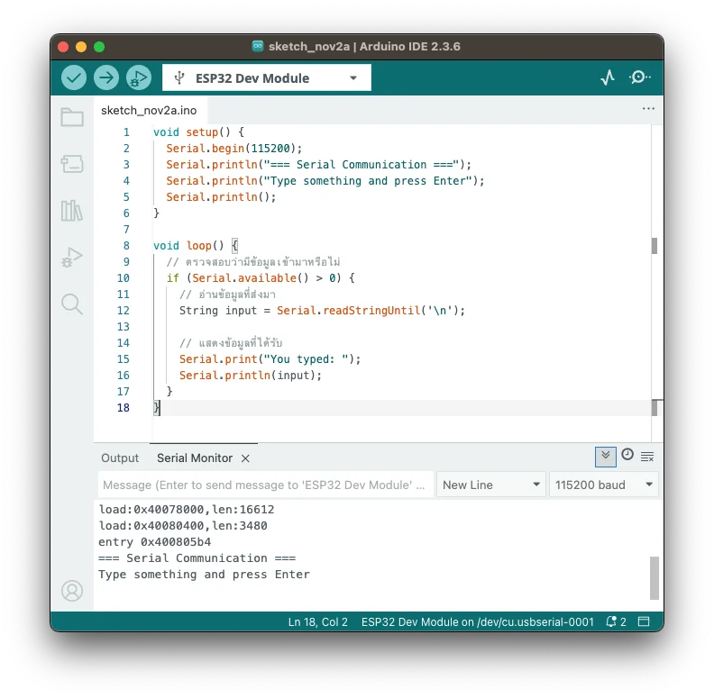
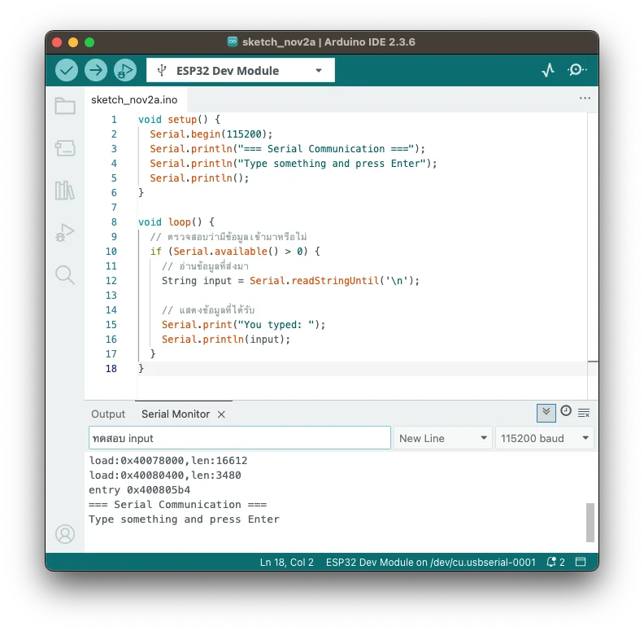
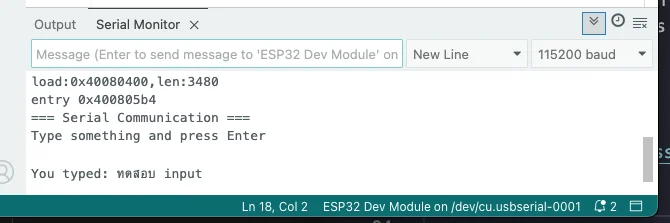
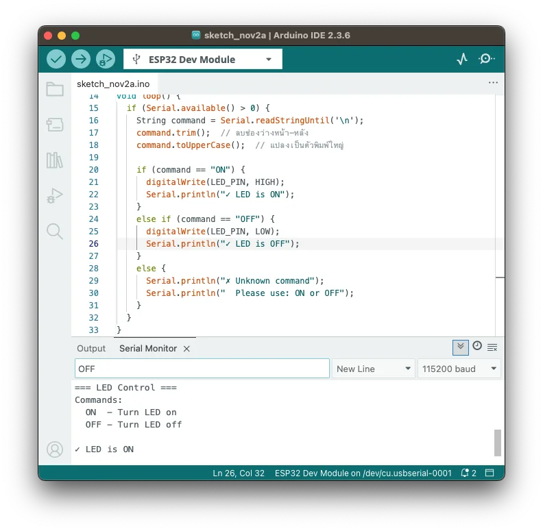
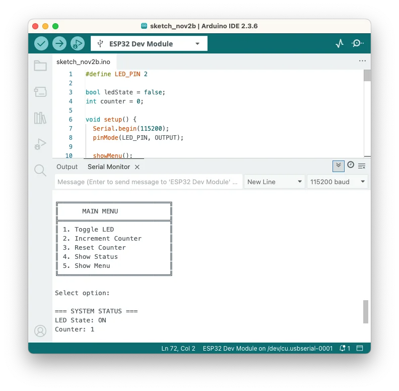

# บทที่ 4: Serial Monitor - การสื่อสารสองทาง

ในบทนี้เราจะเรียนรู้การรับข้อมูลจาก Serial Monitor และสร้างโปรแกรมที่โต้ตอบได้

## วัตถุประสงค์
- รับข้อมูลจาก Serial Monitor
- ตรวจสอบและประมวลผลข้อมูลที่รับ
- สร้างโปรแกรมแบบ Interactive
- ใช้ Serial สำหรับ Debug

---

## ขั้นตอนที่ 1: รับข้อความจาก Serial Monitor

### 1.1 โปรแกรมพื้นฐาน

สร้างโปรเจคใหม่และเขียนโค้ด:

```cpp
void setup() {
  Serial.begin(115200);
  Serial.println("=== Serial Communication ===");
  Serial.println("Type something and press Enter");
  Serial.println();
}

void loop() {
  // ตรวจสอบว่ามีข้อมูลเข้ามาหรือไม่
  if (Serial.available() > 0) {
    // อ่านข้อมูลที่ส่งมา
    String input = Serial.readStringUntil('\n');
    
    // แสดงข้อมูลที่ได้รับ
    Serial.print("You typed: ");
    Serial.println(input);
  }
}
``` 


<details markdown="1">
<summary>📖 <b>อธิบายโค้ดทีละส่วน</b></summary>

### `Serial.available()`
```cpp
if (Serial.available() > 0)
```
- ตรวจสอบว่ามีข้อมูลเข้ามาทาง Serial หรือไม่
- Return จำนวน byte ที่มีอยู่ใน buffer
- ถ้า > 0 แสดงว่ามีข้อมูล

### `Serial.readStringUntil('\n')`
```cpp
String input = Serial.readStringUntil('\n');
```
- อ่านข้อมูลจนเจอ newline (`\n`)
- newline เกิดจากการกด Enter
- เก็บข้อมูลในตัวแปร `input` ประเภท String

### ทำไมต้องใช้ `readStringUntil()`?
ถ้าใช้ `Serial.read()` จะอ่านทีละตัวอักษร:
```
พิมพ์: Hello
Serial.read() จะได้: 'H' ครั้งแรก
ต้องอ่านซ้ำ 5 ครั้งถึงจะได้ "Hello"
```

แต่ `readStringUntil('\n')` จะอ่านทั้งประโยค:
```
พิมพ์: Hello [Enter]
readStringUntil() จะได้: "Hello" เลย
```

</details>

### 1.2 ทดสอบโปรแกรม

1. Upload โปรแกรม
2. เปิด Serial Monitor
3. พิมพ์ข้อความในช่องด้านบน เช่น "Hello ESP32"
4. กด Enter หรือคลิกปุ่ม Send

**ผลลัพธ์:**
```
=== Serial Communication ===
Type something and press Enter

You typed: Hello ESP32
``` 



---

## ขั้นตอนที่ 2: ควบคุม LED ด้วย Serial

### 2.1 เขียนโปรแกรมควบคุม

```cpp
#define LED_PIN 2  // LED ที่ต่อกับขา GPIO 2

void setup() {
  Serial.begin(115200);
  pinMode(LED_PIN, OUTPUT);
  
  Serial.println("=== LED Control ===");
  Serial.println("Commands:");
  Serial.println("  ON  - Turn LED on");
  Serial.println("  OFF - Turn LED off");
  Serial.println();
} 

void loop() {
  if (Serial.available() > 0) {
    String command = Serial.readStringUntil('\n');
    command.trim();  // ลบช่องว่างหน้า-หลัง
    command.toUpperCase();  // แปลงเป็นตัวพิมพ์ใหญ่
    
    if (command == "ON") {
      digitalWrite(LED_PIN, HIGH);
      Serial.println("✓ LED is ON");
    }
    else if (command == "OFF") {
      digitalWrite(LED_PIN, LOW);
      Serial.println("✓ LED is OFF");
    }
    else {
      Serial.println("✗ Unknown command");
      Serial.println("  Please use: ON or OFF");
    }
  }
}
```

<details markdown="1">
<summary>📖 <b>String Functions ที่ใช้</b></summary>

### `command.trim()`
ลบช่องว่าง (space) หน้าและหลังข้อความ

```cpp
String text = "  Hello  ";
text.trim();
// ผลลัพธ์: "Hello"
```

**ทำไมต้องใช้?**
- User อาจพิมพ์เว้นวรรคหน้าหรือหลัง
- `" ON"` ไม่เท่ากับ `"ON"`

### `command.toUpperCase()`
แปลงตัวอักษรเป็นตัวพิมพ์ใหญ่ทั้งหมด

```cpp
String text = "hello";
text.toUpperCase();
// ผลลัพธ์: "HELLO"
```

**ทำไมต้องใช้?**
- User อาจพิมพ์ "on", "On", "ON"
- แปลงเป็นตัวใหญ่หมด → เปรียบเทียบง่าย

### String Functions อื่นๆ
```cpp
text.toLowerCase();      // แปลงเป็นตัวเล็กทั้งหมด
text.length();          // นับจำนวนตัวอักษร
text.startsWith("LED"); // เช็คว่าขึ้นต้นด้วย "LED" หรือไม่
text.endsWith("ON");    // เช็คว่าลงท้ายด้วย "ON" หรือไม่
text.indexOf("LED");    // หาตำแหน่งของ "LED"
```

</details>

### 2.2 ทดสอบโปรแกรม

**ทดลองพิมพ์:**
- `ON` → LED ติด
- `OFF` → LED ดับ
- `on` → LED ติด (แปลงเป็นตัวใหญ่อัตโนมัติ)
- `hello` → แสดง error



---

## ขั้นตอนที่ 3: รับตัวเลขและคำนวณ

### 3.1 โปรแกรมบวกเลข

```cpp
void setup() {
  Serial.begin(115200);
  Serial.println("=== Number Calculator ===");
  Serial.println("Enter a number:");
}

void loop() {
  if (Serial.available() > 0) {
    String input = Serial.readStringUntil('\n');
    input.trim();
    
    // แปลง String เป็นตัวเลข
    int number = input.toInt();
    
    // ตรวจสอบว่าเป็นตัวเลขหรือไม่
    if (number == 0 && input != "0") {
      Serial.println("✗ Please enter a valid number");
    } else {
      int result = number * 2;
      Serial.print("Result: ");
      Serial.print(number);
      Serial.print(" x 2 = ");
      Serial.println(result);
    }
    
    Serial.println("Enter another number:");
  }
}
```

<details markdown="1">
<summary>📖 <b>การแปลง String เป็นตัวเลข</b></summary>

### `toInt()` - แปลงเป็น Integer

```cpp
String text = "123";
int number = text.toInt();
// number = 123
```

**ข้อควรระวัง:**
```cpp
String text = "hello";
int number = text.toInt();
// number = 0 (เพราะแปลงไม่ได้)
```

ต้องตรวจสอบก่อนว่าเป็นตัวเลขจริง:
```cpp
if (number == 0 && input != "0") {
  // ไม่ใช่ตัวเลข
}
```

### การแปลงประเภทอื่น

```cpp
// String → Float
String text = "25.5";
float temperature = text.toFloat();
// temperature = 25.5

// Float → String
float temp = 25.5;
String text = String(temp);
// text = "25.5"

// Int → String
int count = 100;
String text = String(count);
// text = "100"
```

</details>

### 3.2 ทดสอบโปรแกรม

**ทดลองพิมพ์:**
- `5` → Result: 5 x 2 = 10
- `100` → Result: 100 x 2 = 200
- `hello` → Please enter a valid number

---

## ขั้นตอนที่ 4: สร้าง Menu Interactive

### 4.1 โปรแกรม Menu System

```cpp
#define LED_PIN 2

bool ledState = false;
int counter = 0;

void setup() {
  Serial.begin(115200);
  pinMode(LED_PIN, OUTPUT);
  
  showMenu();
}

void loop() {
  if (Serial.available() > 0) {
    String input = Serial.readStringUntil('\n');
    input.trim();
    
    if (input == "1") {
      ledState = !ledState;
      digitalWrite(LED_PIN, ledState);
      Serial.print("LED is now: ");
      Serial.println(ledState ? "ON" : "OFF");
    }
    else if (input == "2") {
      counter++;
      Serial.print("Counter: ");
      Serial.println(counter);
    }
    else if (input == "3") {
      counter = 0;
      Serial.println("Counter reset to 0");
    }
    else if (input == "4") {
      showStatus();
    }
    else if (input == "5") {
      showMenu();
    }
    else {
      Serial.println("Invalid option");
    }
    
    Serial.println();
  }
}

void showMenu() {
  Serial.println();
  Serial.println("╔════════════════════════════╗");
  Serial.println("║      MAIN MENU             ║");
  Serial.println("╠════════════════════════════╣");
  Serial.println("║ 1. Toggle LED              ║");
  Serial.println("║ 2. Increment Counter       ║");
  Serial.println("║ 3. Reset Counter           ║");
  Serial.println("║ 4. Show Status             ║");
  Serial.println("║ 5. Show Menu               ║");
  Serial.println("╚════════════════════════════╝");
  Serial.println();
  Serial.print("Select option: ");
}

void showStatus() {
  Serial.println();
  Serial.println("=== SYSTEM STATUS ===");
  Serial.print("LED State: ");
  Serial.println(ledState ? "ON" : "OFF");
  Serial.print("Counter: ");
  Serial.println(counter);
  Serial.print("Uptime: ");
  Serial.print(millis() / 1000);
  Serial.println(" seconds");
}
```



<details markdown="1">
<summary>📖 <b>การสร้าง Function เอง</b></summary>

### ทำไมต้องสร้าง Function?

**ปัญหา:** โค้ดใน `loop()` ยาวและอ่านยาก

**วิธีแก้:** แยกออกเป็น Function

### การสร้าง Function

```cpp
// รูปแบบ
returnType functionName(parameters) {
  // code here
}

// ตัวอย่าง
void showMenu() {
  Serial.println("Menu...");
}
```

### Function แบบมี Return

```cpp
int addNumbers(int a, int b) {
  int result = a + b;
  return result;
}

// เรียกใช้
int sum = addNumbers(5, 3);  // sum = 8
```

### Function แบบไม่มี Return (void)

```cpp
void printMessage(String msg) {
  Serial.println(msg);
}

// เรียกใช้
printMessage("Hello");
```

### ประโยชน์ของ Function:
- โค้ดอ่านง่าย เข้าใจง่าย
- ใช้ซ้ำได้หลายที่
- แก้ไขง่าย (แก้ที่เดียว ใช้ได้ทุกที่)
- แยกส่วนการทำงานชัดเจน

</details>

### 4.2 ทดสอบโปรแกรม

1. Upload และเปิด Serial Monitor
2. จะเห็น Menu แสดงขึ้นมา
3. พิมพ์ตัวเลข 1-5 เพื่อเลือกเมนู

**ตัวอย่างการใช้:**
```
Select option: 1
LED is now: ON

Select option: 2
Counter: 1

Select option: 4

=== SYSTEM STATUS ===
LED State: ON
Counter: 1
Uptime: 25 seconds
```

---

## ขั้นตอนที่ 5: การใช้ Serial ในการ Debug

### 5.1 แสดงค่าตัวแปรเพื่อ Debug

```cpp
int sensorValue = 0;

void setup() {
  Serial.begin(115200);
  pinMode(34, INPUT);  // Analog input
}

void loop() {
  sensorValue = analogRead(34);
  
  // Debug: แสดงค่าที่อ่านได้
  Serial.print("[DEBUG] Sensor Value: ");
  Serial.println(sensorValue);
  
  // ตรวจสอบช่วงค่า
  if (sensorValue > 2000) {
    Serial.println("[INFO] High value detected!");
  } else if (sensorValue < 500) {
    Serial.println("[WARNING] Low value!");
  }
  
  delay(1000);
}
```

<details markdown="1">
<summary>📖 <b>เทคนิค Debug ด้วย Serial</b></summary>

### 1. ใช้ Prefix แยกประเภทข้อความ

```cpp
Serial.println("[DEBUG] This is debug info");
Serial.println("[INFO] This is information");
Serial.println("[WARNING] This is warning");
Serial.println("[ERROR] This is error");
```

ประโยชน์:
- มองเห็นชัดว่าข้อความไหนสำคัญ
- Search หาได้ง่าย

### 2. แสดงค่าตัวแปรหลายตัว

```cpp
Serial.print("X: "); Serial.print(x);
Serial.print(" | Y: "); Serial.print(y);
Serial.print(" | Z: "); Serial.println(z);
// Output: X: 10 | Y: 20 | Z: 30
```

### 3. ใช้ millis() ติดตามเวลา

```cpp
Serial.print("[");
Serial.print(millis());
Serial.print("ms] ");
Serial.println("Action completed");
// Output: [1250ms] Action completed
```

### 4. แสดงจุดที่โปรแกรมทำงานถึง

```cpp
void myFunction() {
  Serial.println(">> Enter myFunction");
  // ... code ...
  Serial.println("<< Exit myFunction");
}
```

### 5. เปิด-ปิด Debug ด้วย Flag

```cpp
#define DEBUG true

void debugPrint(String msg) {
  if (DEBUG) {
    Serial.println("[DEBUG] " + msg);
  }
}

// เรียกใช้
debugPrint("Value: " + String(sensorValue));
```

เมื่อต้องการปิด Debug → เปลี่ยนเป็น `#define DEBUG false`

</details>

---

## สรุป

ในบทนี้เราได้เรียนรู้:
- ✅ รับข้อมูลจาก Serial Monitor
- ✅ ประมวลผล String (trim, toUpperCase, toInt)
- ✅ สร้างโปรแกรมแบบ Interactive
- ✅ สร้าง Function เพื่อจัดระเบียบโค้ด
- ✅ ใช้ Serial สำหรับ Debug

---

## แบบฝึกหัด

1. สร้างโปรแกรมเครื่องคิดเลข รับตัวเลข 2 ตัว และเครื่องหมาย (+, -, *, /)
2. สร้างโปรแกรมที่รับชื่อและตอบกลับ "Hello, [ชื่อ]!"
3. เพิ่มเมนูในโปรแกรม LED Control ให้มีตัวเลือก "BLINK" (กระพริบ LED)

<details markdown="1">
<summary>💡 <b>ดูเฉลย</b></summary>

### แบบฝึกหัดที่ 1: เครื่องคิดเลข

```cpp
void setup() {
  Serial.begin(115200);
  Serial.println("=== Calculator ===");
  Serial.println("Format: number1 operator number2");
  Serial.println("Example: 10 + 5");
}

void loop() {
  if (Serial.available() > 0) {
    String input = Serial.readStringUntil('\n');
    input.trim();
    
    int space1 = input.indexOf(' ');
    int space2 = input.lastIndexOf(' ');
    
    if (space1 == -1 || space2 == -1) {
      Serial.println("Invalid format");
      return;
    }
    
    float num1 = input.substring(0, space1).toFloat();
    String op = input.substring(space1 + 1, space2);
    float num2 = input.substring(space2 + 1).toFloat();
    
    float result;
    if (op == "+") result = num1 + num2;
    else if (op == "-") result = num1 - num2;
    else if (op == "*") result = num1 * num2;
    else if (op == "/") result = num1 / num2;
    else {
      Serial.println("Invalid operator");
      return;
    }
    
    Serial.print("Result: ");
    Serial.println(result);
  }
}
```

### แบบฝึกหัดที่ 2: ทักทาย

```cpp
void setup() {
  Serial.begin(115200);
  Serial.println("What is your name?");
}

void loop() {
  if (Serial.available() > 0) {
    String name = Serial.readStringUntil('\n');
    name.trim();
    
    Serial.print("Hello, ");
    Serial.print(name);
    Serial.println("!");
    Serial.println("Nice to meet you!");
    Serial.println();
    Serial.println("What is your name?");
  }
}
```

### แบบฝึกหัดที่ 3: LED Blink Mode

```cpp
#define LED_PIN 2

String mode = "OFF";

void setup() {
  Serial.begin(115200);
  pinMode(LED_PIN, OUTPUT);
  Serial.println("Commands: ON, OFF, BLINK");
}

void loop() {
  if (Serial.available() > 0) {
    mode = Serial.readStringUntil('\n');
    mode.trim();
    mode.toUpperCase();
    Serial.print("Mode: ");
    Serial.println(mode);
  }
  
  if (mode == "ON") {
    digitalWrite(LED_PIN, HIGH);
  }
  else if (mode == "OFF") {
    digitalWrite(LED_PIN, LOW);
  }
  else if (mode == "BLINK") {
    digitalWrite(LED_PIN, HIGH);
    delay(500);
    digitalWrite(LED_PIN, LOW);
    delay(500);
  }
}
```

</details>

---

## ขั้นตอนถัดไป

ในบทถัดไป เราจะเรียนรู้การใช้ปุ่มกด (Button) และการอ่านสัญญาณ Digital Input

➡️ [บทถัดไป: Button Input](05-button.md)
