# บทที่ 5: Button และ Debouncing


## ตัวอย่างโปรเจค Arduino / ESP32


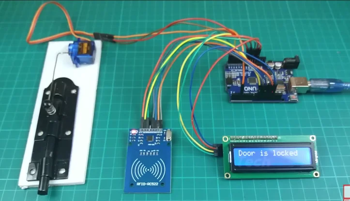 
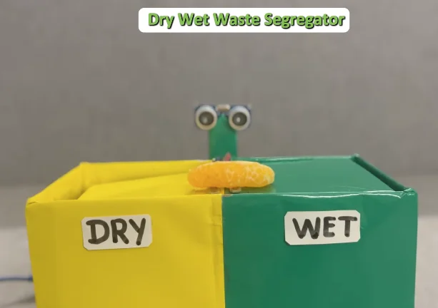 
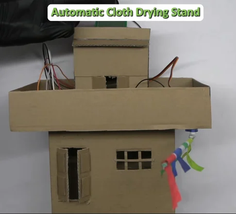 
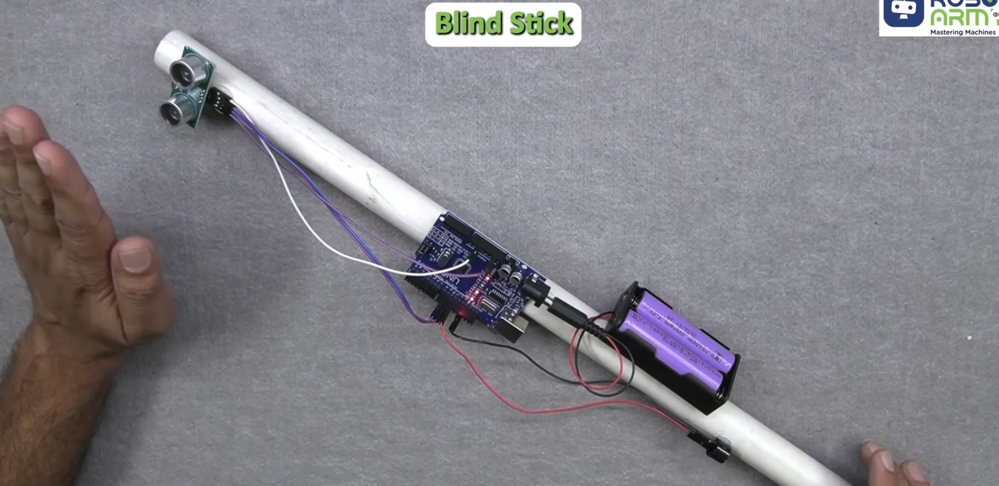

 


## วัตถุประสงค์
- เข้าใจการทำงานของปุ่มกด
- ใช้งาน `digitalRead()` และ `INPUT_PULLUP`
- เข้าใจปัญหา Button Bounce
- แก้ปัญหาด้วย Debouncing
- นับจำนวนครั้งที่กดปุ่มได้อย่างแม่นยำ

---

## อุปกรณ์ที่ใช้
- ESP32 Development Board
- ปุ่มกด (Push Button) 1 ตัว
- LED 1 ดวง
- ตัวต้านทาน 470Ω (สำหรับ LED)
- สายจัมเปอร์

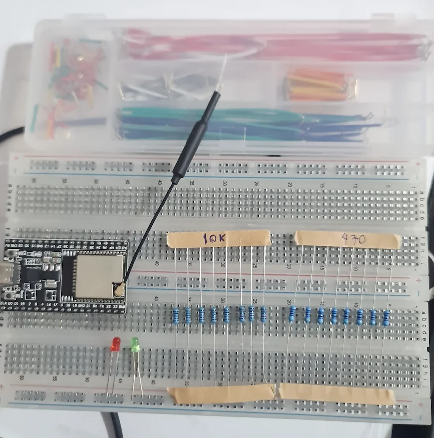
---


## Bonus : โปรแกรม simulation วงจร falstad
https://www.falstad.com/circuit/circuitjs.html

ใช้สำหรับจำลองวงจรไฟฟ้า ที่สามารถทดสอบการทำงานของปุ่มกดและวงจรต่างๆ ได้โดยไม่ต้องใช้ฮาร์ดแวร์จริง 

## Part 1: การใช้งานปุ่มกดพื้นฐาน

### ทฤษฎี: โครงสร้างปุ่มกด

ปุ่มกดมี **4 ขา** แต่ทำงานเป็นคู่:


การต่อวงจรปุ่มกด 4 วิธี:

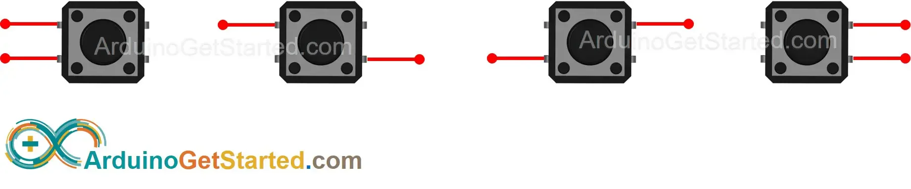

การทำงานของปุ่มกดถูกกด

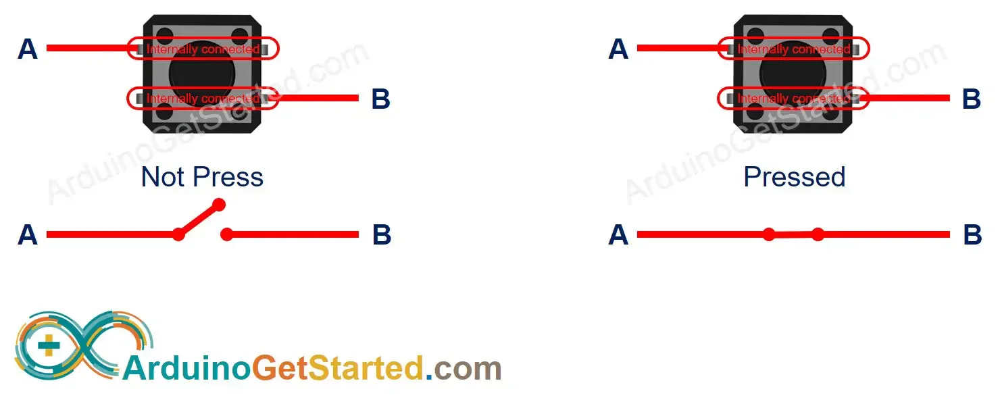

[ขอบคุณภาพจาก arduinogetstarted](https://arduinogetstarted.com/tutorials/arduino-button)

---
 
### วงจรพื้นฐานของปุ่มกด

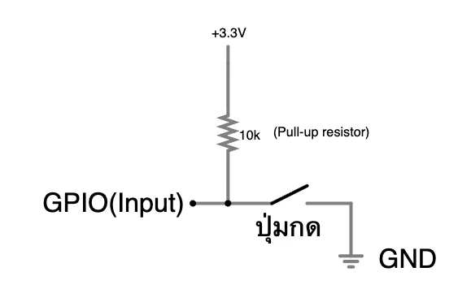

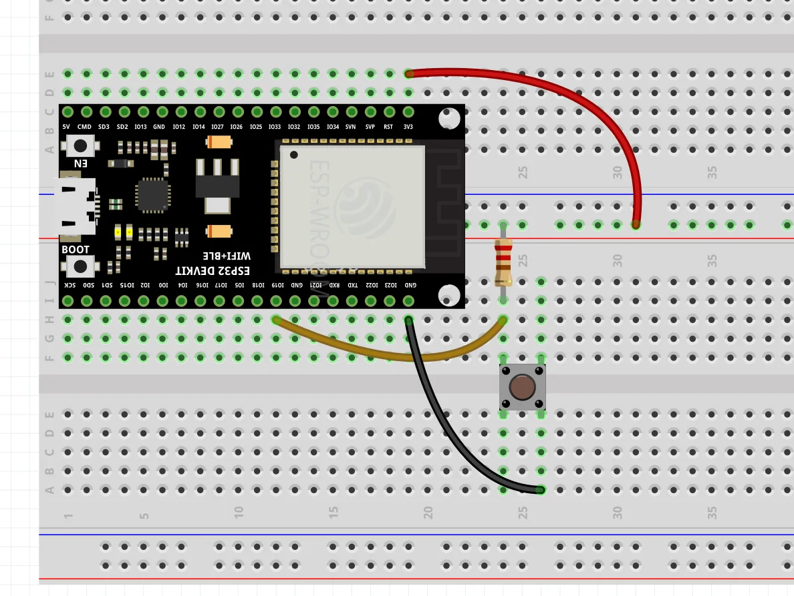


**พฤติกรรม:**
- **ไม่กด** = HIGH (1)
- **กด** = LOW (0)

**การใช้งาน:**
```cpp
pinMode(BUTTON_PIN, INPUT_PULLUP);  // เปิดใช้ Pull-up ภายใน
```

---

### ตัวอย่าง 1: อ่านค่าปุ่มกด

**วงจร:**

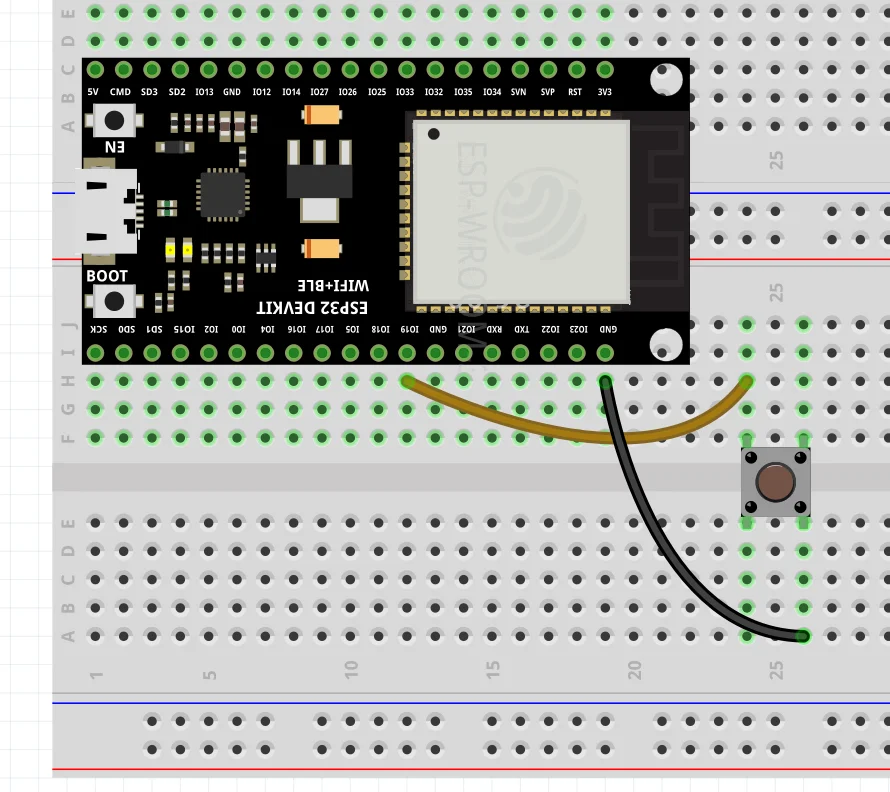


**โค้ด:**

```cpp
const int BUTTON_PIN = 19;

void setup() {
  Serial.begin(115200);
  pinMode(BUTTON_PIN, INPUT_PULLUP);  // ใช้ Pull-up ภายใน
}

void loop() {
  int state = digitalRead(BUTTON_PIN);
  
  Serial.print("Button: ");
  Serial.println(state == LOW ? "PRESSED" : "NOT PRESSED");
  
  delay(100);
}
```

**ผลลัพธ์:**

```
Button: NOT PRESSED
Button: NOT PRESSED
Button: PRESSED      ← กดปุ่ม
Button: PRESSED
Button: NOT PRESSED  ← ปล่อยปุ่ม
```

---

### ตัวอย่าง 2: นับจำนวนครั้งที่กด (ยังไม่มี Debouncing)

**โค้ด:**

```cpp
const int BUTTON_PIN = 19;

int count = 0;
int lastState = HIGH;

void setup() {
  Serial.begin(115200);
  pinMode(BUTTON_PIN, INPUT_PULLUP);
}

void loop() {
  int currentState = digitalRead(BUTTON_PIN);
  
  // ตรวจจับขอบลง (HIGH → LOW)
  if (lastState == HIGH && currentState == LOW) {
    count++;
    Serial.print("Count: ");
    Serial.println(count);
  }
  
  lastState = currentState;
  delay(20);
}
```

**ปัญหา:** บางครั้งนับได้มากกว่า 1 ครั้งจากการกดเพียงครั้งเดียว! 🤔

---

## Part 2: Button Bounce และปัญหา

### ทฤษฎี: Button Bounce คืออะไร?

เมื่อกดปุ่ม **แผ่นโลหะภายในปุ่ม** จะสัมผัสกัน แต่ในช่วงเวลาสั้นๆ (0.001-0.05 วินาที) แผ่นโลหะจะ**สั่นกระเด้ง** ทำให้เกิดการเปิด-ปิด-เปิด-ปิดหลายครั้ง


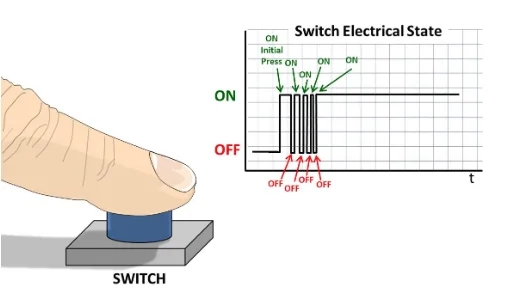


**ผลลัพธ์:** ESP32 "คิดว่ากดหลายครั้ง" แม้จริงๆ กดเพียงครั้งเดียว

---

### ตัวอย่าง 3: สังเกต Bounce ด้วย Serial Plotter

**โค้ด:**

```cpp
const int BUTTON_PIN = 19;

void setup() {
  Serial.begin(115200);
  pinMode(BUTTON_PIN, INPUT_PULLUP);
}

void loop() {
  int state = digitalRead(BUTTON_PIN);
  
  // ส่งค่าไปที่ Serial Plotter
  Serial.println(state == LOW ? 1 : 0);  // กด=1, ไม่กด=0
  
  delay(1);  // อ่านเร็วมากเพื่อจับ Bounce
}
```

**ขั้นตอน:**
1. อัปโหลดโค้ด
2. เปิด **Tools → Serial Plotter**
3. กดปุ่มและปล่อยอย่างช้าๆ
4. สังเกตกราฟตรงช่วงที่กดและปล่อย

**ผลที่เห็น:** กราฟจะกระโดดขึ้นลงตรงช่วงกดและปล่อย → นั่นคือ **Bounce**!

---

### ตัวอย่าง 4: ปัญหา Bounce กับการควบคุม LED (ข้าม)

**วงจร:**


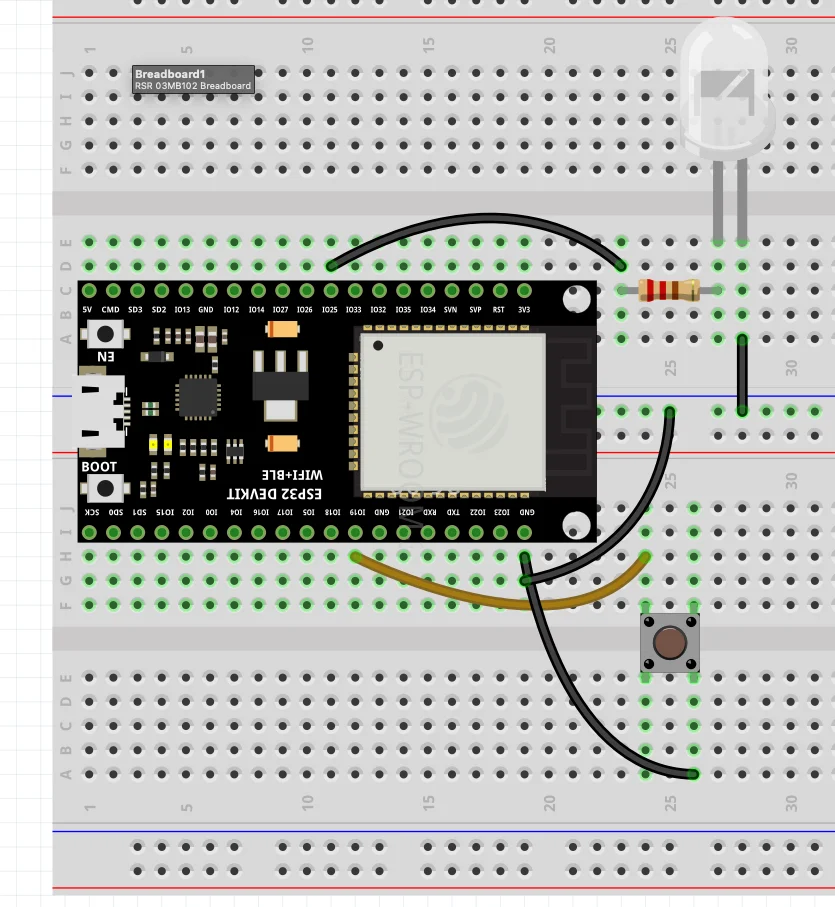


**โค้ด (ไม่มี Debouncing):**

```cpp
const int BUTTON_PIN = 19;
const int LED_PIN = 25;

bool ledState = false;

void setup() {
  Serial.begin(115200);
  pinMode(BUTTON_PIN, INPUT_PULLUP);
  pinMode(LED_PIN, OUTPUT);
}

void loop() {
  int buttonState = digitalRead(BUTTON_PIN);
  
  if(buttonState == LOW) {
    ledState = !ledState;
    digitalWrite(LED_PIN, ledState);
    
    Serial.print("LED: ");
    Serial.println(ledState ? "ON" : "OFF");
    
    delay(10);
  }
}
```

**ผลที่เห็น:**

```
LED: ON
LED: OFF   ← กดครั้งเดียวแต่เกิดหลายครั้ง!
LED: ON
LED: OFF
```

LED ติด/ดับแบบสุ่ม เพราะ Bounce ทำให้นับหลายครั้ง ❌

---

## Part 3: Debouncing - แก้ปัญหา

### หลักการ Debouncing

**วิธีแก้:** หลังจากตรวจจับการกดปุ่มแล้ว → **รอสักครู่** (เช่น 50ms) ก่อนตรวจจับครั้งถัดไป

```
กด → รอ 50ms → ตรวจสอบอีกครั้ง → ถ้ายังกดอยู่ → ยืนยันว่ากดจริง
```

---

### ตัวอย่าง 5: Debouncing ด้วย delay()

**โค้ด:**

```cpp
const int BUTTON_PIN = 19;
const int LED_PIN = 25;

bool ledState = false;
int lastButtonState = HIGH;

void setup() {
  Serial.begin(115200);
  pinMode(BUTTON_PIN, INPUT_PULLUP);
  pinMode(LED_PIN, OUTPUT);
}

void loop() {
  int buttonState = digitalRead(BUTTON_PIN);
  
  // ตรวจจับ Falling Edge (HIGH → LOW)
  if(buttonState == LOW && lastButtonState == HIGH) {
    delay(50);  // ⏳ รอ 50ms เพื่อให้ Bounce หมด
    
    // อ่านค่าอีกครั้งเพื่อยืนยัน
    buttonState = digitalRead(BUTTON_PIN);
    
    if(buttonState == LOW) {
      ledState = !ledState;
      digitalWrite(LED_PIN, ledState);
      
      Serial.print("LED: ");
      Serial.println(ledState ? "ON" : "OFF");
    }
  }
  
  lastButtonState = buttonState;
}
```

**ผลลัพธ์:**

```
LED: ON   ← กดครั้งที่ 1
LED: OFF  ← กดครั้งที่ 2
LED: ON   ← กดครั้งที่ 3
```

**✅ ทำงานถูกต้อง!** กด 1 ครั้ง = เปลี่ยนสถานะ 1 ครั้ง

---

### ตัวอย่าง 6: นับจำนวนครั้ง (มี Debouncing)

**โค้ด:**

```cpp
const int BUTTON_PIN = 19;
const int LED_PIN = 25;

int pressCount = 0;
int lastButtonState = HIGH;

void setup() {
  Serial.begin(115200);
  pinMode(BUTTON_PIN, INPUT_PULLUP);
  pinMode(LED_PIN, OUTPUT);
}

void loop() {
  int buttonState = digitalRead(BUTTON_PIN);
  
  if(buttonState == LOW && lastButtonState == HIGH) {
    delay(50);  // Debounce
    
    buttonState = digitalRead(BUTTON_PIN);
    
    if(buttonState == LOW) {
      pressCount++;
      Serial.print("Count: ");
      Serial.println(pressCount);
      
      // กะพริบ LED
      digitalWrite(LED_PIN, HIGH);
      delay(100);
      digitalWrite(LED_PIN, LOW);
    }
  }
  
  lastButtonState = buttonState;
}
```

**ผลลัพธ์:**

```
Count: 1  ← นับถูกต้องทุกครั้ง
Count: 2
Count: 3
```

---

### ตัวอย่าง 7: Debouncing แบบ Non-Blocking (ไม่บล็อก) (ข้าม)

**ปัญหาของ delay():** บล็อกโปรแกรม → ไม่สามารถทำงานอื่นได้ระหว่างรอ

**วิธีแก้:** ใช้ `millis()` แทน

**โค้ด:**

```cpp
const int BUTTON_PIN = 19;
const int LED_PIN = 25;

const unsigned long DEBOUNCE_DELAY = 50;  // 50ms

bool ledState = false;
int lastButtonState = HIGH;
int buttonState = HIGH;

unsigned long lastDebounceTime = 0;

void setup() {
  Serial.begin(115200);
  pinMode(BUTTON_PIN, INPUT_PULLUP);
  pinMode(LED_PIN, OUTPUT);
}

void loop() {
  int reading = digitalRead(BUTTON_PIN);
  
  // ถ้าค่าเปลี่ยน → รีเซ็ตตัวจับเวลา
  if(reading != lastButtonState) {
    lastDebounceTime = millis();
  }
  
  // ถ้าผ่านไป 50ms และค่ายังเหมือนเดิม → ยืนยัน
  if((millis() - lastDebounceTime) > DEBOUNCE_DELAY) {
    if(reading != buttonState) {
      buttonState = reading;
      
      if(buttonState == LOW) {
        ledState = !ledState;
        digitalWrite(LED_PIN, ledState);
        
        Serial.print("LED: ");
        Serial.println(ledState ? "ON" : "OFF");
      }
    }
  }
  
  lastButtonState = reading;
  
  // ⭐ สามารถทำงานอื่นได้ที่นี่!
}
```

**ข้อดี:**
- ✅ ไม่บล็อกโปรแกรม
- ✅ สามารถทำงานอื่นพร้อมกันได้
- ✅ เหมาะกับโปรแกรมซับซ้อน

---

### ตัวอย่าง 8: กดค้างเพื่อรีเซ็ต (Long Press)

**โค้ด:**

```cpp
const int BUTTON_PIN = 19;
const int LED_PIN = 25;

const unsigned long DEBOUNCE_DELAY = 50;
const unsigned long LONG_PRESS_TIME = 2000;  // กด 2 วินาที

int pressCount = 0;
int lastButtonState = HIGH;
int buttonState = HIGH;

unsigned long lastDebounceTime = 0;
unsigned long buttonPressTime = 0;

void setup() {
  Serial.begin(115200);
  pinMode(BUTTON_PIN, INPUT_PULLUP);
  pinMode(LED_PIN, OUTPUT);
  
  Serial.println("Press = count | Hold 2s = reset");
}

void loop() {
  int reading = digitalRead(BUTTON_PIN);
  
  if(reading != lastButtonState) {
    lastDebounceTime = millis();
  }
  
  if((millis() - lastDebounceTime) > DEBOUNCE_DELAY) {
    if(reading != buttonState) {
      buttonState = reading;
      
      if(buttonState == LOW) {
        buttonPressTime = millis();  // เริ่มจับเวลา
      }
      else {
        unsigned long pressDuration = millis() - buttonPressTime;
        
        if(pressDuration >= LONG_PRESS_TIME) {
          // Long Press → รีเซ็ต
          pressCount = 0;
          Serial.println("🔄 RESET!");
          
          for(int i = 0; i < 3; i++) {
            digitalWrite(LED_PIN, HIGH);
            delay(100);
            digitalWrite(LED_PIN, LOW);
            delay(100);
          }
        }
        else {
          // Short Press → นับ
          pressCount++;
          Serial.print("Count: ");
          Serial.println(pressCount);
          
          digitalWrite(LED_PIN, HIGH);
          delay(100);
          digitalWrite(LED_PIN, LOW);
        }
      }
    }
  }
  
  lastButtonState = reading;
}
```

**ผลลัพธ์:**

```
Count: 1
Count: 2
🔄 RESET!  ← กดค้าง 2 วินาที
Count: 1
```

---

## สรุป

| หัวข้อ | รายละเอียด |
|--------|-----------|
| **INPUT_PULLUP** | เปิดใช้ Pull-up ภายใน ไม่กด=1, กด=0 |
| **Floating Input** | ขา GPIO ที่ไม่มี Pull-up/down → อ่านค่าไม่มั่นคง |
| **Button Bounce** | ปรากฏการณ์สวิตช์สั่นกระเด้งเมื่อกด/ปล่อย |
| **Debouncing** | รอ 50ms หลังตรวจจับการกดเพื่อยืนยัน |
| **delay()** | ง่าย แต่บล็อกโปรแกรม |
| **millis()** | ซับซ้อนกว่า แต่ไม่บล็อก |
| **Falling Edge** | HIGH → LOW (การกดปุ่มกับ INPUT_PULLUP) |
| **Long Press** | ตรวจจับระยะเวลาที่กดค้าง |

---

## 🎯 ความท้าทาย

### Challenge 1: Double Click Detector
กด 2 ครั้งติดกัน (ภายใน 500ms) → LED กะพริบ 3 ครั้ง  
กด 1 ครั้ง → LED กะพริบ 1 ครั้ง

### Challenge 2: Multi-Button System
- ปุ่ม 1 (GPIO 19) → เพิ่มตัวนับ
- ปุ่ม 2 (GPIO 18) → ลดตัวนับ
- ปุ่ม 3 (GPIO 5) → รีเซ็ต

### Challenge 3: LED Brightness Control
- กดสั้น → เพิ่มความสว่าง +20%
- กดค้าง 1 วินาที → ลดความสว่าง -20%
- กดค้าง 3 วินาที → ปิด LED

---

## ❓ คำถามท้ายบท

1. `INPUT_PULLUP` ทำหน้าที่อะไร?
2. Button Bounce คืออะไร และเกิดขึ้นเมื่อไหร่?
3. ทำไมต้องทำ Debouncing?
4. Debounce Delay ควรใช้เท่าไหร่?
5. `delay()` vs `millis()` แตกต่างกันอย่างไร?
6. Falling Edge คืออะไร?

---

## 📚 เนื้อหาบทถัดไป

ในบทถัดไป เราจะเรียนรู้:
- 💡 การควบคุมความสว่าง LED ด้วย PWM
- 🎛️ ใช้ `ledcWrite()` ปรับความเข้มแสง
- 🌅 สร้าง Fade Effect (ค่อยๆ สว่าง/มืด)

[→ ไปบทที่ 6: PWM และการควบคุมความสว่าง LED](08-pwm-led.md)
