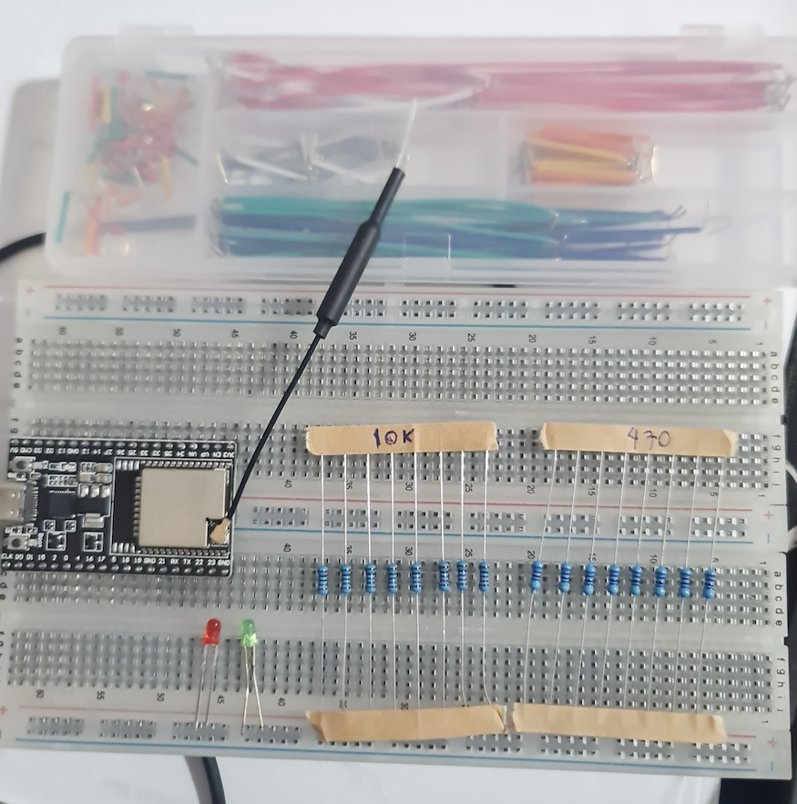

# บทที่ 5: Button - การรับสัญญาณจากปุ่มกด

ในบทนี้เราจะเรียนรู้การใช้ปุ่มกดเพื่อรับสัญญาณเข้า ESP32 และเข้าใจการทำงานของ INPUT_PULLUP และ INPUT_PULLDOWN

## วัตถุประสงค์
- เข้าใจหลักการทำงานของปุ่มกด
- ใช้ GPIO เป็น Digital Input
- เข้าใจ Pull-up และ Pull-down Resistor
- สร้างโปรแกรมควบคุม LED ด้วยปุ่ม

---

## ขั้นตอนที่ 1: เตรียมอุปกรณ์

### อุปกรณ์ที่ต้องใช้

1. **ESP32 board** - 1 ตัว
2. **Push button (Tactile switch)** - 1 ตัว
3. **LED** - 1 ดวง
4. **Resistor 330Ω** - 1 ตัว (สำหรับ LED)
5. **Resistor 10kΩ** - 1 ตัว (สำหรับ Pull-down, ถ้าไม่ใช้ Internal)
6. **Breadboard** - 1 อัน
7. **สายจั๊มเปอร์** - หลายเส้น



---

## ขั้นตอนที่ 2: ทำความเข้าใจปุ่มกด

### 2.1 โครงสร้างปุ่มกด (Push Button)

```
      ┌─────────┐
      │  ┌───┐  │
  ●───┤  │ o │  ├───●
      │  └───┘  │
      │         │
  ●───┤         ├───●
      └─────────┘
```

**การทำงาน:**
- **ไม่กด** → วงจรเปิด (ไม่มีกระแสไหล)
- **กด** → วงจรปิด (มีกระแสไหล)


<details markdown="1">
<summary>📖 <b>Digital Input คืออะไร?</b></summary>

**Digital Input** คือการอ่านสัญญาณที่มี 2 สถานะ:
- **HIGH** (1) - แรงดัน 3.3V (หรือ 5V)
- **LOW** (0) - แรงดัน 0V

**ตัวอย่างการใช้งาน:**
- อ่านสถานะปุ่มกด (กด/ไม่กด)
- อ่านสถานะสวิตช์ (เปิด/ปิด)
- อ่านเซ็นเซอร์แบบดิจิทัล (มี/ไม่มี)

**เปรียบเทียบกับ Analog Input:**
| Digital | Analog |
|---------|--------|
| 2 สถานะ (0 หรือ 1) | หลายระดับ (0-4095) |
| เหมาะกับ On/Off | เหมาะกับค่าต่อเนื่อง |
| ตัวอย่าง: ปุ่ม | ตัวอย่าง: เซ็นเซอร์แสง |

</details>

---

## ขั้นตอนที่ 3: Pull-up และ Pull-down Resistor

### 3.1 ปัญหาของ Floating Input

ถ้าต่อปุ่มแบบนี้:

```
GPIO ────┤ o ├──── GND
       (Button)
```

**ปัญหา:** เมื่อ**ไม่กดปุ่ม** GPIO จะอยู่ในสถานะ "ลอย" (Floating)
- ไม่ได้เชื่อมต่อกับ HIGH หรือ LOW
- อ่านค่าได้ไม่แน่นอน (บางทีอ่านได้ 1 บางทีอ่านได้ 0)


### 3.2 วิธีแก้: ใช้ Pull-up หรือ Pull-down

<details markdown="1">
<summary>📖 <b>Pull-down Resistor (ดึงลง)</b></summary>

```
        3.3V
          │
          ├────┤ o ├──── GPIO
          │   (Button)
         10kΩ
          │
         GND
```

**การทำงาน:**
- **ไม่กดปุ่ม** → GPIO ต่อกับ GND ผ่าน 10kΩ → อ่านค่าได้ **LOW (0)**
- **กดปุ่ม** → GPIO ต่อกับ 3.3V → อ่านค่าได้ **HIGH (1)**

**สรุป:**
- ไม่กด = LOW (0)
- กด = HIGH (1)


</details>

<details markdown="1">
<summary>📖 <b>Pull-up Resistor (ดึงขึ้น)</b></summary>

```
        3.3V
          │
         10kΩ
          │
          ├──── GPIO
          │
          ├────┤ o ├──── GND
               (Button)
```

**การทำงาน:**
- **ไม่กดปุ่ม** → GPIO ต่อกับ 3.3V ผ่าน 10kΩ → อ่านค่าได้ **HIGH (1)**
- **กดปุ่ม** → GPIO ต่อกับ GND → อ่านค่าได้ **LOW (0)**

**สรุป:**
- ไม่กด = HIGH (1)
- กด = LOW (0) ← ตรงข้ามกับ Pull-down!


</details>

### 3.3 ESP32 มี Internal Pull-up/Pull-down

ข่าวดี! ESP32 มี Resistor ในตัว ไม่ต้องต่อภายนอก

```cpp
// Pull-up ในตัว
pinMode(pin, INPUT_PULLUP);

// Pull-down ในตัว
pinMode(pin, INPUT_PULLDOWN);
```


---

## ขั้นตอนที่ 4: ต่อวงจรและเขียนโปรแกรม

### 4.1 วงจรแบบใช้ Internal Pull-up

**วงจร:**
```
ESP32                Button
GPIO 4 ────────┤ o ├──── GND
```

**โค้ด:**
```cpp
#define BUTTON_PIN 4

void setup() {
  Serial.begin(115200);
  pinMode(BUTTON_PIN, INPUT_PULLUP);  // ใช้ Pull-up ในตัว
  
  Serial.println("=== Button Test ===");
  Serial.println("Press the button!");
}

void loop() {
  int buttonState = digitalRead(BUTTON_PIN);
  
  Serial.print("Button state: ");
  Serial.println(buttonState);
  
  delay(200);
}
```


<details markdown="1">
<summary>📖 <b>digitalRead() คืออะไร?</b></summary>

```cpp
int value = digitalRead(pin);
```

**Parameter:**
- `pin` - หมายเลข GPIO ที่ต้องการอ่าน

**Return:**
- `HIGH` (1) - อ่านได้ 3.3V
- `LOW` (0) - อ่านได้ 0V

**ตัวอย่าง:**
```cpp
pinMode(4, INPUT_PULLUP);
int state = digitalRead(4);

if (state == LOW) {
  Serial.println("ปุ่มถูกกด!");
} else {
  Serial.println("ปุ่มไม่ถูกกด");
}
```

**หมายเหตุ:**
- ใช้กับ INPUT_PULLUP → กดปุ่ม = LOW
- ใช้กับ INPUT_PULLDOWN → กดปุ่ม = HIGH

</details>

### 4.2 ทดสอบโปรแกรม

1. ต่อวงจรตามรูป
2. Upload โปรแกรม
3. เปิด Serial Monitor
4. กดปุ่ม → จะเห็นค่าเปลี่ยนจาก 1 เป็น 0

**ผลลัพธ์:**
```
Button state: 1  ← ไม่กด
Button state: 1
Button state: 0  ← กด!
Button state: 0
Button state: 1  ← ปล่อย
```

---

## ขั้นตอนที่ 5: ควบคุม LED ด้วยปุ่ม

### 5.1 ต่อวงจร

```
ESP32
  GPIO 4 ────┤ o ├──── GND  (Button)
  GPIO 2 ────[330Ω]────|>|──── GND  (LED)
```


### 5.2 โปรแกรมควบคุม LED

```cpp
#define BUTTON_PIN 4
#define LED_PIN 2

void setup() {
  Serial.begin(115200);
  pinMode(BUTTON_PIN, INPUT_PULLUP);
  pinMode(LED_PIN, OUTPUT);
  
  Serial.println("=== Button Control LED ===");
}

void loop() {
  int buttonState = digitalRead(BUTTON_PIN);
  
  if (buttonState == LOW) {
    // ปุ่มถูกกด → เปิด LED
    digitalWrite(LED_PIN, HIGH);
    Serial.println("Button pressed - LED ON");
  } else {
    // ปุ่มไม่ถูกกด → ปิด LED
    digitalWrite(LED_PIN, LOW);
  }
  
  delay(50);  // Delay เล็กน้อยเพื่อป้องกันการอ่านค่าถี่เกินไป
}
```

### 5.3 ทดสอบ

- กดปุ่มค้าง → LED ติด
- ปล่อยปุ่ม → LED ดับ

---

## ขั้นตอนที่ 6: Toggle LED (เปิด-ปิดสลับกัน)

### 6.1 โปรแกรม Toggle

```cpp
#define BUTTON_PIN 4
#define LED_PIN 2

bool ledState = false;
bool lastButtonState = HIGH;

void setup() {
  Serial.begin(115200);
  pinMode(BUTTON_PIN, INPUT_PULLUP);
  pinMode(LED_PIN, OUTPUT);
  
  Serial.println("=== Toggle LED ===");
  Serial.println("Press button to toggle");
}

void loop() {
  int buttonState = digitalRead(BUTTON_PIN);
  
  // ตรวจจับการกดปุ่ม (เปลี่ยนจาก HIGH เป็น LOW)
  if (buttonState == LOW && lastButtonState == HIGH) {
    // Toggle LED
    ledState = !ledState;
    digitalWrite(LED_PIN, ledState);
    
    Serial.print("LED is now: ");
    Serial.println(ledState ? "ON" : "OFF");
    
    delay(50);  // Debounce delay
  }
  
  lastButtonState = buttonState;
}
```

<details markdown="1">
<summary>📖 <b>การตรวจจับ Edge (Falling/Rising)</b></summary>

### Edge Detection คืออะไร?

**Edge** = การเปลี่ยนแปลงของสัญญาณ

**Falling Edge:**
```
HIGH ─────┐
          └───── LOW
    (ขณะที่กดปุ่ม)
```

**Rising Edge:**
```
          ┌───── HIGH
LOW ──────┘
    (ขณะที่ปล่อยปุ่ม)
```

### ตรวจจับ Falling Edge

```cpp
bool lastState = HIGH;

void loop() {
  int currentState = digitalRead(pin);
  
  // ตรวจจับ HIGH → LOW
  if (currentState == LOW && lastState == HIGH) {
    Serial.println("Falling edge detected!");
  }
  
  lastState = currentState;
}
```

### ทำไมต้องตรวจจับ Edge?

ถ้าไม่ใช้:
```cpp
if (buttonState == LOW) {
  ledState = !ledState;  // Toggle
}
```
**ปัญหา:** Toggle เร็วมากจนเห็นไม่ทัน (หลายพันครั้งต่อวินาที)

ใช้ Edge Detection:
- Toggle เฉพาะตอนกดปุ่ม (Falling Edge)
- ค้างปุ่มไว้ก็ไม่ Toggle ซ้ำ

</details>

### 6.2 ทดสอบ

- กดปุ่ม 1 ครั้ง → LED เปลี่ยนสถานะ (ดับ→ติด หรือ ติด→ดับ)
- กดอีกครั้ง → สลับกลับ

---

## ขั้นตอนที่ 7: นับจำนวนครั้งที่กดปุ่ม

### 7.1 โปรแกรมนับ

```cpp
#define BUTTON_PIN 4
#define LED_PIN 2

int pressCount = 0;
bool lastButtonState = HIGH;

void setup() {
  Serial.begin(115200);
  pinMode(BUTTON_PIN, INPUT_PULLUP);
  pinMode(LED_PIN, OUTPUT);
  
  Serial.println("=== Button Counter ===");
  Serial.println("Press button to count");
}

void loop() {
  int buttonState = digitalRead(BUTTON_PIN);
  
  if (buttonState == LOW && lastButtonState == HIGH) {
    pressCount++;
    
    Serial.print("Button pressed: ");
    Serial.print(pressCount);
    Serial.println(" times");
    
    // กระพริบ LED เมื่อกดปุ่ม
    digitalWrite(LED_PIN, HIGH);
    delay(100);
    digitalWrite(LED_PIN, LOW);
    
    delay(50);  // Debounce
  }
  
  lastButtonState = buttonState;
}
```

### 7.2 เพิ่มการ Reset ด้วยปุ่มกดค้าง

```cpp
#define BUTTON_PIN 4
#define LED_PIN 2

int pressCount = 0;
bool lastButtonState = HIGH;
unsigned long pressStartTime = 0;

void setup() {
  Serial.begin(115200);
  pinMode(BUTTON_PIN, INPUT_PULLUP);
  pinMode(LED_PIN, OUTPUT);
  
  Serial.println("=== Button Counter ===");
  Serial.println("Press: Count | Hold 2s: Reset");
}

void loop() {
  int buttonState = digitalRead(BUTTON_PIN);
  
  // ตรวจจับการกดปุ่ม
  if (buttonState == LOW && lastButtonState == HIGH) {
    pressStartTime = millis();
    pressCount++;
    Serial.print("Count: ");
    Serial.println(pressCount);
    digitalWrite(LED_PIN, HIGH);
    delay(100);
    digitalWrite(LED_PIN, LOW);
    delay(50);
  }
  
  // ตรวจจับการกดค้าง
  if (buttonState == LOW) {
    if (millis() - pressStartTime > 2000) {
      // กดค้างเกิน 2 วินาที → Reset
      pressCount = 0;
      Serial.println(">>> Counter RESET <<<");
      
      // กระพริบ LED หลายครั้ง
      for (int i = 0; i < 5; i++) {
        digitalWrite(LED_PIN, HIGH);
        delay(100);
        digitalWrite(LED_PIN, LOW);
        delay(100);
      }
      
      pressStartTime = millis();  // รีเซ็ตเวลา
    }
  }
  
  lastButtonState = buttonState;
}
```

<details markdown="1">
<summary>📖 <b>millis() และการจับเวลา</b></summary>

### `millis()` คืออะไร?

```cpp
unsigned long time = millis();
```

- Return จำนวนมิลลิวินาทีนับจากตอนเริ่มโปรแกรม
- ประเภทข้อมูล: `unsigned long` (0 ถึง 4,294,967,295)
- ไม่หยุดการทำงาน (ไม่เหมือน `delay()`)

### ตัวอย่างการใช้งาน

**1. จับเวลา:**
```cpp
unsigned long startTime = millis();
// ทำอะไรบางอย่าง...
unsigned long elapsed = millis() - startTime;
Serial.print("Elapsed: ");
Serial.print(elapsed);
Serial.println(" ms");
```

**2. ทำงานทุกช่วงเวลา:**
```cpp
unsigned long lastTime = 0;

void loop() {
  if (millis() - lastTime > 1000) {
    Serial.println("1 second passed");
    lastTime = millis();
  }
}
```

**3. Timeout:**
```cpp
unsigned long startTime = millis();

while (condition) {
  if (millis() - startTime > 5000) {
    Serial.println("Timeout!");
    break;
  }
}
```

### ทำไมต้องใช้ `unsigned long`?

- `millis()` return ค่าใหญ่มาก
- ประมาณ 50 วัน = 4,294,967,295 ms
- ใช้ `int` จะเก็บไม่พอ (max 32,767)

</details>

---

## สรุป

ในบทนี้เราได้เรียนรู้:
- ✅ การใช้ปุ่มกดกับ ESP32
- ✅ Pull-up และ Pull-down Resistor
- ✅ การอ่านค่า Digital Input
- ✅ Edge Detection
- ✅ การใช้ millis() จับเวลา
- ✅ สร้างโปรแกรมควบคุม LED และนับจำนวนครั้ง

---

## แบบฝึกหัด

1. สร้างโปรแกรมที่ใช้ปุ่ม 2 ปุ่ม ควบคุม LED 2 ดวงแยกกัน
2. สร้างเกมกดปุ่ม: กดปุ่มให้ได้ 10 ครั้งภายใน 10 วินาที
3. สร้างโปรแกรมที่ปุ่ม 1 กด = เพิ่มค่า, ปุ่ม 2 กด = ลดค่า, แสดงค่าใน Serial

<details markdown="1">
<summary>💡 <b>ดูเฉลย แบบฝึกหัดที่ 2</b></summary>

```cpp
#define BUTTON_PIN 4
#define LED_PIN 2

int pressCount = 0;
unsigned long gameStartTime = 0;
bool gameRunning = false;
bool lastButtonState = HIGH;

void setup() {
  Serial.begin(115200);
  pinMode(BUTTON_PIN, INPUT_PULLUP);
  pinMode(LED_PIN, OUTPUT);
  
  Serial.println("=== Button Game ===");
  Serial.println("Press button to start!");
}

void loop() {
  int buttonState = digitalRead(BUTTON_PIN);
  
  // เริ่มเกม
  if (!gameRunning && buttonState == LOW && lastButtonState == HIGH) {
    gameRunning = true;
    pressCount = 0;
    gameStartTime = millis();
    Serial.println(">>> GAME START! <<<");
    Serial.println("Press 10 times in 10 seconds!");
    delay(50);
  }
  
  // เล่นเกม
  if (gameRunning) {
    unsigned long elapsed = millis() - gameStartTime;
    
    // นับการกด
    if (buttonState == LOW && lastButtonState == HIGH) {
      pressCount++;
      Serial.print("Press: ");
      Serial.print(pressCount);
      Serial.print(" / Time: ");
      Serial.print(elapsed / 1000.0, 1);
      Serial.println("s");
      
      digitalWrite(LED_PIN, HIGH);
      delay(50);
      digitalWrite(LED_PIN, LOW);
      delay(50);
    }
    
    // ชนะ
    if (pressCount >= 10) {
      Serial.println(">>> YOU WIN! <<<");
      for (int i = 0; i < 5; i++) {
        digitalWrite(LED_PIN, HIGH);
        delay(200);
        digitalWrite(LED_PIN, LOW);
        delay(200);
      }
      gameRunning = false;
      Serial.println("Press button to play again!");
    }
    
    // หมดเวลา
    if (elapsed > 10000) {
      Serial.println(">>> TIME OUT! <<<");
      Serial.print("You pressed ");
      Serial.print(pressCount);
      Serial.println(" times");
      gameRunning = false;
      Serial.println("Press button to try again!");
    }
  }
  
  lastButtonState = buttonState;
}
```

</details>

---

## ขั้นตอนถัดไป

ในบทถัดไป เราจะเรียนรู้การควบคุม LED แบบต่างๆ เช่น PWM (ปรับความสว่าง), RGB LED, และ LED Strip

➡️ [บทถัดไป: LED Control](06-led.md)
