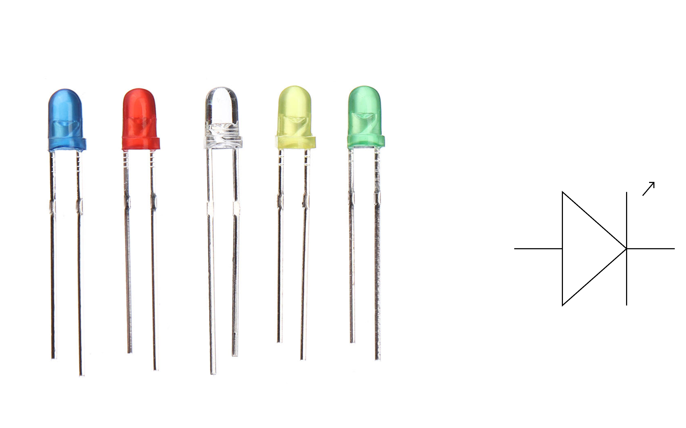
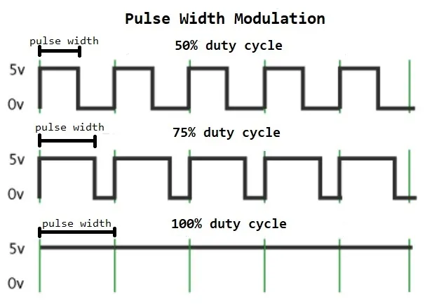
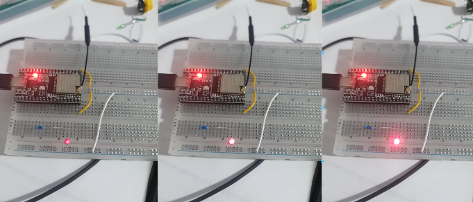

# บทที่ 6: LED - การควบคุมความสว่างและสี

ในบทนี้เราจะเรียนรู้การควบคุม LED ขั้นสูง รวมถึงการปรับความสว่างด้วย PWM และการควบคุม RGB LED

## วัตถุประสงค์
- เข้าใจการทำงานของ LED
- ใช้ PWM ปรับความสว่าง LED
- ควบคุม RGB LED เปลี่ยนสี
- สร้างเอฟเฟกต์แสงต่างๆ

---

## ขั้นตอนที่ 1: ทบทวน LED พื้นฐาน

### 1.1 LED คืออะไร?

**LED (Light Emitting Diode)** = ไดโอดเปล่งแสง



**ส่วนประกอบ:**
- **Anode (+)** - ขาบวก (ขายาว)
- **Cathode (-)** - ขาลบ (ขาสั้น)

<details markdown="1">
<summary>📖 <b>หลักการทำงานของ LED</b></summary>

### LED ทำงานอย่างไร?

LED เป็น **Diode** ชนิดหนึ่ง:
- ต่อขั้วถูก (Forward Bias) → ไฟติด
- ต่อขั้วผิด (Reverse Bias) → ไฟไม่ติด

```
ถูกต้อง:
3.3V ────[330Ω]────|>|──── GND
       (Resistor) (LED)

ผิด:
3.3V ────|<|────[330Ω]──── GND
       (LED)   (Resistor)
       ↑ ไฟไม่ติด
```

### ทำไมต้องใช้ Resistor?

LED ต้องการกระแส **จำกัด** (ประมาณ 20mA):
- ไม่มี Resistor → กระแสไหลมากเกิน → LED ไหม้
- มี Resistor → จำกัดกระแส → LED ปลอดภัย

**การคำนวณ Resistor:**
```
R = (Vsource - VLED) / ILED

ตัวอย่าง:
Vsource = 3.3V
VLED = 2V (LED แดง)
ILED = 20mA = 0.02A

R = (3.3 - 2) / 0.02 = 65Ω
ใช้ 100Ω หรือ 330Ω ก็ได้ (ความสว่างลดลงนิดหน่อย)
```

### สี LED กับแรงดันตก

| สี LED | แรงดันตก (V) |
|--------|--------------|
| แดง    | 1.8 - 2.2    |
| เขียว  | 2.0 - 3.0    |
| น้ำเงิน| 3.0 - 3.4    |
| ขาว    | 3.0 - 3.6    |
| เหลือง | 2.0 - 2.4    |

</details>

### 1.2 ทบทวนการควบคุม LED แบบ ON/OFF

```cpp
#define LED_PIN 2

void setup() {
  pinMode(LED_PIN, OUTPUT);
}

void loop() {
  digitalWrite(LED_PIN, HIGH);  // เปิด LED
  delay(1000);
  digitalWrite(LED_PIN, LOW);   // ปิด LED
  delay(1000);
}
```

---

## ขั้นตอนที่ 2: PWM - ปรับความสว่าง LED

### 2.1 PWM คืออะไร?

**PWM (Pulse Width Modulation)** = การปรับความกว้างของพัลส์



**หลักการ:**
- เปิด-ปิด LED **เร็วมาก** (หลายพันครั้งต่อวินาที)
- ตาเราเห็นเป็นความสว่างต่างกัน

<details markdown="1">
<summary>📖 <b>PWM ทำงานอย่างไร?</b></summary>

### Duty Cycle

**Duty Cycle** = เปอร์เซ็นต์ของเวลาที่เป็น HIGH

```
0% Duty Cycle (ปิดตลอด)
LOW ──────────────────────────

25% Duty Cycle (สว่าง 25%)
HIGH ──┐  ┐  ┐  ┐  ┐  ┐  ┐
LOW   └──└──└──└──└──└──└──

50% Duty Cycle (สว่าง 50%)
HIGH ───┐  ┐  ┐  ┐  ┐  ┐
LOW    └──└──└──└──└──└──

75% Duty Cycle (สว่าง 75%)
HIGH ────┐ ┐ ┐ ┐ ┐ ┐ ┐
LOW     └─└─└─└─└─└─└─

100% Duty Cycle (เปิดตลอด)
HIGH ──────────────────────────
```

### ใน ESP32

- ESP32 มี PWM 16 ช่อง
- ความละเอียด: 8-bit (0-255) หรือ 16-bit (0-65535)
- ความถี่: ตั้งได้ (โดยทั่วไปใช้ 5000 Hz)

**ค่า PWM:**
- 0 = ปิดทั้งหมด (0%)
- 128 = สว่างครึ่งหนึ่ง (50%)
- 255 = สว่างเต็มที่ (100%)

</details>

### 2.2 ตั้งค่า PWM บน ESP32

```cpp
#define LED_PIN 2

// ตั้งค่า PWM
const int freq = 5000;      // ความถี่ 5000 Hz
const int ledChannel = 0;   // ช่อง PWM 0
const int resolution = 8;   // ความละเอียด 8-bit (0-255)

void setup() {
  Serial.begin(115200);
  
  // ตั้งค่า PWM channel
  ledcSetup(ledChannel, freq, resolution);
  
  // ผูก channel กับ GPIO
  ledcAttachPin(LED_PIN, ledChannel);
  
  Serial.println("=== PWM LED Control ===");
}

void loop() {
  // ค่อยๆ สว่างขึ้น (Fade In)
  for (int brightness = 0; brightness <= 255; brightness++) {
    ledcWrite(ledChannel, brightness);
    delay(10);
  }
  
  // ค่อยๆ มืดลง (Fade Out)
  for (int brightness = 255; brightness >= 0; brightness--) {
    ledcWrite(ledChannel, brightness);
    delay(10);
  }
}
```



<details markdown="1">
<summary>📖 <b>PWM Functions บน ESP32</b></summary>

### `ledcSetup(channel, freq, resolution)`
ตั้งค่า PWM channel

**Parameters:**
- `channel` - หมายเลขช่อง (0-15)
- `freq` - ความถี่ในหน่วย Hz
- `resolution` - ความละเอียด (1-16 bit)

**Return:** ความถี่จริงที่ตั้งได้

```cpp
ledcSetup(0, 5000, 8);  // Channel 0, 5kHz, 8-bit
```

### `ledcAttachPin(pin, channel)`
ผูก GPIO กับ PWM channel

```cpp
ledcAttachPin(2, 0);  // GPIO 2 ใช้ Channel 0
```

### `ledcWrite(channel, dutyCycle)`
เขียนค่า PWM

```cpp
ledcWrite(0, 128);  // Channel 0, Duty = 128 (50%)
```

### `ledcDetachPin(pin)`
ยกเลิกการผูก GPIO กับ PWM

```cpp
ledcDetachPin(2);
```

### ตัวอย่างการใช้หลาย Channel

```cpp
// LED 1 - Channel 0
ledcSetup(0, 5000, 8);
ledcAttachPin(2, 0);

// LED 2 - Channel 1
ledcSetup(1, 5000, 8);
ledcAttachPin(4, 1);

// ควบคุม
ledcWrite(0, 100);  // LED 1 สว่าง 39%
ledcWrite(1, 200);  // LED 2 สว่าง 78%
```

</details>

### 2.3 โปรแกรมควบคุมความสว่างด้วย Serial

```cpp
#define LED_PIN 2

const int ledChannel = 0;

void setup() {
  Serial.begin(115200);
  ledcSetup(ledChannel, 5000, 8);
  ledcAttachPin(LED_PIN, ledChannel);
  
  Serial.println("=== LED Brightness Control ===");
  Serial.println("Enter brightness (0-255):");
}

void loop() {
  if (Serial.available() > 0) {
    String input = Serial.readStringUntil('\n');
    int brightness = input.toInt();
    
    // ตรวจสอบช่วงค่า
    if (brightness >= 0 && brightness <= 255) {
      ledcWrite(ledChannel, brightness);
      Serial.print("Brightness set to: ");
      Serial.print(brightness);
      Serial.print(" (");
      Serial.print(brightness * 100 / 255);
      Serial.println("%)");
    } else {
      Serial.println("Error: Value must be 0-255");
    }
    
    Serial.println("Enter brightness (0-255):");
  }
}
```

---

## ขั้นตอนที่ 3: RGB LED

### 3.1 รู้จักกับ RGB LED

**RGB LED** = LED 3 สี ในหลอดเดียว (Red, Green, Blue)


**ประเภท:**
- **Common Cathode** - ขาลบร่วมกัน (ใช้บ่อย)
- **Common Anode** - ขาบวกร่วมกัน

<details markdown="1">
<summary>📖 <b>การผสมสี RGB</b></summary>

### สีพื้นฐาน

```
แดง   = (255,   0,   0)
เขียว = (  0, 255,   0)
น้ำเงิน= (  0,   0, 255)
```

### การผสมสี

```
เหลือง  = แดง + เขียว    = (255, 255,   0)
ฟ้า     = เขียว + น้ำเงิน  = (  0, 255, 255)
ม่วง    = แดง + น้ำเงิน    = (255,   0, 255)
ขาว     = แดง + เขียว + น้ำเงิน = (255, 255, 255)
ดำ (ปิด)= ไม่มีสี          = (  0,   0,   0)
```

### สีอื่นๆ

```
ส้ม     = (255, 165,   0)
ชมพู    = (255, 105, 180)
เขียวมรกต = (  0, 255, 128)
ฟ้าน้ำทะเล = ( 64, 224, 208)
```

### ตาราง HSV → RGB

ค้นหาได้จาก: https://www.rapidtables.com/web/color/RGB_Color.html

</details>

### 3.2 ต่อวงจร RGB LED

**วงจร (Common Cathode):**
```
ESP32
GPIO 25 ────[330Ω]──── Red   ┐
GPIO 26 ────[330Ω]──── Green ├─── GND
GPIO 27 ────[330Ω]──── Blue  ┘
```


### 3.3 โปรแกรมควบคุม RGB LED

```cpp
// RGB LED Pins
#define RED_PIN   25
#define GREEN_PIN 26
#define BLUE_PIN  27

// PWM Channels
#define RED_CHANNEL   0
#define GREEN_CHANNEL 1
#define BLUE_CHANNEL  2

void setup() {
  Serial.begin(115200);
  
  // ตั้งค่า PWM
  ledcSetup(RED_CHANNEL, 5000, 8);
  ledcSetup(GREEN_CHANNEL, 5000, 8);
  ledcSetup(BLUE_CHANNEL, 5000, 8);
  
  // ผูก Pins
  ledcAttachPin(RED_PIN, RED_CHANNEL);
  ledcAttachPin(GREEN_PIN, GREEN_CHANNEL);
  ledcAttachPin(BLUE_PIN, BLUE_CHANNEL);
  
  Serial.println("=== RGB LED Demo ===");
}

void loop() {
  // แดง
  setColor(255, 0, 0);
  delay(1000);
  
  // เขียว
  setColor(0, 255, 0);
  delay(1000);
  
  // น้ำเงิน
  setColor(0, 0, 255);
  delay(1000);
  
  // เหลือง
  setColor(255, 255, 0);
  delay(1000);
  
  // ฟ้า
  setColor(0, 255, 255);
  delay(1000);
  
  // ม่วง
  setColor(255, 0, 255);
  delay(1000);
  
  // ขาว
  setColor(255, 255, 255);
  delay(1000);
  
  // ปิด
  setColor(0, 0, 0);
  delay(1000);
}

void setColor(int red, int green, int blue) {
  ledcWrite(RED_CHANNEL, red);
  ledcWrite(GREEN_CHANNEL, green);
  ledcWrite(BLUE_CHANNEL, blue);
}
```

---

## ขั้นตอนที่ 4: เอฟเฟกต์แสงต่างๆ

### 4.1 Rainbow Effect (สีรุ้ง)

```cpp
void loop() {
  rainbowEffect();
}

void rainbowEffect() {
  // วนผ่านสีทั้งหมด
  for (int hue = 0; hue < 360; hue++) {
    // แปลง HSV เป็น RGB
    int r, g, b;
    hsvToRgb(hue, 255, 255, r, g, b);
    setColor(r, g, b);
    delay(10);
  }
}

void hsvToRgb(int h, int s, int v, int &r, int &g, int &b) {
  // แปลง HSV เป็น RGB
  // H: 0-360, S: 0-255, V: 0-255
  
  float hf = h / 60.0;
  int i = (int)hf;
  float f = hf - i;
  
  int p = v * (255 - s) / 255;
  int q = v * (255 - s * f) / 255;
  int t = v * (255 - s * (1 - f)) / 255;
  
  switch(i) {
    case 0: r = v; g = t; b = p; break;
    case 1: r = q; g = v; b = p; break;
    case 2: r = p; g = v; b = t; break;
    case 3: r = p; g = q; b = v; break;
    case 4: r = t; g = p; b = v; break;
    default: r = v; g = p; b = q; break;
  }
}
```


### 4.2 Breathing Effect (หายใจ)

```cpp
void loop() {
  breathingEffect(255, 0, 0);  // หายใจสีแดง
  delay(500);
}

void breathingEffect(int r, int g, int b) {
  // Fade In
  for (int brightness = 0; brightness <= 255; brightness += 5) {
    setColor(r * brightness / 255, 
             g * brightness / 255, 
             b * brightness / 255);
    delay(20);
  }
  
  // Fade Out
  for (int brightness = 255; brightness >= 0; brightness -= 5) {
    setColor(r * brightness / 255, 
             g * brightness / 255, 
             b * brightness / 255);
    delay(20);
  }
}
```

### 4.3 Police Lights (ไฟกระพริบแดง-น้ำเงิน)

```cpp
void loop() {
  policeLights();
}

void policeLights() {
  // แดง
  for (int i = 0; i < 3; i++) {
    setColor(255, 0, 0);
    delay(100);
    setColor(0, 0, 0);
    delay(100);
  }
  
  delay(200);
  
  // น้ำเงิน
  for (int i = 0; i < 3; i++) {
    setColor(0, 0, 255);
    delay(100);
    setColor(0, 0, 0);
    delay(100);
  }
  
  delay(200);
}
```

### 4.4 Random Colors (สุ่มสี)

```cpp
void loop() {
  randomColors();
  delay(500);
}

void randomColors() {
  int r = random(0, 256);
  int g = random(0, 256);
  int b = random(0, 256);
  
  setColor(r, g, b);
  
  Serial.print("Color: RGB(");
  Serial.print(r); Serial.print(", ");
  Serial.print(g); Serial.print(", ");
  Serial.print(b); Serial.println(")");
}
```

---

## ขั้นตอนที่ 5: โปรเจครวม - RGB Control System

### 5.1 โปรแกรมเมนูควบคุม

```cpp
#define RED_PIN   25
#define GREEN_PIN 26
#define BLUE_PIN  27

#define RED_CHANNEL   0
#define GREEN_CHANNEL 1
#define BLUE_CHANNEL  2

int currentMode = 0;
int customR = 0, customG = 0, customB = 0;

void setup() {
  Serial.begin(115200);
  
  ledcSetup(RED_CHANNEL, 5000, 8);
  ledcSetup(GREEN_CHANNEL, 5000, 8);
  ledcSetup(BLUE_CHANNEL, 5000, 8);
  
  ledcAttachPin(RED_PIN, RED_CHANNEL);
  ledcAttachPin(GREEN_PIN, GREEN_CHANNEL);
  ledcAttachPin(BLUE_PIN, BLUE_CHANNEL);
  
  showMenu();
}

void loop() {
  // เช็คคำสั่งจาก Serial
  if (Serial.available() > 0) {
    String command = Serial.readStringUntil('\n');
    command.trim();
    processCommand(command);
  }
  
  // รันโหมดปัจจุบัน
  switch(currentMode) {
    case 1: rainbowMode(); break;
    case 2: breathingMode(); break;
    case 3: policeMode(); break;
    case 4: randomMode(); break;
    case 5: customMode(); break;
    default: setColor(0, 0, 0); delay(100); break;
  }
}

void showMenu() {
  Serial.println("\n╔═══════════════════════════╗");
  Serial.println("║   RGB LED Control Menu    ║");
  Serial.println("╠═══════════════════════════╣");
  Serial.println("║ 0 - OFF                   ║");
  Serial.println("║ 1 - Rainbow Effect        ║");
  Serial.println("║ 2 - Breathing Effect      ║");
  Serial.println("║ 3 - Police Lights         ║");
  Serial.println("║ 4 - Random Colors         ║");
  Serial.println("║ 5 - Custom Color          ║");
  Serial.println("║ R[0-255] - Set Red        ║");
  Serial.println("║ G[0-255] - Set Green      ║");
  Serial.println("║ B[0-255] - Set Blue       ║");
  Serial.println("║ MENU - Show this menu     ║");
  Serial.println("╚═══════════════════════════╝\n");
}

void processCommand(String cmd) {
  cmd.toUpperCase();
  
  if (cmd == "MENU") {
    showMenu();
  }
  else if (cmd == "0") {
    currentMode = 0;
    setColor(0, 0, 0);
    Serial.println("✓ LED OFF");
  }
  else if (cmd == "1") {
    currentMode = 1;
    Serial.println("✓ Rainbow Mode");
  }
  else if (cmd == "2") {
    currentMode = 2;
    Serial.println("✓ Breathing Mode");
  }
  else if (cmd == "3") {
    currentMode = 3;
    Serial.println("✓ Police Lights Mode");
  }
  else if (cmd == "4") {
    currentMode = 4;
    Serial.println("✓ Random Colors Mode");
  }
  else if (cmd == "5") {
    currentMode = 5;
    Serial.println("✓ Custom Color Mode");
    Serial.println("Use R, G, B commands to set color");
  }
  else if (cmd.startsWith("R")) {
    customR = cmd.substring(1).toInt();
    customR = constrain(customR, 0, 255);
    Serial.print("✓ Red = "); Serial.println(customR);
    if (currentMode == 5) setColor(customR, customG, customB);
  }
  else if (cmd.startsWith("G")) {
    customG = cmd.substring(1).toInt();
    customG = constrain(customG, 0, 255);
    Serial.print("✓ Green = "); Serial.println(customG);
    if (currentMode == 5) setColor(customR, customG, customB);
  }
  else if (cmd.startsWith("B")) {
    customB = cmd.substring(1).toInt();
    customB = constrain(customB, 0, 255);
    Serial.print("✓ Blue = "); Serial.println(customB);
    if (currentMode == 5) setColor(customR, customG, customB);
  }
  else {
    Serial.println("✗ Unknown command");
  }
}

void setColor(int r, int g, int b) {
  ledcWrite(RED_CHANNEL, r);
  ledcWrite(GREEN_CHANNEL, g);
  ledcWrite(BLUE_CHANNEL, b);
}

void rainbowMode() {
  static int hue = 0;
  int r, g, b;
  hsvToRgb(hue, 255, 255, r, g, b);
  setColor(r, g, b);
  hue = (hue + 1) % 360;
  delay(10);
}

void breathingMode() {
  static int brightness = 0;
  static int direction = 5;
  setColor(255 * brightness / 255, 0, 128 * brightness / 255);
  brightness += direction;
  if (brightness >= 255 || brightness <= 0) direction = -direction;
  delay(20);
}

void policeMode() {
  static int step = 0;
  if (step < 6) {
    setColor(255, 0, 0);
    delay(100);
    setColor(0, 0, 0);
  } else {
    setColor(0, 0, 255);
    delay(100);
    setColor(0, 0, 0);
  }
  step = (step + 1) % 12;
}

void randomMode() {
  setColor(random(256), random(256), random(256));
  delay(500);
}

void customMode() {
  setColor(customR, customG, customB);
  delay(100);
}

void hsvToRgb(int h, int s, int v, int &r, int &g, int &b) {
  // (same as before)
  float hf = h / 60.0;
  int i = (int)hf;
  float f = hf - i;
  int p = v * (255 - s) / 255;
  int q = v * (255 - s * f) / 255;
  int t = v * (255 - s * (1 - f)) / 255;
  switch(i) {
    case 0: r = v; g = t; b = p; break;
    case 1: r = q; g = v; b = p; break;
    case 2: r = p; g = v; b = t; break;
    case 3: r = p; g = q; b = v; break;
    case 4: r = t; g = p; b = v; break;
    default: r = v; g = p; b = q; break;
  }
}
```

---

## สรุป

ในบทนี้เราได้เรียนรู้:
- ✅ หลักการทำงานของ LED
- ✅ PWM และการปรับความสว่าง
- ✅ RGB LED และการผสมสี
- ✅ เอฟเฟกต์แสงต่างๆ
- ✅ สร้างระบบควบคุม RGB แบบสมบูรณ์

---

## แบบฝึกหัด

1. สร้างเอฟเฟกต์แสง "Sunset" (พระอาทิตย์ตก) เปลี่ยนจากส้มเป็นแดงเข้มค่อยๆ
2. เพิ่มโหมด "Candle" (เทียน) ที่ LED กระพริบแบบสุ่มเลียนแบบเปลวไฟ
3. ใช้ปุ่ม 2 ปุ่มเปลี่ยนโหมด (ปุ่ม 1 = โหมดถัดไป, ปุ่ม 2 = ปรับความสว่าง)

---

## ขั้นตอนถัดไป

ต่อไปเราจะมาเล่นเกมง่ายๆ ด้วย LED และปุ่มเพื่อฝึกทักษะที่เรียนมา!

➡️ [บทถัดไป: Game Time!](07-game-time.md)
