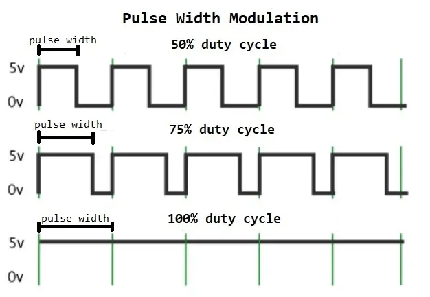
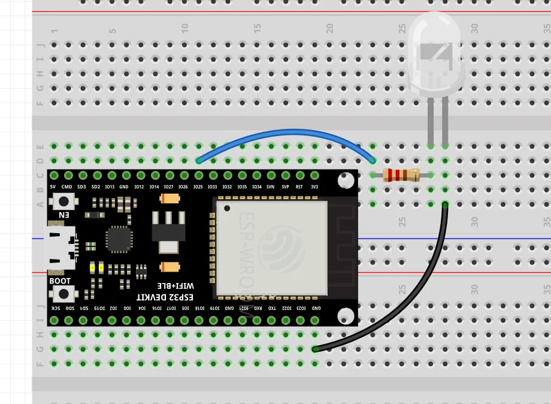

# บทที่ 6: PWM และการควบคุมความสว่าง LED

## วัตถุประสงค์
- เข้าใจหลักการ PWM (Pulse Width Modulation)
- ใช้ `ledcWrite()` ควบคุมความสว่าง LED
- ควบคุมความสว่างตามระยะเวลาที่กดปุ่ม
- สร้าง Fade Effect (ค่อยๆ สว่าง/มืด)

---

## อุปกรณ์ที่ใช้
- ESP32 Development Board
- LED 1 ดวง
- ต้านทาน 470Ω
- ปุ่มกด 1 ตัว
- สายจัมเปอร์

---

## ทฤษฎี: PWM (Pulse Width Modulation)

### PWM คืออะไร?

**PWM** = เทคนิคการเปิด-ปิดสัญญาณอย่างรวดเร็ว เพื่อควบคุม**พลังงานเฉลี่ย**ที่ส่งไปยังอุปกรณ์




### Duty Cycle

**Duty Cycle** = สัดส่วนเวลาที่สัญญาณเป็น HIGH

$$
\text{Duty Cycle (\%)} = \frac{\text{เวลาที่เป็น HIGH}}{\text{เวลารวมทั้งหมด}} \times 100
$$

**ตัวอย่าง:**
- 0% = ดับ
- 50% = สว่างครึ่งหนึ่ง
- 100% = สว่างเต็มที่

---

## PWM ใน ESP32

### ฟังก์ชัน PWM ใหม่

ESP32 มี **16 ช่อง PWM** สามารถตั้งค่าความถี่และความละเอียดได้

```cpp
// 1. ตั้งค่า PWM และผูกกับ GPIO
ledcAttach(pin, frequency, resolution);

// 2. เขียนค่า Duty Cycle
ledcWrite(pin, value);
```

### พารามิเตอร์

| พารามิเตอร์ | ความหมาย | ค่าแนะนำ |
|------------|----------|---------|
| **pin** | GPIO pin | 25 |
| **frequency** | ความถี่ (Hz) | 5000 (5kHz) |
| **resolution** | ความละเอียด (bit) | 8 (0-255) |
| **value** | ค่า Duty Cycle | 0-255 (8-bit) |

**หมายเหตุ:** 
- Resolution 8-bit → ค่า 0-255
- Resolution 10-bit → ค่า 0-1023
- Resolution 12-bit → ค่า 0-4095

---

## ตัวอย่าง 1: ควบคุมความสว่าง LED ด้วย PWM

### วงจร



### โค้ด

```cpp
const int LED_PIN = 25;

void setup() {
  Serial.begin(115200);
  
  // ตั้งค่า PWM: ledcAttach(pin, freq, resolution)
  ledcAttach(LED_PIN, 5000, 8);  // 5kHz, 8-bit (0-255)
  
  Serial.println("PWM LED Control");
  Serial.println("0 = Off | 255 = Max");
}

void loop() {
  // ความสว่าง 0%
  Serial.println("Brightness: 0%");
  ledcWrite(LED_PIN, 0);
  delay(1000);
  
  // ความสว่าง 25%
  Serial.println("Brightness: 25%");
  ledcWrite(LED_PIN, 64);  // 255 * 0.25 = 64
  delay(1000);
  
  // ความสว่าง 50%
  Serial.println("Brightness: 50%");
  ledcWrite(LED_PIN, 128);
  delay(1000);
  
  // ความสว่าง 75%
  Serial.println("Brightness: 75%");
  ledcWrite(LED_PIN, 192);
  delay(1000);
  
  // ความสว่าง 100%
  Serial.println("Brightness: 100%");
  ledcWrite(LED_PIN, 255);
  delay(1000);
}
```

### ผลลัพธ์

LED จะ**ค่อยๆ สว่างขึ้น** ทีละขั้น: 0% → 25% → 50% → 75% → 100%

---

## ตัวอย่าง 2: Fade In/Out Effect

### วงจร

เหมือนตัวอย่างที่ 1

### โค้ด

```cpp
const int LED_PIN = 25;

void setup() {
  ledcAttach(LED_PIN, 5000, 8);  // 5kHz, 8-bit
}

void loop() {
  // Fade In (ค่อยๆ สว่างขึ้น)
  for(int brightness = 0; brightness <= 255; brightness++) {
    ledcWrite(LED_PIN, brightness);
    delay(5);
  }
  
  delay(500);  // หยุดชั่วขณะเมื่อสว่างเต็มที่
  
  // Fade Out (ค่อยๆ มืดลง)
  for(int brightness = 255; brightness >= 0; brightness--) {
    ledcWrite(LED_PIN, brightness);
    delay(5);
  }
  
  delay(500);  // หยุดชั่วขณะเมื่อดับ
}
```

### ผลลัพธ์

LED จะ**ค่อยๆ สว่างขึ้น → สว่างเต็มที่ → ค่อยๆ มืดลง → ดับ** แล้ววนซ้ำ

---

## ตัวอย่าง 3 (โจทย์): กดค้างเพิ่มความสว่าง ปล่อยลดความสว่าง ⭐

### จงเขียนโค้ดให้ทำงานดังนี้:

- **กดค้างปุ่ม** → ความสว่างเพิ่มขึ้นเรื่อยๆ (0 → 255)
- **ปล่อยปุ่ม** → ความสว่างลดลงเรื่อยๆ จนกลับไป 0

### วงจร
 

 


### โค้ด

```cpp
const int BUTTON_PIN = 19;
const int LED_PIN = 25;

int brightness = 0;

void setup() {
  Serial.begin(115200);
  pinMode(BUTTON_PIN, INPUT_PULLUP);
  
  ledcAttach(LED_PIN, 5000, 8);
  ledcWrite(LED_PIN, brightness);
  
  Serial.println("Hold button to increase brightness");
  Serial.println("Release to fade out");
}

void loop() {
  int buttonState = digitalRead(BUTTON_PIN);
  
  if(buttonState == LOW) {
    // เติมความสว่าง
    // แก้ไขตรงนี้ 
    //
    
    ledcWrite(LED_PIN, brightness);
    
    Serial.print("↑ Brightness: ");
    Serial.println(brightness);
    
    delay(20);
  }
  else {
    // ปล่อยปุ่ม → ลดความสว่าง
    if(brightness > 0) {
      
      // ลดความสว่าง
      // แก้ไขตรงนี้
      
      ledcWrite(LED_PIN, brightness);
      
      Serial.print("↓ Brightness: ");
      Serial.println(brightness);
      
      delay(20);
    }
  }
}
```

### ผลลัพธ์

```
Hold button to increase brightness
Release to fade out

↑ Brightness: 2
↑ Brightness: 4
↑ Brightness: 6
...
↑ Brightness: 254
↑ Brightness: 255
↓ Brightness: 253   ← ปล่อยปุ่ม
↓ Brightness: 251
↓ Brightness: 249
...
↓ Brightness: 2
↓ Brightness: 0
```

**การทำงาน:**
- กดค้าง → LED ค่อยๆ สว่างขึ้นจนเต็มที่ (255)
- ปล่อย → LED ค่อยๆ มืดลงจนดับ (0)

---

## ตัวอย่าง 4: ปรับความสว่างขึ้น-ลงด้วยปุ่ม 2 ปุ่ม

### วงจร

```
ESP32
GPIO 19 ────┬───╮
            │ UP│  ← ปุ่มเพิ่มความสว่าง
           GND ╰─╯

GPIO 18 ────┬─────╮
            │ DOWN│  ← ปุ่มลดความสว่าง
           GND ╰───╯

GPIO 25 ────┬─── LED (+)
            │
           470Ω
            │
           GND (LED -)
```

### โค้ด

```cpp
const int BUTTON_UP = 19;
const int BUTTON_DOWN = 18;
const int LED_PIN = 25;

int brightness = 128;  // เริ่มต้นที่ 50%
const int STEP = 25;   // เพิ่ม/ลดครั้งละ 25

int lastButtonUpState = HIGH;
int lastButtonDownState = HIGH;

void setup() {
  Serial.begin(115200);
  pinMode(BUTTON_UP, INPUT_PULLUP);
  pinMode(BUTTON_DOWN, INPUT_PULLUP);
  
  ledcAttach(LED_PIN, 5000, 8);
  
  ledcWrite(LED_PIN, brightness);
  
  Serial.println("UP = Increase | DOWN = Decrease");
  printBrightness();
}

void loop() {
  int buttonUpState = digitalRead(BUTTON_UP);
  int buttonDownState = digitalRead(BUTTON_DOWN);
  
  // ปุ่ม UP (เพิ่มความสว่าง)
  if(buttonUpState == LOW && lastButtonUpState == HIGH) {
    delay(50);
    
    brightness += STEP;
    if(brightness > 255) brightness = 255;  // จำกัดไม่เกิน 255
    
    ledcWrite(LED_PIN, brightness);
    printBrightness();
  }
  
  // ปุ่ม DOWN (ลดความสว่าง)
  if(buttonDownState == LOW && lastButtonDownState == HIGH) {
    delay(50);
    
    brightness -= STEP;
    if(brightness < 0) brightness = 0;  // จำกัดไม่ต่ำกว่า 0
    
    ledcWrite(LED_PIN, brightness);
    printBrightness();
  }
  
  lastButtonUpState = buttonUpState;
  lastButtonDownState = buttonDownState;
}

void printBrightness() {
  int percent = (brightness * 100) / 255;
  
  Serial.print("Brightness: ");
  Serial.print(brightness);
  Serial.print(" (");
  Serial.print(percent);
  Serial.print("%) ");
  
  // แสดง Bar Graph
  for(int i = 0; i < brightness; i += 10) {
    Serial.print("█");
  }
  Serial.println();
}
```

### ผลลัพธ์

```
UP = Increase | DOWN = Decrease
Brightness: 128 (50%) ████████████
Brightness: 153 (60%) ███████████████
Brightness: 178 (70%) █████████████████
Brightness: 203 (80%) ████████████████████
Brightness: 228 (89%) ██████████████████████
Brightness: 253 (99%) ████████████████████████
Brightness: 228 (89%) ██████████████████████  ← กดปุ่ม DOWN
```

---

## ตัวอย่าง 5: กดค้างเพื่อ Fade ขึ้น-ลงอัตโนมัติ

### วงจร

เหมือนตัวอย่างที่ 4

### โค้ด

```cpp
const int BUTTON_UP = 19;
const int BUTTON_DOWN = 18;
const int LED_PIN = 25;

int brightness = 128;

void setup() {
  Serial.begin(115200);
  pinMode(BUTTON_UP, INPUT_PULLUP);
  pinMode(BUTTON_DOWN, INPUT_PULLUP);
  
  ledcAttach(LED_PIN, 5000, 8);
  
  ledcWrite(LED_PIN, brightness);
  
  Serial.println("Hold UP/DOWN to fade");
}

void loop() {
  int buttonUpState = digitalRead(BUTTON_UP);
  int buttonDownState = digitalRead(BUTTON_DOWN);
  
  // กดค้างปุ่ม UP → ค่อยๆ สว่างขึ้น
  if(buttonUpState == LOW) {
    brightness += 2;
    if(brightness > 255) brightness = 255;
    
    ledcWrite(LED_PIN, brightness);
    Serial.print("↑ ");
    Serial.println(brightness);
    delay(20);
  }
  
  // กดค้างปุ่ม DOWN → ค่อยๆ มืดลง
  if(buttonDownState == LOW) {
    brightness -= 2;
    if(brightness < 0) brightness = 0;
    
    ledcWrite(LED_PIN, brightness);
    Serial.print("↓ ");
    Serial.println(brightness);
    delay(20);
  }
}
```

### ผลลัพธ์

เมื่อกดค้างปุ่ม → LED จะ**ค่อยๆ สว่าง/มืด**แบบ Smooth

---

## สรุป

| หัวข้อ | รายละเอียด |
|--------|-----------|
| **PWM** | เทคนิคเปิด-ปิดสัญญาณเร็วเพื่อควบคุมพลังงานเฉลี่ย |
| **Duty Cycle** | สัดส่วนเวลาที่สัญญาณเป็น HIGH (0-100%) |
| **ledcAttach()** | ตั้งค่า PWM และผูกกับ GPIO (pin, freq, resolution) |
| **ledcWrite()** | เขียนค่า Duty Cycle (pin, value) |
| **ความละเอียด** | 8-bit (0-255), 10-bit (0-1023), 12-bit (0-4095) |
| **ประยุกต์ใช้** | ควบคุมความสว่าง LED, ความเร็วมอเตอร์, Servo |

---

## 🎯 ความท้าทาย

### Challenge 1: Traffic Light with Fade

สร้างไฟจราจร 3 สี (แดง, เหลือง, เขียว) แต่ละสีจะ**ค่อยๆ สว่างขึ้นแล้วค่อยๆ มืดลง**

- แดง: สว่าง 3 วินาที
- เหลือง: สว่าง 1 วินาที
- เขียว: สว่าง 3 วินาที

### Challenge 2: LED Breathing Effect

ทำ LED "หายใจ" (สว่างขึ้น-มืดลง แบบนุ่มนวล)

**Hint:** ใช้ `sin()` หรือ `cos()` เพื่อสร้างการเปลี่ยนแปลงที่นุ่มนวล

```cpp
brightness = (sin(millis() / 500.0) + 1) * 127.5;
```

### Challenge 3: Multi-Level Brightness

ใช้ 1 ปุ่ม สลับความสว่าง 5 ระดับ:
- กดครั้งที่ 1 → 20%
- กดครั้งที่ 2 → 40%
- กดครั้งที่ 3 → 60%
- กดครั้งที่ 4 → 80%
- กดครั้งที่ 5 → 100%
- กดครั้งที่ 6 → กลับไป 20%

---

## ❓ คำถามท้ายบท

1. PWM คืออะไร และทำงานอย่างไร?
2. Duty Cycle 50% หมายความว่าอย่างไร?
3. ค่า `ledcWrite(25, 128)` ทำให้ LED สว่างกี่เปอร์เซ็นต์?
4. ความละเอียด 8-bit และ 10-bit แตกต่างกันอย่างไร?
5. PWM สามารถนำไปประยุกต์ใช้กับอุปกรณ์อะไรได้บ้าง?

---

## 📚 เนื้อหาบทถัดไป

ในบทถัดไป เราจะเรียนรู้:
- 🤖 การควบคุม Servo Motor ด้วย PWM
- 📐 หมุน Servo 0-180 องศา
- 🎮 ควบคุม Servo ด้วยปุ่มกด
- 🔒 สร้างระบบล็อคอย่างง่าย

[→ ไปบทที่ 7: Servo Motor และการควบคุมมุม](07-servo-motor.md)
