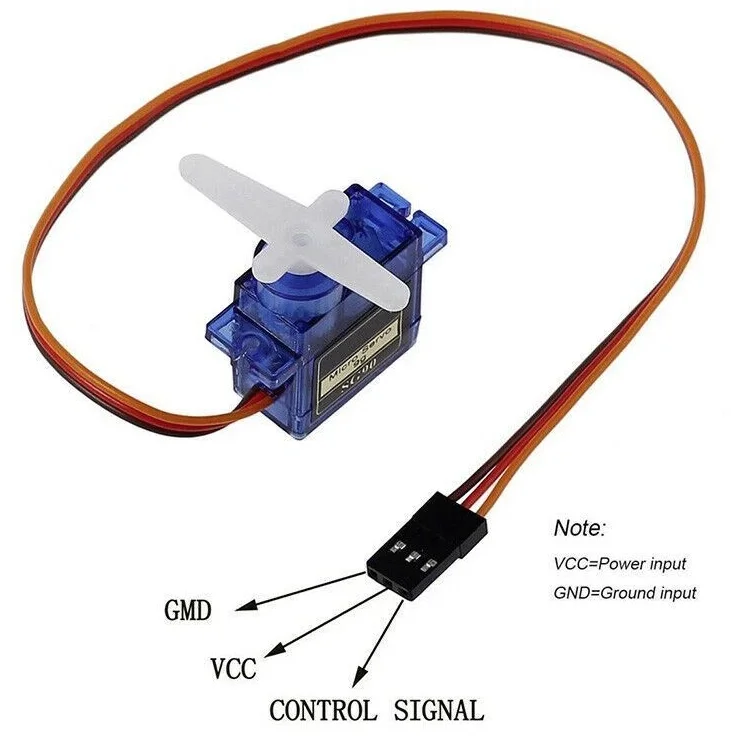
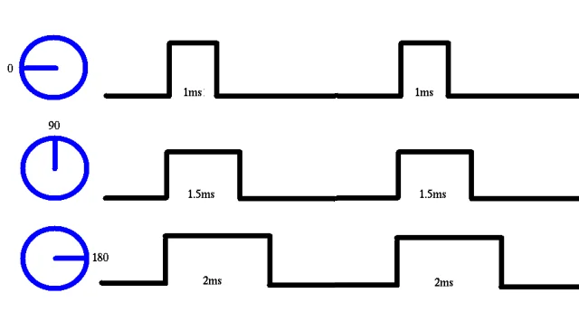
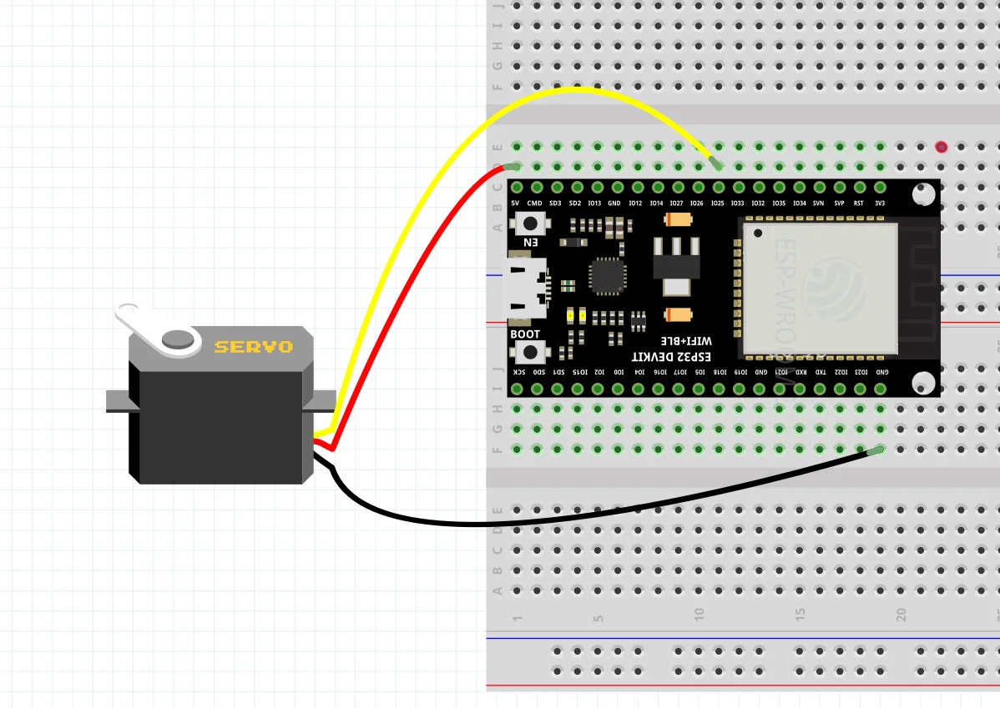
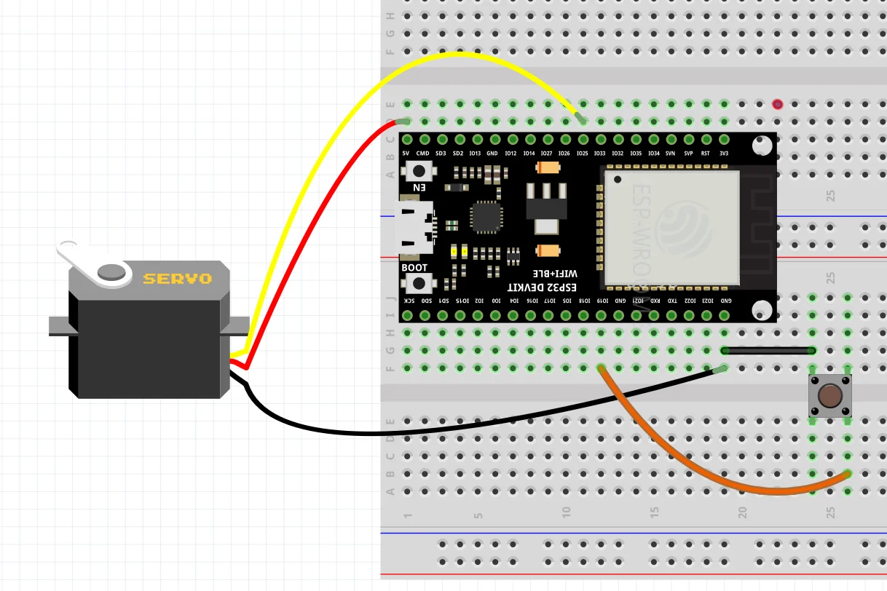
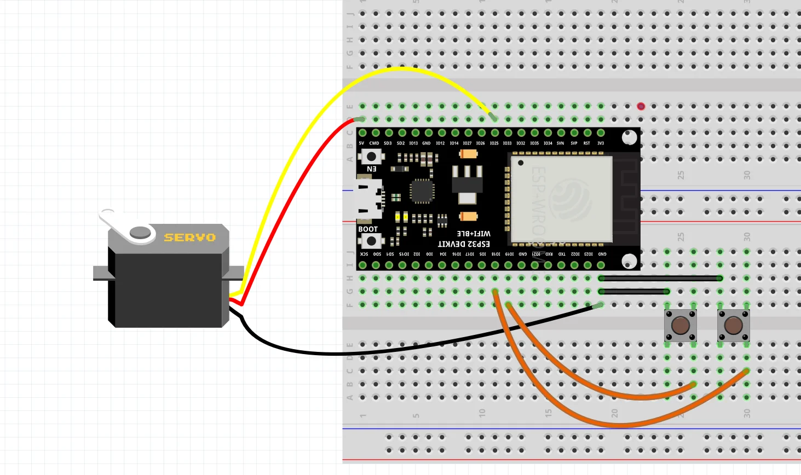

# บทที่ 7: Servo Motor และการควบคุมมุม

## วัตถุประสงค์
- เข้าใจหลักการทำงานของ Servo Motor
- ใช้ `ledcWrite()` ควบคุม Servo
- หมุน Servo ไปยังมุมต่างๆ (0-180°)
- สร้างระบบล็อคอย่างง่ายด้วยปุ่มกด

---

## อุปกรณ์ที่ใช้
- ESP32 Development Board
- Servo Motor SG90 (หรือรุ่นอื่นที่คล้ายกัน)
- ปุ่มกด 1-2 ตัว
- สายจัมเปอร์

---

## ทฤษฎี: Servo Motor

### Servo Motor คืออะไร?

**Servo Motor** = มอเตอร์ที่สามารถควบคุม**มุม**ได้อย่างแม่นยำ (โดยทั่วไป 0-180°)

```
     ┌─────────┐
     │ Servo   │
     │ SG90    │
     └─────────┘
       │ │ │
       │ │ └─ สีส้ม (Signal)
       │ └─── สีแดง (VCC 5V)
       └───── สีน้ำตาล (GND)
```



### การควบคุม Servo

Servo ใช้สัญญาณ **PWM** แบบพิเศษ:
- **ความถี่:** 50Hz (คาบเวลา 20ms)
- **Pulse Width:**
  - 500μs → 0° (ซ้ายสุด)
  - 1500μs → 90° (กลาง)
  - 2500μs → 180° (ขวาสุด)
 
### Pulse Width vs Angle


---

## การใช้ ledcWrite() กับ Servo

### ขั้นตอน

1. ตั้งค่า PWM ที่ **50Hz, 16-bit**
2. แปลงมุม (0-180°) เป็นค่า Duty Cycle
3. เขียนค่าด้วย `ledcWrite()`

### สูตรแปลงมุม → Duty Cycle

$$
\text{Duty} = \frac{\text{Pulse Width (μs)} \times 2^{16}}{20000}
$$

**ตัวอย่าง:**
- 0° → 500μs → Duty = 1638
- 90° → 1500μs → Duty = 4915
- 180° → 2500μs → Duty = 8192

---

## ตัวอย่าง 1: หมุน Servo ไปยังมุมต่างๆ

### วงจร

```
ESP32                Servo SG90
GPIO 25 ──────────── Signal (สีส้ม)
5V ─────────────────  VCC (สีแดง)
GND ─────────────────  GND (สีน้ำตาล)
```




**หมายเหตุ:** 
- ใช้ 5V จาก ESP32 (หรือแหล่งจ่ายไฟภายนอก)
- สำหรับ Servo หลายตัว ควรใช้แหล่งจ่ายไฟแยก

### โค้ด

```cpp
const int SERVO_PIN = 25;

void setup() {
  Serial.begin(115200);
  
  // ตั้งค่า PWM สำหรับ Servo: ledcAttach(pin, freq, resolution)
  ledcAttach(SERVO_PIN, 50, 16);  // 50Hz, 16-bit
  
  Serial.println("Servo Control Test");
}

void loop() {
  Serial.println("0° (Left)");
  servoWrite(0);
  delay(1000);
  
  Serial.println("45°");
  servoWrite(45);
  delay(1000);
  
  Serial.println("90° (Center)");
  servoWrite(90);
  delay(1000);
  
  Serial.println("135°");
  servoWrite(135);
  delay(1000);
  
  Serial.println("180° (Right)");
  servoWrite(180);
  delay(1000);
}

// ฟังก์ชันแปลงมุม (0-180) → Duty Cycle
void servoWrite(int angle) {
  // จำกัดมุมไม่เกิน 0-180°
  if(angle < 0) angle = 0;
  if(angle > 180) angle = 180;
  
  // แปลงมุมเป็น Pulse Width (μs)
  int pulseWidth = map(angle, 0, 180, 500, 2500);
  
  // แปลง Pulse Width เป็น Duty Cycle (16-bit)
  int duty = (pulseWidth * 65536) / 20000;
  
  ledcWrite(SERVO_PIN, duty);
}
```

### ผลลัพธ์

Servo จะหมุนไปยังมุม: **0° → 45° → 90° → 135° → 180°** แล้ววนซ้ำ

---

## ตัวอย่าง 2: ควบคุม Servo ด้วยปุ่มกด (ล็อค/ปลดล็อค)

### ทฤษฎี

สร้างระบบล็อคอย่างง่าย:
- กดปุ่มครั้งที่ 1 → Servo หมุนไป **0°** (ล็อค 🔒)
- กดปุ่มครั้งที่ 2 → Servo หมุนไป **90°** (ปลดล็อค 🔓)

### วงจร
 



### โค้ด

```cpp
const int BUTTON_PIN = 19;
const int SERVO_PIN = 25;

bool isLocked = true;  // สถานะล็อค
int lastButtonState = HIGH;

void setup() {
  Serial.begin(115200);
  pinMode(BUTTON_PIN, INPUT_PULLUP);
  
  ledcAttach(SERVO_PIN, 50, 16);  // 50Hz, 16-bit
  
  // เริ่มต้นที่ตำแหน่งล็อค
  servoWrite(0);
  Serial.println("🔒 LOCKED");
}

void loop() {
  int buttonState = digitalRead(BUTTON_PIN);
  
  // ตรวจจับการกดปุ่ม (Falling Edge)
  if(buttonState == LOW && lastButtonState == HIGH) {
    delay(50);  // Debounce
    
    buttonState = digitalRead(BUTTON_PIN);
    
    if(buttonState == LOW) {
      isLocked = !isLocked;  // สลับสถานะ
      
      if(isLocked) {
        servoWrite(0);   // หมุนไป 0° (ล็อค)
        Serial.println("🔒 LOCKED");
      }
      else {
        servoWrite(90);  // หมุนไป 90° (ปลดล็อค)
        Serial.println("🔓 UNLOCKED");
      }
    }
  }
  
  lastButtonState = buttonState;
}

void servoWrite(int angle) {
  if(angle < 0) angle = 0;
  if(angle > 180) angle = 180;
  
  int pulseWidth = map(angle, 0, 180, 500, 2500);
  int duty = (pulseWidth * 65536) / 20000;
  
  ledcWrite(SERVO_PIN, duty);
}
```

### ผลลัพธ์

```
🔒 LOCKED
🔓 UNLOCKED  ← กดปุ่ม
🔒 LOCKED    ← กดปุ่มอีกครั้ง
🔓 UNLOCKED
```

**ประยุกต์ใช้:**
- ล็อคประตู
- กล่องเก็บของ
- ตู้เซฟขนาดเล็ก

---

## ตัวอย่าง 3: ควบคุม Servo ด้วย 2 ปุ่ม (เปิด/ปิด)

### วงจร
 
 

### โค้ด

```cpp
const int BUTTON_OPEN = 19;
const int BUTTON_CLOSE = 18;
const int SERVO_PIN = 25;

int lastOpenState = HIGH;
int lastCloseState = HIGH;

void setup() {
  Serial.begin(115200);
  pinMode(BUTTON_OPEN, INPUT_PULLUP);
  pinMode(BUTTON_CLOSE, INPUT_PULLUP);
  
  ledcAttach(SERVO_PIN, 50, 16);  // 50Hz, 16-bit
  
  servoWrite(0);  // เริ่มต้นที่ปิด
  Serial.println("Door: CLOSED");
}

void loop() {
  int openState = digitalRead(BUTTON_OPEN);
  int closeState = digitalRead(BUTTON_CLOSE);
  
  // ปุ่ม OPEN
  if(openState == LOW && lastOpenState == HIGH) {
    delay(50);
    
    Serial.println("Opening door...");
    for(int angle = 0; angle <= 90; angle += 2) {
      servoWrite(angle);
      delay(15);  // หมุนแบบ smooth
    }
    Serial.println("Door: OPEN ✅");
  }
  
  // ปุ่ม CLOSE
  if(closeState == LOW && lastCloseState == HIGH) {
    delay(50);
    
    Serial.println("Closing door...");
    for(int angle = 90; angle >= 0; angle -= 2) {
      servoWrite(angle);
      delay(15);
    }
    Serial.println("Door: CLOSED ✅");
  }
  
  lastOpenState = openState;
  lastCloseState = closeState;
}

void servoWrite(int angle) {
  if(angle < 0) angle = 0;
  if(angle > 180) angle = 180;
  
  int pulseWidth = map(angle, 0, 180, 500, 2500);
  int duty = (pulseWidth * 65536) / 20000;
  
  ledcWrite(SERVO_PIN, duty);
}
```

### ผลลัพธ์

```
Door: CLOSED
Opening door...   ← กดปุ่ม OPEN
Door: OPEN ✅
Closing door...   ← กดปุ่ม CLOSE
Door: CLOSED ✅
```

Servo จะ**ค่อยๆ หมุน**แบบ Smooth (ไม่กระตุก)

---

## ตัวอย่าง 4: Sweep (กวาด) ซ้าย-ขวา

### วงจร

เหมือนตัวอย่างที่ 1

### โค้ด

```cpp
const int SERVO_PIN = 25;

void setup() {
  ledcAttach(SERVO_PIN, 50, 16);  // 50Hz, 16-bit
}

void loop() {
  // กวาดจาก 0° → 180°
  for(int angle = 0; angle <= 180; angle++) {
    servoWrite(angle);
    delay(10);
  }
  
  delay(500);
  
  // กวาดจาก 180° → 0°
  for(int angle = 180; angle >= 0; angle--) {
    servoWrite(angle);
    delay(10);
  }
  
  delay(500);
}

void servoWrite(int angle) {
  if(angle < 0) angle = 0;
  if(angle > 180) angle = 180;
  
  int pulseWidth = map(angle, 0, 180, 500, 2500);
  int duty = (pulseWidth * 65536) / 20000;
  
  ledcWrite(SERVO_PIN, duty);
}
```

### ผลลัพธ์

Servo จะ**กวาดไปกลับ**ระหว่าง 0° ถึง 180° อย่างต่อเนื่อง

**ประยุกต์ใช้:**
- Radar Scanner
- Camera Pan/Tilt
- พัดลมหมุน

---

## ตัวอย่าง 5: Serial Command Control

### ทฤษฎี

ควบคุม Servo ผ่าน Serial Monitor:
- พิมพ์ `0` → หมุนไป 0°
- พิมพ์ `90` → หมุนไป 90°
- พิมพ์ `180` → หมุนไป 180°

### วงจร

เหมือนตัวอย่างที่ 1

### โค้ด

```cpp
const int SERVO_PIN = 25;

void setup() {
  Serial.begin(115200);
  
  ledcAttach(SERVO_PIN, 50, 16);  // 50Hz, 16-bit
  
  servoWrite(90);  // เริ่มต้นที่ 90°
  
  Serial.println("Servo Serial Control");
  Serial.println("Enter angle (0-180):");
}

void loop() {
  if(Serial.available() > 0) {
    int angle = Serial.parseInt();
    
    if(angle >= 0 && angle <= 180) {
      servoWrite(angle);
      
      Serial.print("Servo angle: ");
      Serial.print(angle);
      Serial.println("°");
    }
    else {
      Serial.println("❌ Invalid angle! (0-180)");
    }
  }
}

void servoWrite(int angle) {
  if(angle < 0) angle = 0;
  if(angle > 180) angle = 180;
  
  int pulseWidth = map(angle, 0, 180, 500, 2500);
  int duty = (pulseWidth * 65536) / 20000;
  
  ledcWrite(SERVO_PIN, duty);
}
```

### การใช้งาน

1. เปิด Serial Monitor
2. พิมพ์มุมที่ต้องการ เช่น `45`
3. กด Enter
4. Servo จะหมุนไปยังมุมที่ระบุ

```
Servo Serial Control
Enter angle (0-180):
45
Servo angle: 45°
90
Servo angle: 90°
135
Servo angle: 135°
```

---

## สรุป

| หัวข้อ | รายละเอียด |
|--------|-----------|
| **Servo Motor** | มอเตอร์ควบคุมมุม 0-180° |
| **สัญญาณควบคุม** | PWM 50Hz, Pulse Width 500-2500μs |
| **0°** | Pulse = 500μs (ซ้ายสุด) |
| **90°** | Pulse = 1500μs (กลาง) |
| **180°** | Pulse = 2500μs (ขวาสุด) |
| **ledcAttach()** | ตั้งค่า PWM: ledcAttach(pin, 50, 16) |
| **สูตรแปลง** | `Duty = (PulseWidth × 65536) / 20000` |
| **ประยุกต์ใช้** | ประตูอัตโนมัติ, ล็อค, หุ่นยนต์, กล้องเคลื่อนที่ |

---

## 🎯 ความท้าทาย

### Challenge 1: Three-Position Switch

ใช้ 3 ปุ่ม:
- ปุ่ม 1 → Servo ไป 0°
- ปุ่ม 2 → Servo ไป 90°
- ปุ่ม 3 → Servo ไป 180°

### Challenge 2: Auto Return

Servo หมุนไปมุมที่กำหนด แล้ว**รอ 3 วินาที**ก่อนกลับมาที่ 90° อัตโนมัติ

### Challenge 3: Password Lock

สร้างล็อคที่ต้อง**กดปุ่ม 3 ครั้งติดกัน** (ภายใน 2 วินาที) เพื่อปลดล็อค
- ถ้ากดถูก → Servo หมุนเปิด (90°)
- ถ้ากดผิด → Servo อยู่เฉยๆ (0°)

---

## ❓ คำถามท้ายบท

1. Servo Motor ต่างจากมอเตอร์ DC ธรรมดาอย่างไร?
2. ทำไม Servo ต้องใช้ PWM ที่ 50Hz?
3. Pulse Width 1500μs ทำให้ Servo อยู่ที่มุมใด?
4. ทำไมต้องใช้ 16-bit resolution สำหรับ Servo?
5. ฟังก์ชัน `ledcAttach()` และ `ledcWrite()` ใช้ทำอะไร?

---

## 📚 เนื้อหาบทถัดไป

ในบทถัดไป เราจะเรียนรู้:
- 📏 เซนเซอร์วัดระยะทาง Ultrasonic (HC-SR04)
- 📚 การใช้ NewPing Library
- 🤖 โปรเจค: **ถังขยะอัตโนมัติ** (ใช้ Ultrasonic + Servo)
- 📊 แสดงระยะทางแบบ Real-time

[→ ไปบทที่ 8: Ultrasonic Sensor และถังขยะอัตโนมัติ](08-ultrasonic-sensor.md)
