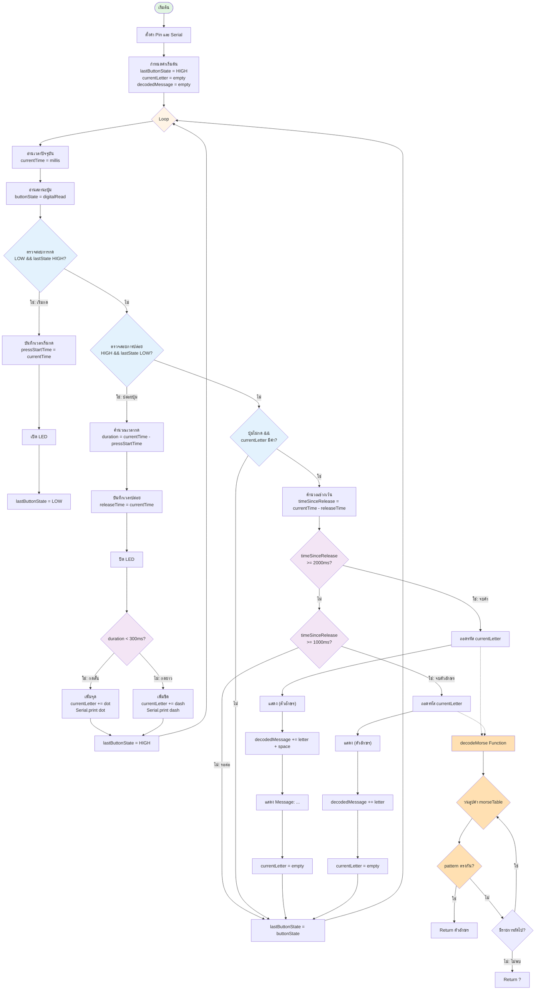

# บทที่ 7: Timing - การจัดการเวลาและ Library

## วัตถุประสงค์
- เข้าใจความแตกต่างระหว่าง `delay()` และ `millis()`
- สามารถสร้างโปรแกรมที่ทำหลายอย่างพร้อมกันได้
- เข้าใจความสำคัญของ Library
- รู้จักการสื่อสารกับเซนเซอร์ผ่าน Protocol

## ปัญหาของ delay()

### ตัวอย่าง: โปรแกรมกะพริบ LED

```cpp
const int LED_PIN = 25;

void setup() {
  pinMode(LED_PIN, OUTPUT);
}

void loop() {
  digitalWrite(LED_PIN, HIGH);
  delay(1000);  // รอ 1 วินาที
  digitalWrite(LED_PIN, LOW);
  delay(1000);  // รอ 1 วินาที
}
```

**ดูเหมือนง่ายใช่ไหม?** แต่...

<details markdown="1">
<summary>😱 ปัญหาของ delay()</summary>

**สถานการณ์:** ต้องการกะพริบ LED พร้อมกับอ่านค่าปุ่ม

```cpp
void loop() {
  // กะพริบ LED
  digitalWrite(LED_PIN, HIGH);
  delay(1000);  // ⏸️ หยุดทุกอย่าง 1 วินาที
  digitalWrite(LED_PIN, LOW);
  delay(1000);  // ⏸️ หยุดอีก 1 วินาที
  
  // อ่านปุ่ม
  if (digitalRead(BUTTON_PIN) == LOW) {
    Serial.println("Button pressed!");  // ❌ อาจพลาดการกด!
  }
}
```

**ปัญหา:**

1. **หยุดทุกอย่าง** - ระหว่าง `delay()` ทำอะไรไม่ได้เลย
2. **พลาดเหตุการณ์** - ถ้ากดปุ่มระหว่าง delay จะไม่รู้
3. **ทำหลายอย่างไม่ได้** - ไม่สามารถกะพริบ LED 2 ดวงด้วยจังหวะต่างกันได้
4. **ตอบสนองช้า** - รอให้ delay จบก่อน ถึงจะทำอย่างอื่นได้

**อุปมา:**
```
delay() เหมือนหลับไปเลย 1 วินาที
- ไม่ได้ยินเสียง ❌
- ไม่เห็นอะไร ❌
- ไม่รู้ว่ามีอะไรเกิดขึ้น ❌
```

</details>

---

## millis() - การจับเวลาแบบไม่หยุด

### แนวคิด

`millis()` = นาฬิกาจับเวลาที่**ไม่หยุด**นับตั้งแต่ ESP32 เปิดเครื่อง

```cpp
unsigned long currentTime = millis();  // เวลาปัจจุบัน (มิลลิวินาที)
```

**การทำงาน:**
```
เวลา (ms):  0 -----> 1000 -----> 2000 -----> 3000 -----> ...
millis():   0        1000        2000        3000
```

### Pattern การใช้ millis()

```cpp
unsigned long previousTime = 0;  // เก็บเวลาครั้งที่แล้ว
unsigned long interval = 1000;   // ระยะเวลาที่ต้องการ (1 วินาที)

void loop() {
  unsigned long currentTime = millis();
  
  // ตรวจสอบว่าผ่านไปครบ interval หรือยัง
  if (currentTime - previousTime >= interval) {
    // ทำงานที่ต้องการ
    digitalWrite(LED_PIN, !digitalRead(LED_PIN));  // Toggle LED
    
    // บันทึกเวลาใหม่
    previousTime = currentTime;
  }
  
  // สามารถทำอย่างอื่นต่อได้เลย!
}
```

### ตัวอย่าง: กะพริบ LED ด้วย millis()

```cpp
const int LED_PIN = 25;
unsigned long previousTime = 0;
unsigned long interval = 1000;  // กะพริบทุก 1 วินาที
bool ledState = false;

void setup() {
  pinMode(LED_PIN, OUTPUT);
}

void loop() {
  unsigned long currentTime = millis();
  
  if (currentTime - previousTime >= interval) {
    ledState = !ledState;
    digitalWrite(LED_PIN, ledState);
    previousTime = currentTime;
  }
  
  // ทำอย่างอื่นได้เลย! ไม่ต้องรอ
}
```

<details markdown="1">
<summary>💡 ข้อดีของ millis()</summary>

**1. ทำหลายอย่างพร้อมกัน**
```cpp
// LED 1 กะพริบเร็ว (200ms)
if (currentTime - led1Time >= 200) {
  digitalWrite(LED1, !digitalRead(LED1));
  led1Time = currentTime;
}

// LED 2 กะพริบช้า (1000ms)
if (currentTime - led2Time >= 1000) {
  digitalWrite(LED2, !digitalRead(LED2));
  led2Time = currentTime;
}

// อ่านปุ่มได้ตลอดเวลา
if (digitalRead(BUTTON) == LOW) {
  Serial.println("Pressed!");
}
```

**2. ไม่พลาดเหตุการณ์**
- โค้ด loop รันเร็วมาก (มากกว่า 1000 รอบต่อวินาที)
- ตรวจจับปุ่มได้ทันที

**3. ยืดหยุ่น**
- เปลี่ยนจังหวะได้ง่าย
- หยุด/เริ่มได้ตามต้องการ

**4. ประหยัดพลังงาน**
- CPU ไม่ติดค้างกับ delay

</details>

---

## 💻 แบบฝึกหัดที่ 1: LED หลายจังหวะ

### โจทย์

สร้างโปรแกรมควบคุม LED 3 ดวง กะพริบด้วยจังหวะต่างกัน:
- LED 1: กะพริบทุก 200ms
- LED 2: กะพริบทุก 500ms
- LED 3: กะพริบทุก 1000ms

และต้องอ่านปุ่มได้ด้วย เมื่อกดปุ่มให้แสดง "Button Pressed!" ทาง Serial

<details markdown="1">
<summary>✅ เฉลย</summary>

```cpp
// ====== Pin Configuration ======
const int LED1_PIN = 25;
const int LED2_PIN = 26;
const int LED3_PIN = 27;
const int BUTTON_PIN = 32;

// ====== Timing Variables ======
unsigned long led1PreviousTime = 0;
unsigned long led2PreviousTime = 0;
unsigned long led3PreviousTime = 0;

const unsigned long LED1_INTERVAL = 200;   // 200ms
const unsigned long LED2_INTERVAL = 500;   // 500ms
const unsigned long LED3_INTERVAL = 1000;  // 1000ms

// ====== LED States ======
bool led1State = false;
bool led2State = false;
bool led3State = false;

// ====== Button Variables ======
int lastButtonState = HIGH;

void setup() {
  Serial.begin(115200);
  
  pinMode(LED1_PIN, OUTPUT);
  pinMode(LED2_PIN, OUTPUT);
  pinMode(LED3_PIN, OUTPUT);
  pinMode(BUTTON_PIN, INPUT_PULLUP);
  
  Serial.println("Multi-Blink Started!");
}

void loop() {
  unsigned long currentTime = millis();
  
  // ===== LED 1 (เร็ว) =====
  if (currentTime - led1PreviousTime >= LED1_INTERVAL) {
    led1State = !led1State;
    digitalWrite(LED1_PIN, led1State);
    led1PreviousTime = currentTime;
  }
  
  // ===== LED 2 (ปานกลาง) =====
  if (currentTime - led2PreviousTime >= LED2_INTERVAL) {
    led2State = !led2State;
    digitalWrite(LED2_PIN, led2State);
    led2PreviousTime = currentTime;
  }
  
  // ===== LED 3 (ช้า) =====
  if (currentTime - led3PreviousTime >= LED3_INTERVAL) {
    led3State = !led3State;
    digitalWrite(LED3_PIN, led3State);
    led3PreviousTime = currentTime;
  }
  
  // ===== อ่านปุ่ม (ไม่พลาดเพราะไม่มี delay!) =====
  int buttonState = digitalRead(BUTTON_PIN);
  if (buttonState == LOW && lastButtonState == HIGH) {
    Serial.println("Button Pressed!");
    delay(50);  // debounce เล็กน้อย (ไม่กระทบอะไรมาก)
  }
  lastButtonState = buttonState;
}
```

**สังเกต:**
- LED ทั้ง 3 กะพริบอิสระจากกัน
- อ่านปุ่มได้ตลอดเวลา ไม่พลาด
- ถ้าใช้ `delay()` จะทำไม่ได้!

</details>

---

## 🎮 โปรเจค: เกมส่งสัญญาณมอร์ส

### แนวคิด

สร้างเกมที่ผู้เล่นต้อง**กดปุ่มตาม timing** เพื่อส่งรหัสมอร์ส

**รหัสมอร์ส:**
- `.` (จุด) = กดสั้น (< 300ms)
- `-` (ขีด) = กดยาว (≥ 300ms)

**ตัวอย่างคำ:**
```
S = ... (จุด จุด จุด)
O = --- (ขีด ขีด ขีด)
SOS = ... --- ...
```

### โค้ดเกม

<details markdown="1">
<summary>📊 Flowchart การทำงานของเกม</summary>



**อธิบายสีในแผนภาพ:**
- 🟢 เขียว: จุดเริ่มต้น
- 🟡 เหลือง: วงลูปหลัก
- 🔵 น้ำเงิน: เงื่อนไขตรวจสอบ
- 🟣 ม่วง: การตัดสินใจตาม timing
- 🟠 ส้ม: ฟังก์ชันถอดรหัส

**จุดสำคัญของ Flow:**

1. **การจับเวลาการกด:**
   - บันทึก `pressStartTime` เมื่อเริ่มกด
   - คำนวณ `duration` เมื่อปล่อย
   - ถ้า < 300ms = จุด, ≥ 300ms = ขีด

2. **การจับเวลาช่วงเว้น (Gap):**
   - บันทึก `releaseTime` เมื่อปล่อยปุ่ม
   - คำนวณ `timeSinceRelease` อย่างต่อเนื่อง
   - ≥ 2000ms = จบคำ (เพิ่มช่องว่าง)
   - ≥ 1000ms = จบตัวอักษร
   - < 1000ms = ยังไม่ถึงเวลา รอต่อ

3. **การถอดรหัส:**
   - เรียกใช้ `decodeMorse()` เมื่อครบตัวอักษรหรือคำ
   - วนลูปค่าใน `morseTable[]`
   - คืนค่า `?` ถ้าไม่พบ pattern

4. **State Management:**
   - ใช้ `lastButtonState` ตรวจจับ edge (LOW→HIGH, HIGH→LOW)
   - เก็บ `currentLetter` สะสม pattern ปัจจุบัน
   - เก็บ `decodedMessage` สะสมข้อความทั้งหมด

</details>

```cpp
// ====== Configuration ======
const int BUTTON_PIN = 4;
const int LED_PIN = 2;

// ====== Morse Timing ======
const unsigned long DOT_THRESHOLD = 300;      // น้อยกว่า 300ms = จุด
const unsigned long LETTER_GAP = 1000;        // เว้น 1 วินาที = จบตัวอักษร
const unsigned long WORD_GAP = 2000;          // เว้น 2 วินาที = จบคำ

// ====== Variables ======
int lastButtonState = HIGH;
unsigned long pressStartTime = 0;
unsigned long releaseTime = 0;
String currentLetter = "";
String decodedMessage = "";

// ====== Morse Code Dictionary ======
struct MorseCode {
  String pattern;
  char letter;
};

MorseCode morseTable[] = {
  {".-", 'A'}, {"-...", 'B'}, {"-.-.", 'C'}, {"-..", 'D'}, {".", 'E'},
  {"..-.", 'F'}, {"--.", 'G'}, {"....", 'H'}, {"..", 'I'}, {".---", 'J'},
  {"-.-", 'K'}, {".-..", 'L'}, {"--", 'M'}, {"-.", 'N'}, {"---", 'O'},
  {".--.", 'P'}, {"--.-", 'Q'}, {".-.", 'R'}, {"...", 'S'}, {"-", 'T'},
  {"..-", 'U'}, {"...-", 'V'}, {".--", 'W'}, {"-..-", 'X'}, {"-.--", 'Y'},
  {"--..", 'Z'},
  {"-----", '0'}, {".----", '1'}, {"..---", '2'}, {"...--", '3'}, {"....-", '4'},
  {".....", '5'}, {"-....", '6'}, {"--...", '7'}, {"---..", '8'}, {"----.", '9'}
};
const int MORSE_TABLE_SIZE = sizeof(morseTable) / sizeof(morseTable[0]);

void setup() {
  Serial.begin(115200);
  pinMode(BUTTON_PIN, INPUT_PULLUP);
  pinMode(LED_PIN, OUTPUT);
  
  Serial.println("=== MORSE CODE GAME ===");
  Serial.println("Dot (.) = Short press (<300ms)");
  Serial.println("Dash (-) = Long press (>=300ms)");
  Serial.println("Gap 1s = End of letter");
  Serial.println("Gap 2s = End of word");
  Serial.println("Type 'SOS' to test!");
  Serial.println("========================\n");
}

char decodeMorse(String pattern) {
  for (int i = 0; i < MORSE_TABLE_SIZE; i++) {
    if (morseTable[i].pattern == pattern) {
      return morseTable[i].letter;
    }
  }
  return '?';  // ไม่พบ
}

void loop() {
  unsigned long currentTime = millis();
  int buttonState = digitalRead(BUTTON_PIN);
  
  // ===== ตรวจจับการกดปุ่ม =====
  if (buttonState == LOW && lastButtonState == HIGH) {
    // เริ่มกด
    pressStartTime = currentTime;
    digitalWrite(LED_PIN, HIGH);  // เปิด LED ตอนกด
    
  } else if (buttonState == HIGH && lastButtonState == LOW) {
    // ปล่อยปุ่ม
    unsigned long pressDuration = currentTime - pressStartTime;
    releaseTime = currentTime;
    digitalWrite(LED_PIN, LOW);  // ปิด LED
    
    // ตรวจสอบว่ากดสั้นหรือยาว
    if (pressDuration < DOT_THRESHOLD) {
      currentLetter += ".";
      Serial.print(".");
    } else {
      currentLetter += "-";
      Serial.print("-");
    }
  }
  
  // ===== ตรวจสอบ gap (เว้นวรรค) =====
  if (buttonState == HIGH && currentLetter.length() > 0) {
    unsigned long timeSinceRelease = currentTime - releaseTime;
    
    // เว้น 2 วินาที = จบคำ
    if (timeSinceRelease >= WORD_GAP) {
      char letter = decodeMorse(currentLetter);
      Serial.print(" [");
      Serial.print(letter);
      Serial.print("] ");
      
      decodedMessage += letter;
      decodedMessage += " ";  // เว้นวรรคระหว่างคำ
      currentLetter = "";
      
      Serial.print("| Message: ");
      Serial.println(decodedMessage);
      
    } 
    // เว้น 1 วินาที = จบตัวอักษร
    else if (timeSinceRelease >= LETTER_GAP) {
      char letter = decodeMorse(currentLetter);
      Serial.print(" [");
      Serial.print(letter);
      Serial.print("] ");
      
      decodedMessage += letter;
      currentLetter = "";
    }
  }
  
  lastButtonState = buttonState;
}
```

<details markdown="1">
<summary>🎮 วิธีเล่น</summary>

**ส่ง "SOS":**

1. **S** = `...` (จุด 3 ครั้ง)
   - กดสั้น ปล่อย
   - กดสั้น ปล่อย
   - กดสั้น รอ 1 วินาที → จะแสดง `[S]`

2. **O** = `---` (ขีด 3 ครั้ง)
   - กดยาว (>300ms) ปล่อย
   - กดยาว ปล่อย
   - กดยาว รอ 1 วินาที → จะแสดง `[O]`

3. **S** = `...` (จุด 3 ครั้ง)
   - กดสั้น ปล่อย
   - กดสั้น ปล่อย
   - กดสั้น รอ 2 วินาที → จะแสดง `[S]` และ Message: `SOS`

**Serial Monitor จะแสดง:**
```
... [S] --- [O] ... [S] | Message: SOS
```

**ทดลองส่งคำอื่น:**
- `HI` = `.... ..` 
- `OK` = `--- -.-`

</details>

<details markdown="1">
<summary>💡 จุดสำคัญของโค้ด</summary>

**1. ใช้ millis() จับเวลา**
```cpp
unsigned long pressDuration = currentTime - pressStartTime;
```

**2. ตรวจสอบ threshold**
```cpp
if (pressDuration < DOT_THRESHOLD) {
  currentLetter += ".";  // จุด
} else {
  currentLetter += "-";  // ขีด
}
```

**3. ตรวจสอบ gap**
```cpp
unsigned long timeSinceRelease = currentTime - releaseTime;
if (timeSinceRelease >= LETTER_GAP) {
  // จบตัวอักษร ถอดรหัส
}
```

**4. ถอดรหัส**
```cpp
char decodeMorse(String pattern) {
  for (int i = 0; i < MORSE_TABLE_SIZE; i++) {
    if (morseTable[i].pattern == pattern) {
      return morseTable[i].letter;
    }
  }
  return '?';
}
```

</details>

---

## 🔌 การสื่อสารกับเซนเซอร์ - ทำไมต้องใช้ Library?

### ปัญหา: เซนเซอร์ซับซ้อน!

สมมติเราต้องการใช้เซนเซอร์วัดอุณหภูมิ **DHT11**

<details markdown="1">
<summary>😱 ถ้าไม่มี Library จะต้องทำอะไรบ้าง?</summary>

### Protocol ของ DHT11

**1. Start Signal (เริ่มต้น)**
```
เราส่ง:
├─ LOW 18ms
└─ HIGH 20-40μs
```

**2. Response Signal (ตอบกลับ)**
```
DHT11 ตอบ:
├─ LOW 80μs
└─ HIGH 80μs
```

**3. Data Transfer (ส่งข้อมูล 40 bits)**
```
แต่ละ bit:
- bit 0: LOW 50μs, HIGH 26-28μs
- bit 1: LOW 50μs, HIGH 70μs
```

**4. ถอดรหัสข้อมูล**
```
40 bits = 5 bytes:
[Humidity Integer][Humidity Decimal][Temp Integer][Temp Decimal][Checksum]
```

### โค้ดที่ต้องเขียนเอง (ไม่มี Library)

```cpp
// ⚠️ โค้ดนี้ยาวมาก! แค่อ่านตัวอย่าง ไม่ต้องพิมพ์!

const int DHT_PIN = 4;

void setup() {
  Serial.begin(115200);
}

bool readDHT11(float &temp, float &humidity) {
  uint8_t data[5] = {0};
  
  // 1. ส่ง Start Signal
  pinMode(DHT_PIN, OUTPUT);
  digitalWrite(DHT_PIN, LOW);
  delay(18);
  digitalWrite(DHT_PIN, HIGH);
  delayMicroseconds(30);
  
  // 2. รอ Response
  pinMode(DHT_PIN, INPUT);
  if (waitForPinState(LOW, 80) == 0) return false;
  if (waitForPinState(HIGH, 80) == 0) return false;
  
  // 3. อ่าน 40 bits
  for (int i = 0; i < 40; i++) {
    if (waitForPinState(LOW, 50) == 0) return false;
    
    unsigned long highDuration = waitForPinState(HIGH, 70);
    if (highDuration == 0) return false;
    
    if (highDuration > 40) {
      data[i / 8] |= (1 << (7 - (i % 8)));  // bit 1
    }
  }
  
  // 4. ตรวจสอบ Checksum
  if (data[4] != ((data[0] + data[1] + data[2] + data[3]) & 0xFF)) {
    return false;
  }
  
  // 5. แปลงเป็นค่าจริง
  humidity = data[0] + data[1] * 0.1;
  temp = data[2] + data[3] * 0.1;
  
  return true;
}

unsigned long waitForPinState(int state, unsigned long timeout) {
  unsigned long startTime = micros();
  while (digitalRead(DHT_PIN) != state) {
    if (micros() - startTime > timeout) return 0;
  }
  return micros() - startTime;
}

void loop() {
  float temp, humidity;
  
  if (readDHT11(temp, humidity)) {
    Serial.print("Temperature: ");
    Serial.print(temp);
    Serial.print("°C, Humidity: ");
    Serial.print(humidity);
    Serial.println("%");
  } else {
    Serial.println("Failed to read DHT11!");
  }
  
  delay(2000);
}
```

**ปัญหา:**

1. **ซับซ้อนมาก** - ต้องเข้าใจ timing แบบ microsecond
2. **อ่าน datasheet เป็นชั่วโมง** - 20+ หน้า เต็มไปด้วยตัวเลขและกราฟ
3. **ผิดพลาดง่าย** - timing ผิดเล็กน้อย ข้อมูลผิดหมด
4. **เสียเวลา** - เขียน debug ได้ทั้งวัน
5. **ใช้ซ้ำยาก** - ทุกโปรเจคต้อง copy-paste

</details>

### วิธีแก้: ใช้ Library!

```cpp
#include <DHT.h>

const int DHT_PIN = 4;
DHT dht(DHT_PIN, DHT11);  // สร้าง object

void setup() {
  Serial.begin(115200);
  dht.begin();  // เริ่มต้น
}

void loop() {
  float temp = dht.readTemperature();      // อ่านอุณหภูมิ
  float humidity = dht.readHumidity();     // อ่านความชื้น
  
  if (isnan(temp) || isnan(humidity)) {
    Serial.println("Failed to read!");
  } else {
    Serial.print("Temperature: ");
    Serial.print(temp);
    Serial.print("°C, Humidity: ");
    Serial.print(humidity);
    Serial.println("%");
  }
  
  delay(2000);
}
```

**เห็นไหม?** จาก 100+ บรรทัด → เหลือแค่ 10 บรรทัด! 🎉

<details markdown="1">
<summary>💡 ข้อดีของ Library</summary>

**1. ง่ายมาก**
```cpp
float temp = dht.readTemperature();  // เพียงบรรทัดเดียว!
```

**2. ถูกต้อง**
- ผู้เขียน library ทดสอบมาดีแล้ว
- ใช้งานได้จริงกับหลายบอร์ด

**3. ประหยัดเวลา**
- ไม่ต้องอ่าน datasheet
- ไม่ต้อง debug timing
- ใช้ได้ทันที

**4. มี Feature เพิ่ม**
```cpp
dht.readHeatIndex();      // คำนวณดัชนีความร้อน
dht.computeDewPoint();    // จุดน้ำค้าง
```

**5. Support หลายรุ่น**
```cpp
DHT dht(DHT_PIN, DHT11);   // DHT11
DHT dht(DHT_PIN, DHT22);   // DHT22 (แม่นกว่า)
// เปลี่ยนแค่ชื่อรุ่น โค้ดเดิมใช้ได้เลย!
```

</details>

---

## 🔌 ตัวอย่างเซนเซอร์ที่ต้องใช้ Library

### 1. **Ultrasonic Sensor (HC-SR04)** - วัดระยะทาง

**ไม่มี Library:**
```cpp
// ส่ง Trigger pulse 10μs
digitalWrite(TRIG_PIN, HIGH);
delayMicroseconds(10);
digitalWrite(TRIG_PIN, LOW);

// อ่าน Echo pulse duration
long duration = pulseIn(ECHO_PIN, HIGH);

// คำนวณระยะทาง
float distance = duration * 0.034 / 2;
```

**มี Library:**
```cpp
#include <NewPing.h>
NewPing sonar(TRIG_PIN, ECHO_PIN, MAX_DISTANCE);

float distance = sonar.ping_cm();  // เพียงบรรทัดเดียว!
```

### 2. **OLED Display** - แสดงผลบนหน้าจอ

**ไม่มี Library:**
```cpp
// ต้องเขียน I2C protocol เอง
// ส่ง command initialize
// ส่งข้อมูล pixel ทีละ byte
// คำนวณตำแหน่ง font
// ... (100+ บรรทัด) 😱
```

**มี Library:**
```cpp
#include <Adafruit_SSD1306.h>
Adafruit_SSD1306 display(128, 64, &Wire);

display.begin(SSD1306_SWITCHCAPVCC, 0x3C);
display.clearDisplay();
display.setTextSize(2);
display.setTextColor(WHITE);
display.setCursor(0, 0);
display.println("Hello!");
display.display();
```

### 3. **MPU6050** - เซนเซอร์วัดการหมุน/เอียง

**Protocol:** I2C, ต้องอ่าน register หลายตัว, คำนวณ calibration, filter noise...

**มี Library:**
```cpp
#include <MPU6050.h>
MPU6050 mpu;

void setup() {
  mpu.initialize();
}

void loop() {
  int16_t ax, ay, az;
  int16_t gx, gy, gz;
  
  mpu.getMotion6(&ax, &ay, &az, &gx, &gy, &gz);
  
  Serial.print("Accel X: "); Serial.println(ax);
}
```

### 4. **RTC DS3231** - นาฬิกาเวลาจริง

**ไม่มี Library:**
- ต้องเขียน I2C protocol
- อ่าน/เขียน register หลายตัว
- แปลง BCD ↔ Decimal
- จัดการ timezone

**มี Library:**
```cpp
#include <RTClib.h>
RTC_DS3231 rtc;

void setup() {
  rtc.begin();
  rtc.adjust(DateTime(2025, 11, 4, 14, 30, 0));  // ตั้งเวลา
}

void loop() {
  DateTime now = rtc.now();
  Serial.print(now.hour());
  Serial.print(":");
  Serial.println(now.minute());
  delay(1000);
}
```

---

## 📚 Library ยอดฮิตสำหรับ ESP32

### Sensors
| Library | เซนเซอร์ | ใช้ทำอะไร |
|---------|---------|-----------|
| `DHT sensor library` | DHT11, DHT22 | วัดอุณหภูมิ/ความชื้น |
| `Adafruit BMP280` | BMP280 | วัดความดัน/อุณหภูมิ/ความสูง |
| `NewPing` | HC-SR04 | วัดระยะทาง |
| `MPU6050` | MPU6050 | Gyroscope/Accelerometer |
| `MAX30100lib` | MAX30100 | วัดชีพจร/ออกซิเจนในเลือด |

### Display
| Library | หน้าจอ | ใช้ทำอะไร |
|---------|--------|-----------|
| `Adafruit SSD1306` | OLED 128x64 | แสดงข้อความ/กราฟิก |
| `TFT_eSPI` | TFT Color Display | จอสี ความละเอียดสูง |
| `LiquidCrystal_I2C` | LCD 16x2, 20x4 | จอ LCD แบบถูก |

### Communication
| Library | Protocol | ใช้ทำอะไร |
|---------|----------|-----------|
| `WiFi.h` | WiFi | เชื่อมต่อ WiFi |
| `PubSubClient` | MQTT | IoT Messaging |
| `HTTPClient` | HTTP | เรียก API |
| `WebServer` | HTTP Server | สร้าง Web Server |
| `ArduinoJson` | JSON | แปลง JSON |

### Time
| Library | อุปกรณ์ | ใช้ทำอะไร |
|---------|---------|-----------|
| `RTClib` | DS3231, DS1307 | นาฬิกาเวลาจริง |
| `NTPClient` | - | ดึงเวลาจาก Internet |

---

## 💻 แบบฝึกหัด: ติดตั้งและใช้ Library

### โจทย์

ติดตั้ง `NewPing` library และสร้างโปรแกรมวัดระยะทางด้วย Ultrasonic sensor แสดงผล:
- ถ้า < 10cm แสดง "TOO CLOSE!" และเปิด LED แดง
- ถ้า 10-50cm แสดงระยะทาง เปิด LED เขียว
- ถ้า > 50cm แสดง "OUT OF RANGE" ปิด LED

<details markdown="1">
<summary>📦 วิธีติดตั้ง Library</summary>

**Arduino IDE:**

1. ไปที่ **Sketch** → **Include Library** → **Manage Libraries...**
2. พิมพ์ค้นหา: `NewPing`
3. คลิก **Install**

**หรือติดตั้งด้วย ZIP:**

1. ดาวน์โหลด: [github.com/livetronic/Arduino-NewPing](https://github.com/livetronic/Arduino-NewPing)
2. **Sketch** → **Include Library** → **Add .ZIP Library...**
3. เลือกไฟล์ที่ดาวน์โหลด

</details>

<details markdown="1">
<summary>🔌 ต่อวงจร</summary>

**Ultrasonic HC-SR04:**
```
HC-SR04          ESP32
---------        ------
VCC       →      5V
GND       →      GND
TRIG      →      Pin 5
ECHO      →      Pin 18
```

**LED:**
```
LED Red    → Pin 25 (+ Resistor 220Ω)
LED Green  → Pin 26 (+ Resistor 220Ω)
```

</details>

<details markdown="1">
<summary>✅ เฉลย</summary>

```cpp
#include <NewPing.h>

// ====== Pin Configuration ======
const int TRIG_PIN = 5;
const int ECHO_PIN = 18;
const int LED_RED = 25;
const int LED_GREEN = 26;

// ====== Ultrasonic Configuration ======
const int MAX_DISTANCE = 200;  // maximum distance (cm)
NewPing sonar(TRIG_PIN, ECHO_PIN, MAX_DISTANCE);

// ====== Timing ======
unsigned long previousTime = 0;
const unsigned long interval = 100;  // อ่านทุก 100ms

void setup() {
  Serial.begin(115200);
  pinMode(LED_RED, OUTPUT);
  pinMode(LED_GREEN, OUTPUT);
  
  Serial.println("Ultrasonic Distance Sensor");
  Serial.println("==========================");
}

void loop() {
  unsigned long currentTime = millis();
  
  if (currentTime - previousTime >= interval) {
    // อ่านระยะทาง
    float distance = sonar.ping_cm();
    
    // แสดงผลและควบคุม LED
    if (distance == 0) {
      // 0 = ไม่ได้รับสัญญาณกลับ (ไกลเกินไป)
      Serial.println("OUT OF RANGE");
      digitalWrite(LED_RED, LOW);
      digitalWrite(LED_GREEN, LOW);
      
    } else if (distance < 10) {
      Serial.print("TOO CLOSE! Distance: ");
      Serial.print(distance);
      Serial.println(" cm");
      digitalWrite(LED_RED, HIGH);
      digitalWrite(LED_GREEN, LOW);
      
    } else if (distance <= 50) {
      Serial.print("Distance: ");
      Serial.print(distance);
      Serial.println(" cm");
      digitalWrite(LED_RED, LOW);
      digitalWrite(LED_GREEN, HIGH);
      
    } else {
      Serial.println("OUT OF RANGE");
      digitalWrite(LED_RED, LOW);
      digitalWrite(LED_GREEN, LOW);
    }
    
    previousTime = currentTime;
  }
}
```

**ทดสอบ:**
1. ไม่มีอุปกรณ์กีดขวาง → `OUT OF RANGE`
2. เอามือเข้าใกล้ 5cm → `TOO CLOSE!` + LED แดง
3. ถอยมือห่าง 20cm → `Distance: 20 cm` + LED เขียว
4. ถอยไกลมาก → `OUT OF RANGE` + LED ดับ

</details>

---

## 📚 สรุป

### delay() vs millis()

| หัวข้อ | delay() | millis() |
|--------|---------|----------|
| **การทำงาน** | หยุดโปรแกรม | ไม่หยุด ทำงานต่อได้ |
| **ใช้เมื่อ** | โค้ดง่ายๆ ไม่ต้องทำอะไรพร้อมกัน | ต้องทำหลายอย่างพร้อมกัน |
| **ข้อดี** | เขียนง่าย | ยืดหยุ่น ไม่พลาดเหตุการณ์ |
| **ข้อเสีย** | หยุดทุกอย่าง | เขียนยากกว่าเล็กน้อย |

### Pattern การใช้ millis()

```cpp
unsigned long previousTime = 0;
unsigned long interval = 1000;

void loop() {
  unsigned long currentTime = millis();
  
  if (currentTime - previousTime >= interval) {
    // ทำงานทุกๆ interval
    previousTime = currentTime;
  }
}
```

### ทำไมต้องใช้ Library?

**เซนเซอร์ซับซ้อน:**
- Protocol ซับซ้อน (I2C, SPI, 1-Wire)
- Timing แม่นยำระดับ microsecond
- ต้องอ่าน datasheet หลายสิบหน้า
- ง่ายต่อการทำผิด

**Library ช่วย:**
- ใช้ง่าย เพียงไม่กี่บรรทัด
- ถูกต้อง ผ่านการทดสอบแล้ว
- ประหยัดเวลา ไม่ต้อง debug
- มี features เพิ่มเติม
- Support หลายรุ่น

### Library ยอดฮิต

- **Sensors:** DHT, BMP280, MPU6050, NewPing
- **Display:** Adafruit SSD1306, TFT_eSPI
- **Network:** WiFi, PubSubClient (MQTT), HTTPClient
- **Time:** RTClib, NTPClient

### เตรียมพร้อมบทถัดไป

บทถัดไปจะเรียนเรื่อง **#define และ const** ซึ่งจะทำให้โค้ดของเราอ่านง่ายและแก้ไขสะดวกมากขึ้น!

---

**หน้าถัดไป:** [บทที่ 8: #define และ const →](08-define-const.md)

**หน้าก่อน:** [← บทที่ 6: LED - การควบคุมความสว่างและสี](06-led.md)

**กลับหน้าแรก:** [← กลับไปหน้าหลักสูตร](../index.md)
