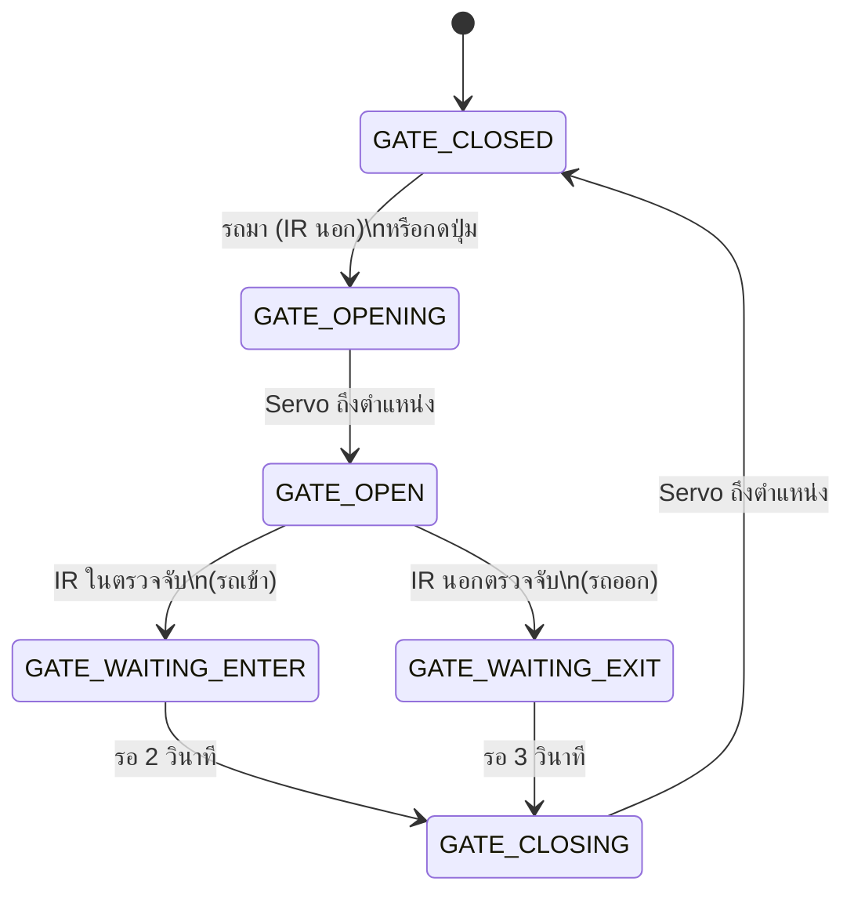

# โปรเจค: ระบบประตูจอดรถอัตโนมัติ

## เกี่ยวกับโปรเจค

ในโปรเจคนี้เราจะสร้าง**ระบบประตูจอดรถอัตโนมัติ (Automatic Parking Gate System)** ที่ใช้เซนเซอร์ตรวจจับรถและควบคุมประตูด้วย Servo Motor


โจทย์


```
เปิดปิดประตูโรงจอดรถอัตโนมัต
1. เมื่อมีรถมาจอดด้านนอกระยะ 20-40cm ให้ประตูเปิด
2. เมื่อรถขยับเข้าไปด้านในจนถึงเซนเซอร์ infrared ให้รอ 2 วินาที จึงสั่งประตูปิด
3. เมื่อจะเอารถออก ให้มีปุ่มกดเพื่อกดให้ประตูเปิด
4. เมื่อรถผ่านเซนเซอร์ด้านนอก ให้รอ 3วินาที จึงสั่งประตูปิด
```


### วัตถุประสงค์
- นำความรู้จากบทที่ผ่านมามาประยุกต์ใช้จริง
- เข้าใจการทำงานแบบ State Machine
- ฝึกการจัดการเวลาด้วย `millis()`
- สร้างระบบที่ตอบสนองต่อเหตุการณ์หลายแบบ

---

## สถานการณ์การทำงาน

### 🚗 Scenario 1: รถเข้าจอด

```
1. รถมาหยุดหน้าประตู (20-40cm)
   → IR Sensor ด้านนอกตรวจจับ
   → ประตูเปิด (Servo 90°)

2. รถขับเข้าไปจนถึงจุดจอด
   → IR Sensor ด้านในตรวจจับ
   → รอ 2 วินาที
   → ประตูปิด (Servo 0°)
```

### 🚗 Scenario 2: รถออกจากที่จอด

```
1. กดปุ่มเพื่อออกจากที่จอด
   → ประตูเปิด (Servo 90°)

2. รถขับออกผ่าน IR Sensor ด้านนอก
   → รอ 3 วินาที
   → ประตูปิด (Servo 0°)
```

---

## อุปกรณ์ที่ใช้

| อุปกรณ์ | จำนวน | หมายเหตุ |
|---------|-------|----------|
| ESP32 DevKit | 1 | |
| Servo Motor SG90 | 1 | สำหรับประตู |
| HC-SR04 Ultrasonic Sensor | 1 | วัดระยะด้านนอก (20-40cm) |
| IR Sensor Module | 1 | ตรวจจับรถด้านใน |
| Push Button | 1 | ใช้ internal pull-up (ไม่ต้อง resistor) |
| LED | 2 | แสดงสถานะ (เขียว=เปิด, แดง=ปิด) |
| Resistor 220Ω | 2 | สำหรับ LED |
| Buzzer (optional) | 1 | เสียงเตือน |

### 📦 Library ที่ต้องติดตั้ง
- **NewPing** (by Tim Eckel) - สำหรับ HC-SR04

---

## ขั้นตอนที่ 1: ทำความเข้าใจเทคนิคที่ใช้

### 1.1 NewPing Library

**ทำไมต้องใช้ NewPing?**

**❌ โค้ดแบบ Raw (ยุ่งยาก):**
```cpp
digitalWrite(TRIG_PIN, LOW);
delayMicroseconds(2);
digitalWrite(TRIG_PIN, HIGH);
delayMicroseconds(10);
digitalWrite(TRIG_PIN, LOW);

long duration = pulseIn(ECHO_PIN, HIGH, 30000);
float distance = duration * 0.0343 / 2;
```

**✅ ใช้ NewPing (สะดวก):**
```cpp
unsigned int distance = sonar.ping_cm();  // เสร็จ!
```

**ข้อดี NewPing:**
- โค้ดสั้นลง 5-10 บรรทัด
- จัดการ timeout อัตโนมัติ
- มี median filter ในตัว
- รองรับหลายเซนเซอร์พร้อมกัน

### 1.2 Internal Pull-up Resistor

**ทำไมไม่ต้องใช้ Resistor ภายนอก?**

**โครงสร้างภายใน ESP32:**
```
        3.3V
         │
    ┌────┴─── Internal Pull-up (เปิด/ปิดได้)
    │
GPIO ───●────[Button]──── GND
    │
   INPUT_PULLUP
```

**การทำงาน:**
```cpp
pinMode(BUTTON_PIN, INPUT_PULLUP);

// ปกติ (ไม่กด):
digitalRead(BUTTON_PIN) == HIGH  (1)

// กดปุ่ม:
digitalRead(BUTTON_PIN) == LOW   (0)
```

**เปรียบเทียบ:**

| External Pull-down | Internal Pull-up |
|-------------------|------------------|
| ต้องใช้ resistor 10KΩ | ไม่ต้องใช้อะไร |
| ต่อปุ่ม: GPIO - Button - VCC | ต่อปุ่ม: GPIO - Button - GND |
| ปกติ = LOW, กด = HIGH | ปกติ = HIGH, กด = LOW |
| ต้องซื้ออะไหล่เพิ่ม | ประหยัดต้นทุน ✨ |

---

## ขั้นตอนที่ 2: การต่อวงจร

### Wiring Diagram

```
ESP32          Components
------         -----------
GPIO 25    →   Servo (Signal) - ประตู

HC-SR04 Ultrasonic (ด้านนอก):
GPIO 5     →   TRIG
GPIO 18    →   ECHO
VCC        →   5V
GND        →   GND

GPIO 32    →   IR Sensor (OUT) - ด้านใน
GPIO 19    →   Button (ต่อปุ่มกับ GND โดยตรง)
GPIO 26    →   LED Green (+ 220Ω → GND)
GPIO 27    →   LED Red (+ 220Ω → GND)
GPIO 14    →   Buzzer (optional)

Power:
5V         →   Servo VCC, HC-SR04 VCC, IR Sensor VCC
GND        →   All GND, Button (one side)
```

### 📌 หมายเหตุการต่อวงจร

**HC-SR04 Ultrasonic:**
- TRIG = ส่งสัญญาณ ultrasonic (10μs pulse)
- ECHO = รับสัญญาณสะท้อน (pulse width = ระยะทาง)
- ใช้ได้ระยะ 2-400cm, แม่นยำ ±3mm
- ติดตั้งหันหน้าออกไปด้านนอกประตู
- ใช้ **NewPing library** ช่วยจัดการ

**Servo Motor:**
- ⚠️ Servo ใช้กระแสสูง ควรใช้แหล่งจ่ายไฟ 5V แยก
- ถ้าใช้ USB ให้ต่อผ่าน USB Hub ที่จ่ายไฟแรง

**IR Sensor (ด้านใน):**
- Active LOW: ตรวจจับได้ = LOW (0), ไม่เจอ = HIGH (1)
- ติดตั้งตรงจุดจอดรถด้านใน

**Button (Internal Pull-up):**
- ต่อปุ่มระหว่าง GPIO 19 กับ GND
- ใช้ `INPUT_PULLUP` ในโค้ด
- ปกติ = HIGH (1), กด = LOW (0)
- **ไม่ต้องใช้ resistor ภายนอก** ✨

---

## State Machine Design

### สถานะของระบบ

```cpp
enum GateState {
  GATE_CLOSED,        // ประตูปิด (รอรถมา)
  GATE_OPENING,       // กำลังเปิดประตู
  GATE_OPEN,          // ประตูเปิดสมบูรณ์
  GATE_WAITING_ENTER, // รอรถเข้าจนถึงด้านใน
  GATE_WAITING_EXIT,  // รอรถออกจนผ่านด้านนอก
  GATE_CLOSING        // กำลังปิดประตู
};
```

### State Diagram



---

## โค้ดโปรแกรม

### ติดตั้ง Library

**NewPing Library:**

1. เปิด Arduino IDE
2. ไปที่ **Sketch** → **Include Library** → **Manage Libraries...**
3. ค้นหา "NewPing"
4. ติดตั้ง **NewPing by Tim Eckel**
5. กด Install

หรือติดตั้งผ่าน PlatformIO:
```ini
lib_deps = 
    teckel/NewPing@^1.9.7
```

---

### Version 0: Simple with delay() - เริ่มต้นแบบง่าย

**สำหรับมือใหม่:** เวอร์ชันนี้ใช้ `delay()` เข้าใจง่าย แต่ขณะรอจะทำอย่างอื่นไม่ได้

```cpp
#include <NewPing.h>

// ===== Pin Definitions =====
const int SERVO_PIN = 25;
const int TRIG_PIN = 5;
const int ECHO_PIN = 18;
const int MAX_DISTANCE = 200;

const int IR_INNER_PIN = 32;
const int BUTTON_PIN = 19;
const int LED_GREEN = 26;
const int LED_RED = 27;

// ===== Distance Settings =====
const int MIN_DISTANCE = 20;
const int MAX_DETECTION = 40;

// ===== NewPing Object =====
NewPing sonar(TRIG_PIN, ECHO_PIN, MAX_DISTANCE);

// ===== Servo Settings =====
const int SERVO_CHANNEL = 0;
const int SERVO_FREQ = 50;
const int SERVO_RESOLUTION = 16;
const int GATE_CLOSED_ANGLE = 0;
const int GATE_OPEN_ANGLE = 90;

void setup() {
  Serial.begin(115200);
  
  pinMode(IR_INNER_PIN, INPUT);
  pinMode(BUTTON_PIN, INPUT_PULLUP);
  pinMode(LED_GREEN, OUTPUT);
  pinMode(LED_RED, OUTPUT);
  
  ledcSetup(SERVO_CHANNEL, SERVO_FREQ, SERVO_RESOLUTION);
  ledcAttachPin(SERVO_PIN, SERVO_CHANNEL);
  
  // เริ่มต้นประตูปิด
  servoWrite(GATE_CLOSED_ANGLE);
  digitalWrite(LED_RED, HIGH);
  digitalWrite(LED_GREEN, LOW);
  
  Serial.println("╔════════════════════════════════════╗");
  Serial.println("║  Parking Gate System v0 (Simple)  ║");
  Serial.println("║  Using delay() - Easy to learn!   ║");
  Serial.println("╚════════════════════════════════════╝");
  Serial.println("System ready.");
  Serial.println("");
}

void servoWrite(int angle) {
  int pulseWidth = map(angle, 0, 180, 500, 2500);
  int dutyCycle = (pulseWidth * 65535) / 20000;
  ledcWrite(SERVO_CHANNEL, dutyCycle);
}

float getDistance() {
  unsigned int distance = sonar.ping_cm();
  return (distance == 0) ? 999.0 : (float)distance;
}

bool isCarAtGate() {
  float distance = getDistance();
  return (distance >= MIN_DISTANCE && distance <= MAX_DETECTION);
}

bool isCarInside() {
  return digitalRead(IR_INNER_PIN) == LOW;
}

bool isButtonPressed() {
  return digitalRead(BUTTON_PIN) == LOW;
}

void openGate() {
  Serial.println("→ Opening gate...");
  digitalWrite(LED_GREEN, HIGH);
  digitalWrite(LED_RED, LOW);
  servoWrite(GATE_OPEN_ANGLE);
  delay(1000);  // รอให้ servo เคลื่อนที่เสร็จ
  Serial.println("✓ Gate OPEN");
}

void closeGate() {
  Serial.println("→ Closing gate...");
  digitalWrite(LED_GREEN, LOW);
  digitalWrite(LED_RED, HIGH);
  servoWrite(GATE_CLOSED_ANGLE);
  delay(1000);  // รอให้ servo เคลื่อนที่เสร็จ
  Serial.println("✓ Gate CLOSED");
}

void loop() {
  // ===== ตรวจสอบรถมาหน้าประตู =====
  if (isCarAtGate() || isButtonPressed()) {
    float distance = getDistance();
    Serial.print("Car detected! Distance: ");
    Serial.print(distance, 1);
    Serial.println(" cm");
    
    openGate();
    
    // ===== รอให้รถเข้าหรือออก =====
    Serial.println("Waiting for car to pass...");
    
    // รอให้รถเคลื่อนที่ผ่านประตู
    delay(2000);
    
    // ตรวจสอบว่ารถเข้าไปด้านในหรือยัง
    if (isCarInside()) {
      Serial.println("→ Car entered (inner sensor)");
      Serial.println("Waiting 2 seconds...");
      delay(2000);  // รอ 2 วินาทีตามที่กำหนด
    } else {
      Serial.println("→ Car exiting");
      Serial.println("Waiting 3 seconds...");
      delay(3000);  // รอ 3 วินาทีตามที่กำหนด
    }
    
    closeGate();
    Serial.println("System ready.");
    Serial.println("");
  }
  
  delay(100);  // เช็คทุก 100ms
}
```

**ข้อดี Version 0:**
- ✅ โค้ดสั้น เข้าใจง่าย
- ✅ ไม่ต้องจัดการ state machine
- ✅ เหมาะสำหรับเริ่มต้นเรียนรู้

**ข้อเสีย Version 0:**
- ❌ ขณะ `delay()` ทำอะไรไม่ได้เลย
- ❌ กดปุ่ม Emergency Stop ไม่ได้
- ❌ ไม่มี countdown แสดง
- ❌ ถ้ารถหยุดตรงประตู อาจปิดทับรถ

---

### Version 1: Basic Implementation (ใช้ millis)

**สำหรับระดับกลาง:** เวอร์ชันนี้ใช้ `millis()` และ State Machine ทำหลายอย่างพร้อมกัน

```cpp
#include <NewPing.h>

// ===== Pin Definitions =====
const int SERVO_PIN = 25;

// HC-SR04 Ultrasonic (ด้านนอก)
const int TRIG_PIN = 5;
const int ECHO_PIN = 18;
const int MAX_DISTANCE = 200;  // Maximum distance (cm) สำหรับ NewPing

const int IR_INNER_PIN = 32;  // เซนเซอร์ด้านใน
const int BUTTON_PIN = 19;    // ใช้ internal pull-up
const int LED_GREEN = 26;
const int LED_RED = 27;

// ===== Distance Threshold =====
const int MIN_DISTANCE = 20;  // 20 cm
const int MAX_DETECTION = 40; // 40 cm

// ===== NewPing Object =====
NewPing sonar(TRIG_PIN, ECHO_PIN, MAX_DISTANCE);

// ===== Servo Settings =====
const int SERVO_CHANNEL = 0;
const int SERVO_FREQ = 50;
const int SERVO_RESOLUTION = 16;

// มุมประตู
const int GATE_CLOSED_ANGLE = 0;   // ปิด
const int GATE_OPEN_ANGLE = 90;    // เปิด

// ===== State Machine =====
enum GateState {
  GATE_CLOSED,
  GATE_OPENING,
  GATE_OPEN,
  GATE_WAITING_ENTER,
  GATE_WAITING_EXIT,
  GATE_CLOSING
};

GateState currentState = GATE_CLOSED;

// ===== Timing =====
unsigned long stateStartTime = 0;
const unsigned long ENTER_DELAY = 2000;  // 2 วินาที
const unsigned long EXIT_DELAY = 3000;   // 3 วินาที
const unsigned long SERVO_MOVE_TIME = 1000;  // เวลาที่ Servo เคลื่อนที่

// ===== Setup =====
void setup() {
  Serial.begin(115200);
  
  // Pin modes
  pinMode(IR_INNER_PIN, INPUT);
  pinMode(BUTTON_PIN, INPUT_PULLUP);  // ใช้ internal pull-up
  pinMode(LED_GREEN, OUTPUT);
  pinMode(LED_RED, OUTPUT);
  
  // Setup Servo
  ledcSetup(SERVO_CHANNEL, SERVO_FREQ, SERVO_RESOLUTION);
  ledcAttachPin(SERVO_PIN, SERVO_CHANNEL);
  
  // เริ่มต้นประตูปิด
  servoWrite(GATE_CLOSED_ANGLE);
  digitalWrite(LED_RED, HIGH);
  digitalWrite(LED_GREEN, LOW);
  
  Serial.println("╔════════════════════════════════════╗");
  Serial.println("║  Automatic Parking Gate System    ║");
  Serial.println("║  + NewPing Library (HC-SR04)      ║");
  Serial.println("║  + Internal Pull-up Button        ║");
  Serial.println("╚════════════════════════════════════╝");
  Serial.println("Distance range: 20-40 cm");
  Serial.println("System ready. Gate CLOSED.");
  Serial.println("");
}

// ===== Servo Control =====
void servoWrite(int angle) {
  // แปลงมุม (0-180°) เป็น duty cycle
  int pulseWidth = map(angle, 0, 180, 500, 2500);
  int dutyCycle = (pulseWidth * 65535) / 20000;
  ledcWrite(SERVO_CHANNEL, dutyCycle);
}

// ===== HC-SR04 with NewPing =====
float getDistance() {
  // NewPing.ping_cm() คืนค่าเป็น cm โดยตรง
  // คืนค่า 0 ถ้าไม่มี echo หรือเกิน MAX_DISTANCE
  unsigned int distance = sonar.ping_cm();
  
  // ถ้าได้ 0 หมายความว่าวัดไม่ได้ ให้คืนค่าสูงมาก
  if (distance == 0) {
    return 999.0;
  }
  
  return (float)distance;
}

// ===== Sensor Reading =====
bool isOuterCarDetected() {
  float distance = getDistance();
  
  // ตรวจสอบว่าอยู่ในช่วง 20-40 cm
  if (distance >= MIN_DISTANCE && distance <= MAX_DETECTION) {
    Serial.print("  [Ultrasonic] Distance: ");
    Serial.print(distance, 1);
    Serial.println(" cm → Car detected!");
    return true;
  }
  return false;
}

bool isInnerCarDetected() {
  return digitalRead(IR_INNER_PIN) == LOW;  // Active LOW
}

bool isButtonPressed() {
  return digitalRead(BUTTON_PIN) == LOW;  // Pull-up: กด = LOW
}

// ===== LED Control =====
void setGateIndicator(bool isOpen) {
  if (isOpen) {
    digitalWrite(LED_GREEN, HIGH);
    digitalWrite(LED_RED, LOW);
  } else {
    digitalWrite(LED_GREEN, LOW);
    digitalWrite(LED_RED, HIGH);
  }
}

// ===== State Machine =====
void updateStateMachine() {
  unsigned long currentTime = millis();
  unsigned long elapsedTime = currentTime - stateStartTime;
  
  switch (currentState) {
    
    // ===== สถานะ: ประตูปิด =====
    case GATE_CLOSED:
      // รอรถมาหน้าประตู (20-40cm) หรือกดปุ่ม
      if (isOuterCarDetected() || isButtonPressed()) {
        Serial.println("→ Event: Car detected / Button pressed");
        Serial.println("→ Action: Opening gate...");
        
        currentState = GATE_OPENING;
        stateStartTime = currentTime;
        servoWrite(GATE_OPEN_ANGLE);
        setGateIndicator(true);
      }
      break;
    
    // ===== สถานะ: กำลังเปิด =====
    case GATE_OPENING:
      // รอให้ Servo เคลื่อนที่เสร็จ
      if (elapsedTime >= SERVO_MOVE_TIME) {
        Serial.println("✓ Gate OPEN");
        Serial.println("");
        
        currentState = GATE_OPEN;
        stateStartTime = currentTime;
      }
      break;
    
    // ===== สถานะ: ประตูเปิดอยู่ =====
    case GATE_OPEN:
      // รอเหตุการณ์: รถเข้าหรือรถออก
      
      // กรณีรถเข้า: ตรวจจับด้านใน
      if (isInnerCarDetected()) {
        Serial.println("→ Event: Car entered (inner sensor)");
        Serial.print("→ Action: Waiting ");
        Serial.print(ENTER_DELAY / 1000);
        Serial.println(" seconds...");
        
        currentState = GATE_WAITING_ENTER;
        stateStartTime = currentTime;
      }
      // กรณีรถออก: ตรวจจับด้านนอก (และไม่ได้กดปุ่มค้างอยู่)
      else if (isOuterCarDetected() && !isButtonPressed()) {
        Serial.println("→ Event: Car exiting (outer sensor)");
        Serial.print("→ Action: Waiting ");
        Serial.print(EXIT_DELAY / 1000);
        Serial.println(" seconds...");
        
        currentState = GATE_WAITING_EXIT;
        stateStartTime = currentTime;
      }
      break;
    
    // ===== สถานะ: รอรถเข้า =====
    case GATE_WAITING_ENTER:
      if (elapsedTime >= ENTER_DELAY) {
        Serial.println("→ Action: Closing gate...");
        
        currentState = GATE_CLOSING;
        stateStartTime = currentTime;
        servoWrite(GATE_CLOSED_ANGLE);
        setGateIndicator(false);
      }
      break;
    
    // ===== สถานะ: รอรถออก =====
    case GATE_WAITING_EXIT:
      if (elapsedTime >= EXIT_DELAY) {
        Serial.println("→ Action: Closing gate...");
        
        currentState = GATE_CLOSING;
        stateStartTime = currentTime;
        servoWrite(GATE_CLOSED_ANGLE);
        setGateIndicator(false);
      }
      break;
    
    // ===== สถานะ: กำลังปิด =====
    case GATE_CLOSING:
      // รอให้ Servo เคลื่อนที่เสร็จ
      if (elapsedTime >= SERVO_MOVE_TIME) {
        Serial.println("✓ Gate CLOSED");
        Serial.println("System ready.");
        Serial.println("");
        
        currentState = GATE_CLOSED;
        stateStartTime = currentTime;
      }
      break;
  }
}

// ===== Main Loop =====
void loop() {
  updateStateMachine();
  delay(100);  // เช็คทุก 100ms
}
```

---

## Version 2: เพิ่ม Buzzer และ Safety Features

```cpp
#include <NewPing.h>

// ===== Pin Definitions =====
const int SERVO_PIN = 25;
const int TRIG_PIN = 5;
const int ECHO_PIN = 18;
const int MAX_DISTANCE = 200;

const int IR_INNER_PIN = 32;
const int BUTTON_PIN = 19;  // Internal pull-up
const int LED_GREEN = 26;
const int LED_RED = 27;
const int BUZZER_PIN = 14;  // เพิ่ม Buzzer

// ===== Distance Settings =====
const int MIN_DISTANCE = 20;
const int MAX_DETECTION = 40;

// ===== NewPing Object =====
NewPing sonar(TRIG_PIN, ECHO_PIN, MAX_DISTANCE);

// ===== เพิ่ม Safety =====
bool emergencyStop = false;

// (Servo settings เหมือนเดิม...)
const int SERVO_CHANNEL = 0;
const int SERVO_FREQ = 50;
const int SERVO_RESOLUTION = 16;
const int GATE_CLOSED_ANGLE = 0;
const int GATE_OPEN_ANGLE = 90;

// (State machine เหมือนเดิม...)
enum GateState {
  GATE_CLOSED,
  GATE_OPENING,
  GATE_OPEN,
  GATE_WAITING_ENTER,
  GATE_WAITING_EXIT,
  GATE_CLOSING
};

GateState currentState = GATE_CLOSED;

unsigned long stateStartTime = 0;
const unsigned long ENTER_DELAY = 2000;
const unsigned long EXIT_DELAY = 3000;
const unsigned long SERVO_MOVE_TIME = 1000;

void setup() {
  Serial.begin(115200);
  
  pinMode(IR_INNER_PIN, INPUT);
  pinMode(BUTTON_PIN, INPUT_PULLUP);  // Internal pull-up
  pinMode(LED_GREEN, OUTPUT);
  pinMode(LED_RED, OUTPUT);
  pinMode(BUZZER_PIN, OUTPUT);
  
  ledcSetup(SERVO_CHANNEL, SERVO_FREQ, SERVO_RESOLUTION);
  ledcAttachPin(SERVO_PIN, SERVO_CHANNEL);
  
  servoWrite(GATE_CLOSED_ANGLE);
  digitalWrite(LED_RED, HIGH);
  digitalWrite(LED_GREEN, LOW);
  
  Serial.println("╔════════════════════════════════════╗");
  Serial.println("║  Parking Gate System v2.0          ║");
  Serial.println("║  + NewPing (HC-SR04)              ║");
  Serial.println("║  + Internal Pull-up Button        ║");
  Serial.println("║  + Buzzer Alert                    ║");
  Serial.println("║  + Safety Features                 ║");
  Serial.println("╚════════════════════════════════════╝");
  Serial.println("Commands: 'S' = Emergency Stop");
  Serial.println("");
}

// ===== Servo Control =====
void servoWrite(int angle) {
  int pulseWidth = map(angle, 0, 180, 500, 2500);
  int dutyCycle = (pulseWidth * 65535) / 20000;
  ledcWrite(SERVO_CHANNEL, dutyCycle);
}

// ===== HC-SR04 with NewPing (Averaging) =====
float getDistance() {
  const int NUM_SAMPLES = 3;
  unsigned int sum = 0;
  int validSamples = 0;
  
  for (int i = 0; i < NUM_SAMPLES; i++) {
    delay(29);  // NewPing แนะนำให้ delay 29ms ระหว่างการวัด
    unsigned int distance = sonar.ping_cm();
    
    if (distance > 0) {  // 0 = ไม่ได้รับ echo
      sum += distance;
      validSamples++;
    }
  }
  
  if (validSamples > 0) {
    return (float)sum / validSamples;
  }
  return 999.0;  // Error value
}

bool isOuterCarDetected() {
  float distance = getDistance();
  
  // เพิ่ม hysteresis เพื่อป้องกัน false trigger
  static bool wasDetected = false;
  static unsigned long lastDetectionTime = 0;
  
  bool inRange = (distance >= MIN_DISTANCE && distance <= MAX_DETECTION);
  
  if (inRange) {
    if (!wasDetected || (millis() - lastDetectionTime > 500)) {
      Serial.print("  [Ultrasonic] Distance: ");
      Serial.print(distance, 1);
      Serial.println(" cm → Car detected!");
      wasDetected = true;
      lastDetectionTime = millis();
    }
    return true;
  } else {
    if (wasDetected && distance > MAX_DETECTION + 10) {
      Serial.println("  [Ultrasonic] Car left detection zone");
      wasDetected = false;
    }
    return false;
  }
}

bool isInnerCarDetected() {
  return digitalRead(IR_INNER_PIN) == LOW;
}

bool isButtonPressed() {
  return digitalRead(BUTTON_PIN) == LOW;  // Pull-up: กด = LOW
}

void setGateIndicator(bool isOpen) {
  if (isOpen) {
    digitalWrite(LED_GREEN, HIGH);
    digitalWrite(LED_RED, LOW);
  } else {
    digitalWrite(LED_GREEN, LOW);
    digitalWrite(LED_RED, HIGH);
  }
}

// ===== Buzzer Functions =====
void beepShort() {
  tone(BUZZER_PIN, 1000, 100);  // 1kHz, 100ms
}

void beepLong() {
  tone(BUZZER_PIN, 800, 500);   // 800Hz, 500ms
}

void beepWarning() {
  for (int i = 0; i < 3; i++) {
    tone(BUZZER_PIN, 1500);
    delay(100);
    noTone(BUZZER_PIN);
    delay(100);
  }
}

// ===== Serial Commands =====
void checkSerialCommands() {
  if (Serial.available()) {
    char cmd = Serial.read();
    if (cmd == 'S' || cmd == 's') {
      emergencyStop = !emergencyStop;
      if (emergencyStop) {
        Serial.println("⚠️  EMERGENCY STOP ACTIVATED!");
        beepWarning();
      } else {
        Serial.println("✓ Emergency stop cleared.");
        beepShort();
      }
    }
  }
}

// ===== Updated State Machine =====
void updateStateMachine() {
  // ตรวจสอบ Emergency Stop
  if (emergencyStop) {
    digitalWrite(LED_GREEN, LOW);
    digitalWrite(LED_RED, HIGH);
    
    static unsigned long lastBlink = 0;
    if (millis() - lastBlink > 500) {
      digitalWrite(LED_RED, !digitalRead(LED_RED));
      lastBlink = millis();
    }
    return;
  }
  
  unsigned long currentTime = millis();
  unsigned long elapsedTime = currentTime - stateStartTime;
  
  switch (currentState) {
    
    case GATE_CLOSED:
      if (isOuterCarDetected() || isButtonPressed()) {
        Serial.println("→ Event: Car detected / Button pressed");
        Serial.println("→ Action: Opening gate...");
        beepShort();
        
        currentState = GATE_OPENING;
        stateStartTime = currentTime;
        servoWrite(GATE_OPEN_ANGLE);
        setGateIndicator(true);
      }
      break;
    
    case GATE_OPENING:
      if (elapsedTime >= SERVO_MOVE_TIME) {
        Serial.println("✓ Gate OPEN");
        beepLong();
        Serial.println("");
        
        currentState = GATE_OPEN;
        stateStartTime = currentTime;
      }
      break;
    
    case GATE_OPEN:
      // Safety: ถ้ามีรถอยู่ตรงประตู ห้ามปิด
      float outerDistance = getDistance();
      if (outerDistance < MIN_DISTANCE && isInnerCarDetected()) {
        static unsigned long lastWarning = 0;
        if (currentTime - lastWarning > 2000) {
          Serial.println("⚠️  WARNING: Car at gate position!");
          Serial.print("  Distance: ");
          Serial.print(outerDistance, 1);
          Serial.println(" cm (too close!)");
          beepWarning();
          lastWarning = currentTime;
        }
        break;
      }
      
      if (isInnerCarDetected()) {
        Serial.println("→ Event: Car entered (inner sensor)");
        Serial.print("→ Action: Waiting ");
        Serial.print(ENTER_DELAY / 1000);
        Serial.println(" seconds...");
        beepShort();
        
        currentState = GATE_WAITING_ENTER;
        stateStartTime = currentTime;
      }
      else if (isOuterCarDetected() && !isButtonPressed()) {
        Serial.println("→ Event: Car exiting (outer sensor)");
        Serial.print("→ Action: Waiting ");
        Serial.print(EXIT_DELAY / 1000);
        Serial.println(" seconds...");
        beepShort();
        
        currentState = GATE_WAITING_EXIT;
        stateStartTime = currentTime;
      }
      break;
    
    case GATE_WAITING_ENTER:
      static int lastSecond = -1;
      int remainingSeconds = (ENTER_DELAY - elapsedTime) / 1000;
      if (remainingSeconds != lastSecond && remainingSeconds >= 0) {
        Serial.print("  Closing in ");
        Serial.print(remainingSeconds);
        Serial.println("...");
        lastSecond = remainingSeconds;
      }
      
      if (elapsedTime >= ENTER_DELAY) {
        Serial.println("→ Action: Closing gate...");
        beepShort();
        
        currentState = GATE_CLOSING;
        stateStartTime = currentTime;
        servoWrite(GATE_CLOSED_ANGLE);
        setGateIndicator(false);
        lastSecond = -1;
      }
      break;
    
    case GATE_WAITING_EXIT:
      static int lastSecondExit = -1;
      int remainingSecondsExit = (EXIT_DELAY - elapsedTime) / 1000;
      if (remainingSecondsExit != lastSecondExit && remainingSecondsExit >= 0) {
        Serial.print("  Closing in ");
        Serial.print(remainingSecondsExit);
        Serial.println("...");
        lastSecondExit = remainingSecondsExit;
      }
      
      if (elapsedTime >= EXIT_DELAY) {
        Serial.println("→ Action: Closing gate...");
        beepShort();
        
        currentState = GATE_CLOSING;
        stateStartTime = currentTime;
        servoWrite(GATE_CLOSED_ANGLE);
        setGateIndicator(false);
        lastSecondExit = -1;
      }
      break;
    
    case GATE_CLOSING:
      if (elapsedTime >= SERVO_MOVE_TIME) {
        Serial.println("✓ Gate CLOSED");
        beepLong();
        Serial.println("System ready.");
        Serial.println("");
        
        currentState = GATE_CLOSED;
        stateStartTime = currentTime;
      }
      break;
  }
}

void loop() {
  checkSerialCommands();
  updateStateMachine();
  delay(100);
}
```

---

## Version 3: LCD Display Integration

```cpp
#include <Wire.h>
#include <LiquidCrystal_I2C.h>

LiquidCrystal_I2C lcd(0x27, 16, 2);

// Custom characters
byte carChar[] = {
  0b00000,
  0b01110,
  0b11111,
  0b10101,
  0b11111,
  0b01110,
  0b00000,
  0b00000
};

byte arrowRightChar[] = {
  0b00000,
  0b00100,
  0b00010,
  0b11111,
  0b00010,
  0b00100,
  0b00000,
  0b00000
};

void setup() {
  // ... (เหมือนเดิม) ...
  
  // LCD setup
  lcd.init();
  lcd.backlight();
  lcd.createChar(0, carChar);
  lcd.createChar(1, arrowRightChar);
  
  lcd.setCursor(0, 0);
  lcd.print("Parking Gate");
  lcd.setCursor(0, 1);
  lcd.print("System Ready");
  delay(2000);
  lcd.clear();
}

void updateLCD() {
  static GateState lastDisplayedState = GATE_CLOSED;
  
  // อัปเดตเมื่อสถานะเปลี่ยน
  if (currentState != lastDisplayedState) {
    lcd.clear();
    
    switch (currentState) {
      case GATE_CLOSED:
        lcd.setCursor(0, 0);
        lcd.print("Gate: CLOSED");
        lcd.setCursor(0, 1);
        lcd.print("Waiting...");
        break;
        
      case GATE_OPENING:
      case GATE_OPEN:
        lcd.setCursor(0, 0);
        lcd.print("Gate: OPEN");
        lcd.setCursor(0, 1);
        lcd.write(0);  // Car icon
        lcd.print(" Drive through");
        break;
        
      case GATE_WAITING_ENTER:
        lcd.setCursor(0, 0);
        lcd.print("Car entered");
        lcd.setCursor(0, 1);
        lcd.write(1);  // Arrow
        lcd.print(" Closing...");
        break;
        
      case GATE_WAITING_EXIT:
        lcd.setCursor(0, 0);
        lcd.print("Car exiting");
        lcd.setCursor(0, 1);
        lcd.write(1);  // Arrow
        lcd.print(" Closing...");
        break;
        
      case GATE_CLOSING:
        lcd.setCursor(0, 0);
        lcd.print("Gate: CLOSING");
        lcd.setCursor(0, 1);
        lcd.print("Please wait");
        break;
    }
    
    lastDisplayedState = currentState;
  }
  
  // แสดง countdown สำหรับ waiting states
  if (currentState == GATE_WAITING_ENTER || currentState == GATE_WAITING_EXIT) {
    unsigned long delay = (currentState == GATE_WAITING_ENTER) ? ENTER_DELAY : EXIT_DELAY;
    int remaining = (delay - (millis() - stateStartTime)) / 1000;
    
    if (remaining >= 0) {
      lcd.setCursor(14, 1);
      lcd.print(remaining);
      lcd.print("s");
    }
  }
}

void loop() {
  checkSerialCommands();
  updateStateMachine();
  updateLCD();  // เพิ่มการอัปเดต LCD
  delay(50);
}
```

---

## การทดสอบ

### Test Cases

#### Test 1: รถเข้าจอดปกติ
1. วางวัตถุหน้า HC-SR04 ระยะ 20-40cm
2. **Expected:** ประตูเปิด, LED เขียวติด, Buzzer beep
3. เลื่อนวัตถุไปด้านใน (IR ด้านใน)
4. **Expected:** รอ 2 วินาที, ประตูปิด

#### Test 2: รถออกจากที่จอด
1. กดปุ่ม
2. **Expected:** ประตูเปิด
3. เลื่อนวัตถุผ่าน HC-SR04 (20-40cm)
4. **Expected:** รอ 3 วินาที, ประตูปิด

#### Test 3: ทดสอบระยะตรวจจับ
1. วางวัตถุที่ 10cm → **Expected:** ไม่เปิดประตู (ใกล้เกินไป)
2. วางวัตถุที่ 30cm → **Expected:** เปิดประตู (ในช่วง)
3. วางวัตถุที่ 50cm → **Expected:** ไม่เปิดประตู (ไกลเกินไป)

#### Test 4: Safety - รถหยุดตรงประตู
1. วางวัตถุที่ 30cm → ประตูเปิด
2. วางวัตถุที่ < 20cm พร้อมกับ IR ด้านในตรวจจับ
3. **Expected:** ไม่ปิดประตู, แสดงคำเตือน "Car at gate position!"

#### Test 5: Emergency Stop
1. ส่งคำสั่ง 'S' ผ่าน Serial
2. **Expected:** ระบบหยุดทำงาน, LED แดงกระพริบ
3. ส่ง 'S' อีกครั้ง
4. **Expected:** กลับมาทำงานปกติ

---

## การปรับแต่งเพิ่มเติม

### 1. ปรับระยะตรวจจับตามสภาพแวดล้อม
```cpp
// ปรับค่าตามความเหมาะสม
const int MIN_DISTANCE = 15;  // ลดลงถ้าต้องการตรวจจับเร็วขึ้น
const int MAX_DISTANCE = 50;  // เพิ่มขึ้นสำหรับพื้นที่กว้าง

// เพิ่ม hysteresis zone
const int HYSTERESIS = 5;  // 5cm buffer zone

bool isOuterCarDetected() {
  static bool lastState = false;
  float distance = getDistance();
  
  if (!lastState && distance >= MIN_DISTANCE && distance <= MAX_DISTANCE) {
    lastState = true;
    return true;
  }
  else if (lastState && distance > MAX_DISTANCE + HYSTERESIS) {
    lastState = false;
    return false;
  }
  
  return lastState;
}
```

### 2. แสดงระยะทางแบบ Real-time
```cpp
void displayDistanceMonitor() {
  static unsigned long lastDisplay = 0;
  
  if (millis() - lastDisplay > 500) {
    unsigned int distance = sonar.ping_cm();
    
    if (distance == 0) {
      Serial.println("[Distance Monitor] Out of range");
    } else {
      Serial.print("[Distance Monitor] ");
      Serial.print(distance);
      Serial.print(" cm  ");
      
      // Visual bar
      if (distance < MIN_DISTANCE) {
        Serial.println("[TOO CLOSE]");
      } else if (distance <= MAX_DETECTION) {
        Serial.print("[IN RANGE] ");
        int bars = map(distance, MIN_DISTANCE, MAX_DETECTION, 20, 0);
        for (int i = 0; i < bars; i++) Serial.print("█");
        Serial.println();
      } else {
        Serial.println("[OUT OF RANGE]");
      }
    }
    
    lastDisplay = millis();
  }
}

void loop() {
  displayDistanceMonitor();  // เพิ่มใน loop
  checkSerialCommands();
  updateStateMachine();
  delay(100);
}
```

### 3. เพิ่ม Button Debouncing
```cpp
bool isButtonPressed() {
  static bool lastButtonState = HIGH;  // Pull-up: ปกติ HIGH
  static unsigned long lastDebounceTime = 0;
  const unsigned long DEBOUNCE_DELAY = 50;
  
  bool reading = digitalRead(BUTTON_PIN);
  
  if (reading != lastButtonState) {
    lastDebounceTime = millis();
  }
  
  bool buttonPressed = false;
  if ((millis() - lastDebounceTime) > DEBOUNCE_DELAY) {
    if (reading == LOW) {  // Pull-up: กด = LOW
      buttonPressed = true;
    }
  }
  
  lastButtonState = reading;
  return buttonPressed;
}
```

### 2. เพิ่มการนับจำนวนรถ
```cpp
int carsInside = 0;

// ในสถานะ GATE_WAITING_ENTER
carsInside++;
Serial.print("Cars inside: ");
Serial.println(carsInside);

// ในสถานะ GATE_WAITING_EXIT
carsInside--;
Serial.print("Cars inside: ");
Serial.println(carsInside);
```

### 3. บันทึกเวลาเข้า-ออก
```cpp
struct ParkingLog {
  unsigned long entryTime;
  unsigned long exitTime;
  int duration;  // นาที
};

ParkingLog logs[10];
int logIndex = 0;
```

### 4. เพิ่มโหมดกลางคืน (Night Mode)
```cpp
bool isNightMode = false;

void checkNightMode() {
  int lightLevel = analogRead(LDR_PIN);  // ใช้ LDR
  isNightMode = (lightLevel < 500);
  
  if (isNightMode) {
    // ลด delay ให้เร็วขึ้น
    ENTER_DELAY = 1000;
    EXIT_DELAY = 2000;
  }
}
```

---

## แบบฝึกหัด

### Challenge 1: Full Indicator
เพิ่มสถานะ "FULL" เมื่อมีรถจอดครบ
- ถ้ามีรถภายใน ≥ 5 คัน → ไม่เปิดประตู
- แสดงข้อความ "Parking Full" บน LCD

### Challenge 2: RFID Access
เพิ่มการตรวจสอบสิทธิ์ด้วย RFID
- เปิดประตูได้เฉพาะ card ที่ลงทะเบียน
- บันทึก user ที่เข้า-ออก

### Challenge 3: Web Dashboard
สร้าง Web Server แสดงข้อมูล
- สถานะประตูปัจจุบัน
- จำนวนรถในลาน
- Log เข้า-ออก

### Challenge 4: Multiple Gates
ขยายเป็น 2 ประตู (เข้า/ออกแยก)
- ใช้ Servo 2 ตัว
- ควบคุมอิสระกัน

---

## สรุป

ในโปรเจคนี้เราได้เรียนรู้:
- ✅ การประยุกต์ใช้เซนเซอร์หลายตัวร่วมกัน
- ✅ State Machine สำหรับควบคุมลำดับการทำงาน
- ✅ การจัดการเวลาด้วย `millis()`
- ✅ Safety features และ error handling
- ✅ User feedback (LED, Buzzer, LCD)
- ✅ Serial debugging และ commands

**ทักษะที่ได้:**
- System design และ flowchart
- Event-driven programming
- Multi-sensor coordination
- Real-world problem solving

---

**หน้าถัดไป:** [Module 3: การเขียนโค้ดขั้นสูง →](08-define-const.md)

**หน้าก่อน:** [← บทที่ 7.7: Relay Module](07.7-relay-module.md)

**กลับหน้าแรก:** [← กลับไปหน้าหลักสูตร](../index.md)
