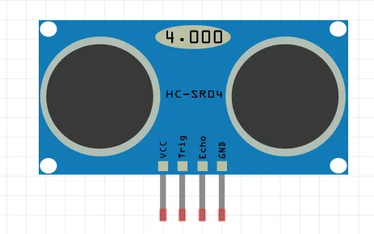
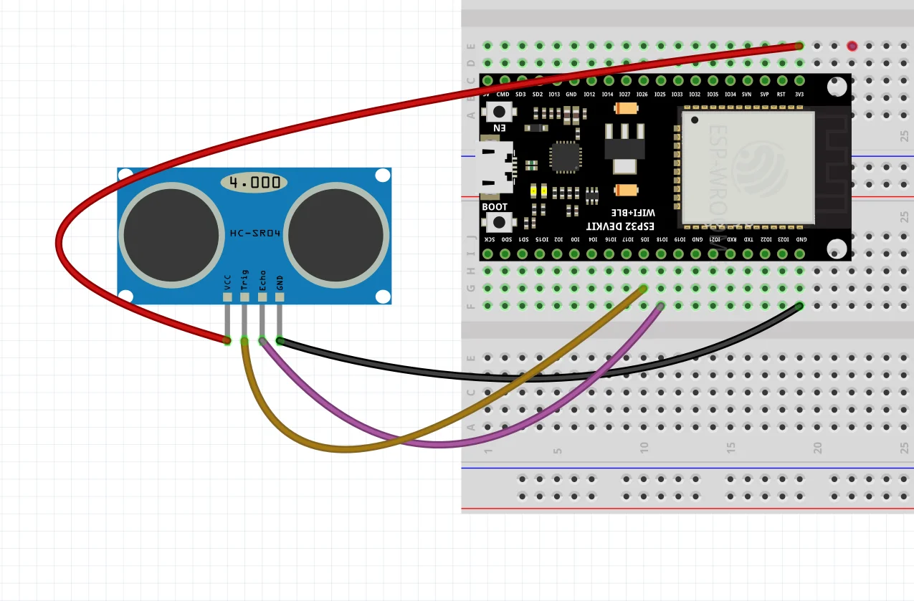
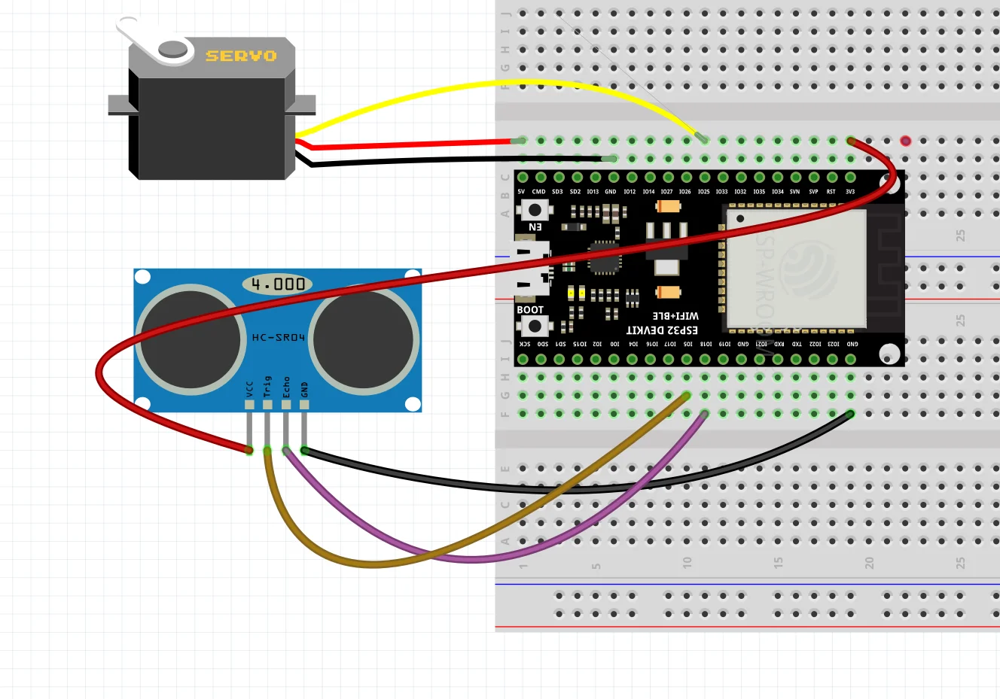

# บทที่ 8: Ultrasonic Sensor (HC-SR04)

## วัตถุประสงค์
- เข้าใจหลักการทำงานของเซนเซอร์ Ultrasonic
- ใช้ NewPing Library วัดระยะทาง
- สร้างโปรเจค**ถังขยะอัตโนมัติ** (Ultrasonic + Servo)
- แสดงระยะทางแบบ Real-time

---

## อุปกรณ์ที่ใช้
- ESP32 Development Board
- HC-SR04 Ultrasonic Sensor
- Servo Motor SG90
- สายจัมเปอร์

---

## ทฤษฎี: Ultrasonic Sensor (HC-SR04)

### การทำงาน

**Ultrasonic** = เซนเซอร์ที่ใช้**คลื่นเสียงความถี่สูง** (40kHz) วัดระยะทาง


 


**หลักการ:**
1. ส่ง Pulse ไปที่ขา **TRIG** (10μs)
2. เซนเซอร์ส่งคลื่นเสียง 40kHz ออกไป
3. คลื่นเสียงสะท้อนกลับมาเมื่อชนวัตถุ
4. ขา **ECHO** จะเป็น HIGH ตามเวลาที่คลื่นเดินทาง
5. คำนวณระยะทาง:

$$
\text{Distance (cm)} = \frac{\text{Time (μs)}}{58}
$$

หรือ

$$
\text{Distance (cm)} = \frac{\text{Time (μs)} \times 0.0343}{2}
$$

---

### ช่วงการวัด

| คุณสมบัติ | ค่า |
|----------|-----|
| **ระยะขั้นต่ำ** | 2 cm |
| **ระยะสูงสุด** | 400 cm |
| **มุมการวัด** | ≤ 15° |
| **ความถี่** | 40 kHz |
| **แรงดัน** | 5V |

---

## การใช้ NewPing Library

### ทำไมต้องใช้ Library?

**ไม่ใช้ Library:**
```cpp
digitalWrite(TRIG, LOW);
delayMicroseconds(2);
digitalWrite(TRIG, HIGH);
delayMicroseconds(10);
digitalWrite(TRIG, LOW);
duration = pulseIn(ECHO, HIGH);
distance = duration / 58;
```
→ โค้ดยาว, ซับซ้อน

**ใช้ NewPing Library:**
```cpp
distance = sonar.ping_cm();
```
→ โค้ดสั้น, เข้าใจง่าย ✨

### ติดตั้ง Library

1. เปิด Arduino IDE
2. ไปที่ **Sketch → Include Library → Manage Libraries**
3. ค้นหา **"NewPing"**
4. คลิก **Install**

---

## ตัวอย่าง 1: วัดระยะทางด้วย NewPing

### วงจร

```
ESP32              HC-SR04
GPIO 5  ────────── TRIG
GPIO 18 ────────── ECHO
5V ────────────── VCC
GND ────────────── GND
```




### โค้ด

```cpp
#include <NewPing.h>

const int TRIG_PIN = 5;
const int ECHO_PIN = 18;
const int MAX_DISTANCE = 400;  // ระยะสูงสุด (cm)

NewPing sonar(TRIG_PIN, ECHO_PIN, MAX_DISTANCE);

void setup() {
  Serial.begin(115200);
  Serial.println("HC-SR04 Ultrasonic Sensor");
}

void loop() {
  int distance = sonar.ping_cm();
  
  if(distance == 0) {
    Serial.println("Out of range");
  }
  else {
    Serial.print("Distance: ");
    Serial.print(distance);
    Serial.println(" cm");
  }
  
  delay(500);
}
```

### ผลลัพธ์

```
HC-SR04 Ultrasonic Sensor
Distance: 15 cm
Distance: 23 cm
Distance: 45 cm
Out of range  ← วัตถุไกลเกิน 400cm หรือไม่มีวัตถุ
Distance: 10 cm
```

---

## ตัวอย่าง 2: แสดงระยะทางแบบ Bar Graph

### วงจร

เหมือนตัวอย่างที่ 1

### โค้ด

```cpp
#include <NewPing.h>

const int TRIG_PIN = 5;
const int ECHO_PIN = 18;
const int MAX_DISTANCE = 100;  // จำกัดที่ 100cm

NewPing sonar(TRIG_PIN, ECHO_PIN, MAX_DISTANCE);

void setup() {
  Serial.begin(115200);
  Serial.println("Distance Bar Graph");
}

void loop() {
  int distance = sonar.ping_cm();
  
  if(distance > 0) {
    Serial.print(distance);
    Serial.print(" cm ");
    
    // แสดง Bar Graph
    for(int i = 0; i < distance; i += 2) {
      Serial.print("█");
    }
    Serial.println();
  }
  
  delay(300);
}
```

### ผลลัพธ์

```
Distance Bar Graph
15 cm ███████
25 cm ████████████
40 cm ████████████████████
10 cm █████
```

---

## ตัวอย่าง 3: Proximity Alert (แจ้งเตือนเมื่อใกล้)

### วงจร

```
ESP32              HC-SR04
GPIO 5  ────────── TRIG
GPIO 18 ────────── ECHO
5V ────────────── VCC
GND ────────────── GND

GPIO 25 ────┬─── LED (+)
            │
           220Ω
            │
           GND
```

### โค้ด

```cpp
#include <NewPing.h>

const int TRIG_PIN = 5;
const int ECHO_PIN = 18;
const int LED_PIN = 25;
const int MAX_DISTANCE = 400;

const int THRESHOLD = 20;  // แจ้งเตือนเมื่อใกล้กว่า 20cm

NewPing sonar(TRIG_PIN, ECHO_PIN, MAX_DISTANCE);

void setup() {
  Serial.begin(115200);
  pinMode(LED_PIN, OUTPUT);
  
  Serial.println("Proximity Alert System");
  Serial.println("Threshold: 20 cm");
}

void loop() {
  int distance = sonar.ping_cm();
  
  if(distance > 0 && distance < THRESHOLD) {
    digitalWrite(LED_PIN, HIGH);
    
    Serial.print("⚠️  WARNING! ");
    Serial.print(distance);
    Serial.println(" cm - TOO CLOSE!");
  }
  else {
    digitalWrite(LED_PIN, LOW);
    
    if(distance > 0) {
      Serial.print("✅ Safe: ");
      Serial.print(distance);
      Serial.println(" cm");
    }
  }
  
  delay(200);
}
```

### ผลลัพธ์

```
Proximity Alert System
Threshold: 20 cm
✅ Safe: 45 cm
✅ Safe: 30 cm
✅ Safe: 25 cm
⚠️  WARNING! 15 cm - TOO CLOSE!  ← LED ติด
⚠️  WARNING! 10 cm - TOO CLOSE!
✅ Safe: 35 cm  ← LED ดับ
```

---

## โปรเจค: ถังขยะอัตโนมัติ 🗑️

### ทฤษฎี

**ถังขยะอัตโนมัติ** เปิดฝาอัตโนมัติเมื่อมีคนเข้าใกล้

**การทำงาน:**
1. วัดระยะทางด้วย Ultrasonic
2. ถ้าใกล้กว่า 20cm → เปิดฝา (Servo 90°)
3. รอ 3 วินาที
4. ปิดฝา (Servo 0°)

### วงจร

```
ESP32              HC-SR04
GPIO 5  ────────── TRIG
GPIO 18 ────────── ECHO
5V ────────────── VCC
GND ────────────── GND

GPIO 25 ──────────── Servo Signal
5V ─────────────────  Servo VCC
GND ─────────────────  Servo GND
```




### โค้ด

```cpp
#include <NewPing.h>

const int TRIG_PIN = 5;
const int ECHO_PIN = 18;
const int SERVO_PIN = 25;
const int MAX_DISTANCE = 400;

const int THRESHOLD = 20;  // เปิดฝาเมื่อใกล้กว่า 20cm
const int OPEN_TIME = 3000; // เปิดฝาค้าง 3 วินาที

const int PWM_CHANNEL = 0;

NewPing sonar(TRIG_PIN, ECHO_PIN, MAX_DISTANCE);

bool isOpen = false;
unsigned long openTime = 0;

void setup() {
  Serial.begin(115200);
  
  // ตั้งค่า Servo
  ledcSetup(PWM_CHANNEL, 50, 16);
  ledcAttachPin(SERVO_PIN, PWM_CHANNEL);
  
  closeLid();  // เริ่มต้นปิดฝา
  
  Serial.println("🗑️  Automatic Trash Bin");
  Serial.println("Approach within 20cm to open");
}

void loop() {
  int distance = sonar.ping_cm();
  
  if(distance > 0) {
    Serial.print("Distance: ");
    Serial.print(distance);
    Serial.println(" cm");
    
    // เปิดฝาเมื่อใกล้กว่า THRESHOLD
    if(distance < THRESHOLD && !isOpen) {
      openLid();
      openTime = millis();
      isOpen = true;
    }
  }
  
  // ปิดฝาหลังจากเวลาผ่านไป
  if(isOpen && (millis() - openTime >= OPEN_TIME)) {
    closeLid();
    isOpen = false;
  }
  
  delay(200);
}

void openLid() {
  Serial.println("🔓 Opening lid...");
  for(int angle = 0; angle <= 90; angle += 3) {
    servoWrite(angle);
    delay(15);
  }
  Serial.println("✅ Lid OPEN");
}

void closeLid() {
  Serial.println("🔒 Closing lid...");
  for(int angle = 90; angle >= 0; angle -= 3) {
    servoWrite(angle);
    delay(15);
  }
  Serial.println("✅ Lid CLOSED");
}

void servoWrite(int angle) {
  if(angle < 0) angle = 0;
  if(angle > 180) angle = 180;
  
  int pulseWidth = map(angle, 0, 180, 500, 2500);
  int duty = (pulseWidth * 65536) / 20000;
  
  ledcWrite(PWM_CHANNEL, duty);
}
```

### ผลลัพธ์

```
🗑️  Automatic Trash Bin
Approach within 20cm to open
Distance: 45 cm
Distance: 30 cm
Distance: 18 cm  ← ใกล้กว่า 20cm
🔓 Opening lid...
✅ Lid OPEN
Distance: 15 cm
Distance: 12 cm
Distance: 50 cm  ← ออกไป (รอ 3 วินาที)
🔒 Closing lid...
✅ Lid CLOSED
```

**การทำงาน:**
- เมื่อมีคนเข้าใกล้ (< 20cm) → ฝาเปิดอัตโนมัติ
- รอ 3 วินาที → ฝาปิดอัตโนมัติ
- Servo หมุนแบบ Smooth (ไม่กระตุก)

---

## ตัวอย่าง 5: ถังขยะอัตโนมัติ (ปรับปรุง - ตรวจจับต่อเนื่อง)

### ปรับปรุงอะไร?

**ปัญหาเดิม:** ถ้าคนยังยืนอยู่ ฝาจะปิดทั้งที่ยังไม่ได้ทิ้งขยะ

**แก้ไข:** ตรวจจับต่อเนื่อง ถ้ายังมีคนอยู่ → **รีเซ็ตเวลา** (ไม่ปิดฝา)

### โค้ด

```cpp
#include <NewPing.h>

const int TRIG_PIN = 5;
const int ECHO_PIN = 18;
const int SERVO_PIN = 25;
const int MAX_DISTANCE = 400;

const int THRESHOLD = 20;
const int CLOSE_DELAY = 3000;  // ปิดหลังจากไม่เจอคน 3 วินาที

const int PWM_CHANNEL = 0;

NewPing sonar(TRIG_PIN, ECHO_PIN, MAX_DISTANCE);

bool isOpen = false;
unsigned long lastDetectionTime = 0;

void setup() {
  Serial.begin(115200);
  
  ledcSetup(PWM_CHANNEL, 50, 16);
  ledcAttachPin(SERVO_PIN, PWM_CHANNEL);
  
  closeLid();
  
  Serial.println("🗑️  Smart Automatic Trash Bin");
  Serial.println("Lid stays open while you're near");
}

void loop() {
  int distance = sonar.ping_cm();
  
  if(distance > 0) {
    Serial.print("Distance: ");
    Serial.print(distance);
    Serial.println(" cm");
    
    if(distance < THRESHOLD) {
      // ตรวจพบคน → อัปเดตเวลา
      lastDetectionTime = millis();
      
      if(!isOpen) {
        openLid();
        isOpen = true;
      }
      else {
        Serial.println("👤 Person detected - keeping lid open");
      }
    }
  }
  
  // ปิดฝาถ้าไม่เจอคนเกิน CLOSE_DELAY
  if(isOpen && (millis() - lastDetectionTime >= CLOSE_DELAY)) {
    closeLid();
    isOpen = false;
  }
  
  delay(200);
}

void openLid() {
  Serial.println("🔓 Opening lid...");
  for(int angle = 0; angle <= 90; angle += 3) {
    servoWrite(angle);
    delay(15);
  }
  Serial.println("✅ Lid OPEN");
}

void closeLid() {
  Serial.println("🔒 No one near - Closing lid...");
  for(int angle = 90; angle >= 0; angle -= 3) {
    servoWrite(angle);
    delay(15);
  }
  Serial.println("✅ Lid CLOSED");
}

void servoWrite(int angle) {
  if(angle < 0) angle = 0;
  if(angle > 180) angle = 180;
  
  int pulseWidth = map(angle, 0, 180, 500, 2500);
  int duty = (pulseWidth * 65536) / 20000;
  
  ledcWrite(PWM_CHANNEL, duty);
}
```

### ผลลัพธ์

```
🗑️  Smart Automatic Trash Bin
Lid stays open while you're near
Distance: 15 cm
🔓 Opening lid...
✅ Lid OPEN
Distance: 12 cm
👤 Person detected - keeping lid open
Distance: 18 cm
👤 Person detected - keeping lid open
Distance: 50 cm  ← ออกไป
Distance: 55 cm
Distance: 60 cm  ← ไม่เจอคน 3 วินาที
🔒 No one near - Closing lid...
✅ Lid CLOSED
```

**ข้อดี:** 
- ฝาจะเปิดค้างตราบใดที่ยังมีคนอยู่ใกล้
- ปิดเฉพาะเมื่อคนออกไปแล้ว

---

## สรุป

| หัวข้อ | รายละเอียด |
|--------|-----------|
| **HC-SR04** | เซนเซอร์วัดระยะทางด้วยคลื่นเสียง Ultrasonic |
| **ช่วงวัด** | 2-400 cm |
| **NewPing Library** | ลดความซับซ้อนของโค้ด |
| **sonar.ping_cm()** | วัดระยะทางในหน่วย cm |
| **ประยุกต์ใช้** | ถังขยะอัตโนมัติ, ระบบจอดรถ, หุ่นยนต์หลบหลีก |

---

## 🎯 ความท้าทาย

### Challenge 1: Parking Sensor

สร้างเซนเซอร์จอดรถ:
- > 50cm → LED เขียว (ปลอดภัย)
- 20-50cm → LED เหลือง (ระวัง)
- < 20cm → LED แดง + Buzzer (อันตราย)

### Challenge 2: Adjustable Threshold

เพิ่มปุ่ม 2 ปุ่ม:
- ปุ่ม UP → เพิ่มระยะเปิดฝา (+5cm)
- ปุ่ม DOWN → ลดระยะเปิดฝา (-5cm)

แสดงระยะปัจจุบันใน Serial Monitor

### Challenge 3: Multi-Level Trash Bin

วัดระยะทางภายในถังขยะ:
- > 30cm → ถังว่าง (เขียว)
- 15-30cm → ถังเต็มครึ่ง (เหลือง)
- < 15cm → ถังเต็ม (แดง + แจ้งเตือน)

---

## ❓ คำถามท้ายบท

1. Ultrasonic Sensor วัดระยะทางได้อย่างไร?
2. ทำไมต้องใช้ NewPing Library?
3. `sonar.ping_cm()` คืนค่า 0 หมายความว่าอย่างไร?
4. ระยะวัดขั้นต่ำและสูงสุดของ HC-SR04 คือเท่าไหร่?
5. ในโปรเจคถังขยะอัตโนมัติ ทำไมต้องมีการรีเซ็ตเวลา?

---

## 📚 เนื้อหาบทถัดไป

ในบทถัดไป เราจะเรียนรู้:
- 🎚️ Analog Input - อ่านค่าความต้านทาน
- 🔄 Potentiometer - ควบคุมตำแหน่ง Servo
- 🐟 โปรเจค: **ตู้ให้อาหารปลาอัตโนมัติ**
- 📊 การแปลงค่า ADC (0-4095)

[→ ไปบทที่ 11: Analog Input และตู้ให้อาหารปลา](11-analog-input.md)
