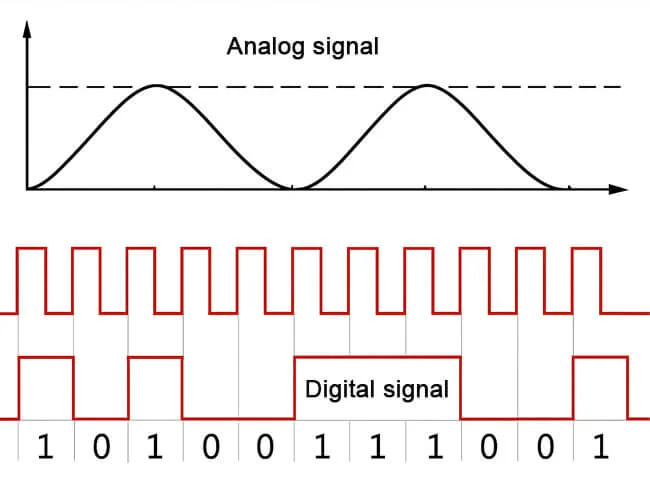
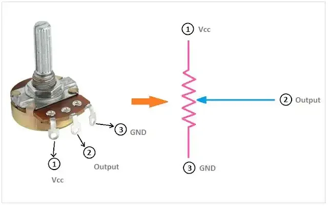
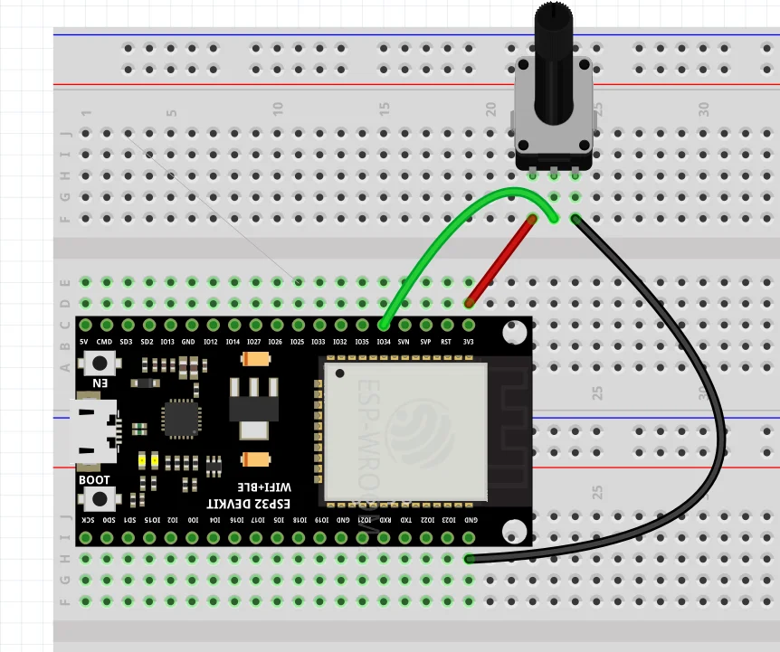
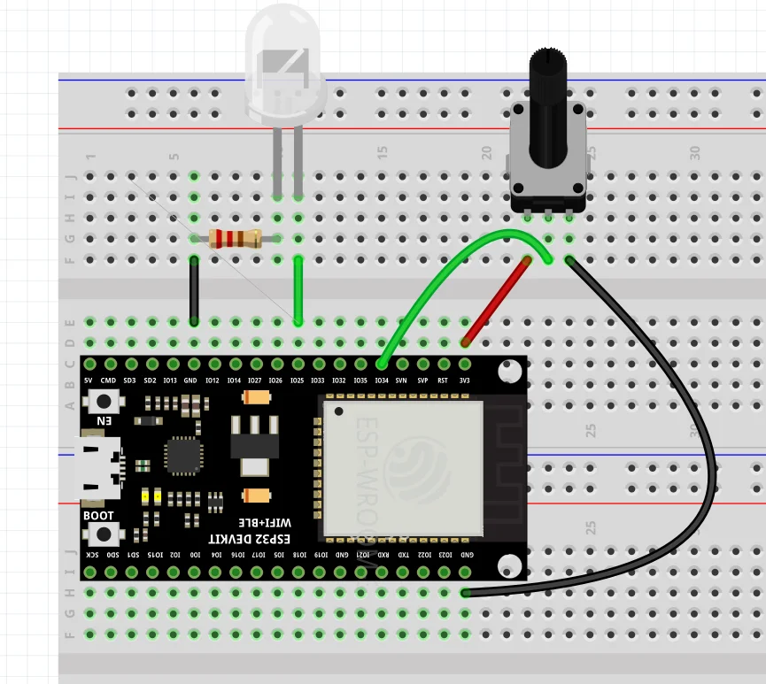
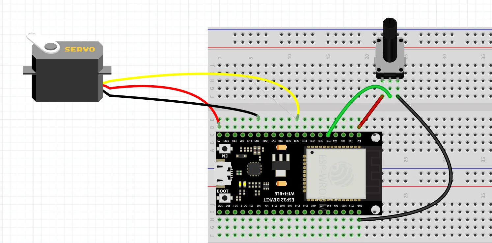
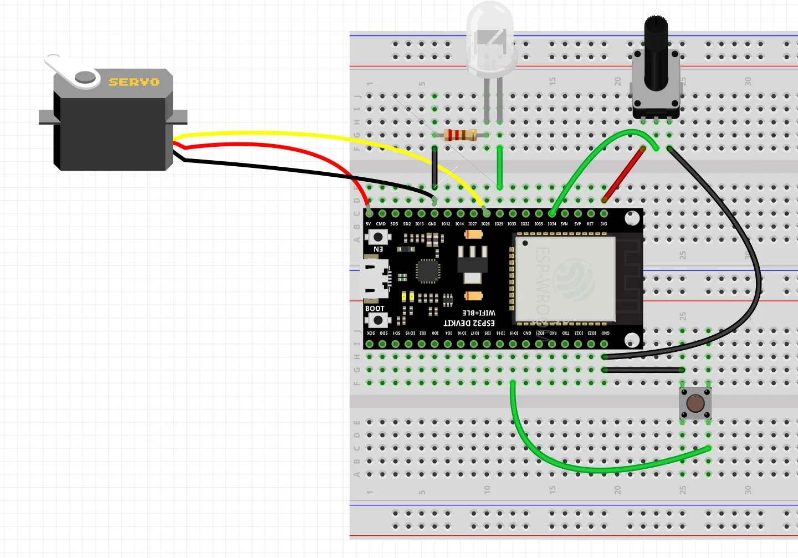

# บทที่ 9: Analog Input และ Potentiometer

## วัตถุประสงค์
- เข้าใจการทำงานของ ADC (Analog-to-Digital Converter)
- อ่านค่า Analog Input ด้วย `analogRead()`
- ใช้ Potentiometer ควบคุมอุปกรณ์
- สร้างโปรเจค**ตู้ให้อาหารปลาอัตโนมัติ**

---

## อุปกรณ์ที่ใช้
- ESP32 Development Board
- Potentiometer 10kΩ (ตัวต้านทานปรับค่าได้)
- Servo Motor SG90
- LED (สำหรับแสดงสถานะ)
- ตัวต้านทาน 470Ω
- สายจัมเปอร์

---

## ทฤษฎี: Analog Input และ ADC

### Digital vs Analog

**Digital Signal:**
- มีได้เพียง **2 สถานะ**: HIGH (1) หรือ LOW (0)
- ตัวอย่าง: ปุ่มกด, สวิตช์

**Analog Signal:**
- มีค่า**ต่อเนื่อง** ระหว่าง 0V ถึง 3.3V
- ตัวอย่าง: เซนเซอร์แสง, อุณหภูมิ, Potentiometer
 

---

### ADC (Analog-to-Digital Converter)

**ADC** = วงจรแปลงสัญญาณ Analog → Digital เพื่อให้ ESP32 ประมวลผลได้

**ESP32 ADC:**
- **ความละเอียด:** 12-bit (0-4095)
- **แรงดันวัด:** 0-3.3V
- **ช่องสัญญาณ:** ADC1 (GPIO 32-39), ADC2 (ใช้ไม่ได้เมื่อเปิด WiFi)

$$
\text{ADC Value} = \frac{\text{Voltage}}{3.3} \times 4095
$$

**ตัวอย่าง:**
- 0V → ADC = 0
- 1.65V → ADC = 2048 (ครึ่งหนึ่ง)
- 3.3V → ADC = 4095 (เต็ม)

---

## Potentiometer คืออะไร?

**Potentiometer** (ตัวต้านทานปรับค่าได้) = ตัวต้านทานที่สามารถ**หมุนปรับค่า**ได้





**หลักการทำงาน:**
- หมุนซ้ายสุด → ออก 0V
- หมุนกลาง → ออก ~1.65V
- หมุนขวาสุด → ออก 3.3V

**การต่อ:**
- **ขาซ้าย** → GND
- **ขากลาง** → GPIO (Analog Input)
- **ขาขวา** → 3.3V

---

## ตัวอย่าง 1: อ่านค่า Potentiometer

### วงจร



### โค้ด

```cpp
const int POT_PIN = 34;  // ADC1 Channel

void setup() {
  Serial.begin(115200);
  Serial.println("Potentiometer Reading");
}

void loop() {
  int value = analogRead(POT_PIN);  // อ่านค่า ADC (0-4095)
  
  Serial.print("ADC Value: ");
  Serial.println(value);
  
  delay(500);
}
```

### ผลลัพธ์

```
Potentiometer Reading
ADC Value: 0      ← หมุนซ้ายสุด
ADC Value: 1024   ← หมุนเล็กน้อย
ADC Value: 2048   ← หมุนครึ่งหนึ่ง
ADC Value: 3072
ADC Value: 4095   ← หมุนขวาสุด
```

---

## ตัวอย่าง 2: แปลงค่า ADC เป็นแรงดัน

### วงจร

เหมือนตัวอย่างที่ 1

### โค้ด

```cpp
const int POT_PIN = 34;

void setup() {
  Serial.begin(115200);
  Serial.println("ADC to Voltage Converter");
}

void loop() {
  int adcValue = analogRead(POT_PIN);
  
  // แปลง ADC (0-4095) → Voltage (0-3.3V)
  float voltage = (adcValue / 4095.0) * 3.3;
  
  Serial.print("ADC: ");
  Serial.print(adcValue);
  Serial.print(" | Voltage: ");
  Serial.print(voltage, 2);  // แสดง 2 ทศนิยม
  Serial.println(" V");
  
  delay(500);
}
```

### ผลลัพธ์

```
ADC to Voltage Converter
ADC: 0    | Voltage: 0.00 V
ADC: 1024 | Voltage: 0.83 V
ADC: 2048 | Voltage: 1.65 V
ADC: 3072 | Voltage: 2.48 V
ADC: 4095 | Voltage: 3.30 V
```

---

## ตัวอย่าง 3: แสดงผลแบบ Bar Graph

### วงจร

เหมือนตัวอย่างที่ 1

### โค้ด

```cpp
const int POT_PIN = 34;

void setup() {
  Serial.begin(115200);
  Serial.println("Potentiometer Bar Graph");
}

void loop() {
  int value = analogRead(POT_PIN);
  
  // แปลงเป็นเปอร์เซ็นต์
  int percent = map(value, 0, 4095, 0, 100);
  
  Serial.print(percent);
  Serial.print("% ");
  
  // แสดง Bar Graph
  int bars = percent / 2;  // แบ่งเป็น 50 ช่อง
  for(int i = 0; i < bars; i++) {
    Serial.print("█");
  }
  
  Serial.println();
  delay(200);
}
```

### ผลลัพธ์

```
Potentiometer Bar Graph
0%
15% ███████
50% █████████████████████████
75% █████████████████████████████████████
100% ██████████████████████████████████████████████
```

---

## ตัวอย่าง 4: ควบคุมความสว่าง LED ด้วย Potentiometer

### วงจร



### โค้ด

```cpp
const int POT_PIN = 34;
const int LED_PIN = 25;
const int PWM_CHANNEL = 0;

void setup() {
  Serial.begin(115200);
  
  ledcSetup(PWM_CHANNEL, 5000, 8);  // 8-bit PWM (0-255)
  ledcAttachPin(LED_PIN, PWM_CHANNEL);
  
  Serial.println("LED Brightness Control");
}

void loop() {
  int adcValue = analogRead(POT_PIN);
  
  // แปลง ADC (0-4095) → PWM (0-255)
  int brightness = map(adcValue, 0, 4095, 0, 255);
  
  ledcWrite(PWM_CHANNEL, brightness);
  
  int percent = (brightness * 100) / 255;
  
  Serial.print("Brightness: ");
  Serial.print(percent);
  Serial.println("%");
  
  delay(100);
}
```

### ผลลัพธ์

```
LED Brightness Control
Brightness: 0%    ← LED ดับ
Brightness: 25%   ← LED สว่างเล็กน้อย
Brightness: 50%   ← LED สว่างครึ่งหนึ่ง
Brightness: 100%  ← LED สว่างเต็มที่
```

**การทำงาน:** หมุน Potentiometer → ความสว่าง LED เปลี่ยนแปลงตาม

---

## ตัวอย่าง 5: ควบคุมมุม Servo ด้วย Potentiometer

### วงจร



### โค้ด

```cpp
const int POT_PIN = 34;
const int SERVO_PIN = 25;
const int PWM_CHANNEL = 0;

void setup() {
  Serial.begin(115200);
  
  ledcSetup(PWM_CHANNEL, 50, 16);  // Servo: 50Hz, 16-bit
  ledcAttachPin(SERVO_PIN, PWM_CHANNEL);
  
  Serial.println("Servo Control with Potentiometer");
}

void loop() {
  int adcValue = analogRead(POT_PIN);
  
  // แปลง ADC (0-4095) → Angle (0-180°)
  int angle = map(adcValue, 0, 4095, 0, 180);
  
  servoWrite(angle);
  
  Serial.print("Pot: ");
  Serial.print(adcValue);
  Serial.print(" → Angle: ");
  Serial.print(angle);
  Serial.println("°");
  
  delay(100);
}

void servoWrite(int angle) {
  if(angle < 0) angle = 0;
  if(angle > 180) angle = 180;
  
  int pulseWidth = map(angle, 0, 180, 500, 2500);
  int duty = (pulseWidth * 65536) / 20000;
  
  ledcWrite(PWM_CHANNEL, duty);
}
```

### ผลลัพธ์

```
Servo Control with Potentiometer
Pot: 0    → Angle: 0°
Pot: 1024 → Angle: 45°
Pot: 2048 → Angle: 90°
Pot: 3072 → Angle: 135°
Pot: 4095 → Angle: 180°
```

**การทำงาน:** หมุน Potentiometer → Servo หมุนไปยังมุมที่สอดคล้อง

---

## โปรเจค: ตู้ให้อาหารปลาอัตโนมัติ 🐟

### ทฤษฎี

**ตู้ให้อาหารปลา** ควบคุมปริมาณอาหารด้วย Potentiometer

**การทำงาน:**
- หมุน Potentiometer → เลือกปริมาณอาหาร (0-100%)
- Servo หมุนเปิดฝา → อาหารตกลงไป
- มุมเปิดขึ้นอยู่กับปริมาณที่เลือก

**ตัวอย่าง:**
- 25% → Servo เปิด 45°
- 50% → Servo เปิด 90°
- 100% → Servo เปิด 180°

### วงจร



### โค้ด

```cpp
const int POT_PIN = 34;
const int BUTTON_PIN = 19;
const int LED_PIN = 25;
const int SERVO_PIN = 26;

int lastButtonState = HIGH;

void setup() {
  Serial.begin(115200);
  pinMode(BUTTON_PIN, INPUT_PULLUP);
  pinMode(LED_PIN, OUTPUT);
  
  ledcAttach(SERVO_PIN, 50, 16);
  
  servoWrite(0);  // ปิดฝา
  
  Serial.println("🐟 Automatic Fish Feeder");
  Serial.println("Adjust amount → Press FEED button");
}

void loop() {
  // อ่านค่า Potentiometer
  int adcValue = analogRead(POT_PIN);
  int amount = map(adcValue, 0, 4095, 0, 100);  // 0-100%
  
  // แสดงปริมาณ
  Serial.print("Amount: ");
  Serial.print(amount);
  Serial.println("%");
  
  // แสดงสถานะด้วย LED (กะพริบตามปริมาณ)
  digitalWrite(LED_PIN, (millis() / (110 - amount)) % 2);
  
  // ตรวจจับปุ่มกด
  int buttonState = digitalRead(BUTTON_PIN);
  
  if(buttonState == LOW && lastButtonState == HIGH) {
    delay(50);  // Debounce
    
    buttonState = digitalRead(BUTTON_PIN);
    
    if(buttonState == LOW) {
      feedFish(amount);
    }
  }
  
  lastButtonState = buttonState;
  
  delay(100);
}

void feedFish(int amount) {
  Serial.println("🍽️  Feeding fish...");
  
  // คำนวณมุมเปิดตามปริมาณ
  int openAngle = map(amount, 0, 100, 0, 180);
  
  Serial.print("Opening lid to ");
  Serial.print(openAngle);
  Serial.println("°");
  
  // กะพริบ LED เร็ว
  for(int i = 0; i < 5; i++) {
    digitalWrite(LED_PIN, HIGH);
    delay(100);
    digitalWrite(LED_PIN, LOW);
    delay(100);
  }
  
  // เปิดฝา
  for(int angle = 0; angle <= openAngle; angle += 3) {
    servoWrite(angle);
    delay(15);
  }
  
  delay(1000);  // รอให้อาหารตก
  
  // ปิดฝา
  Serial.println("Closing lid...");
  for(int angle = openAngle; angle >= 0; angle -= 3) {
    servoWrite(angle);
    delay(15);
  }
  
  Serial.println("✅ Done!");
  Serial.println();
}

void servoWrite(int angle) {
  if(angle < 0) angle = 0;
  if(angle > 180) angle = 180;
  
  int pulseWidth = map(angle, 0, 180, 500, 2500);
  int duty = (pulseWidth * 65536) / 20000;
  
  ledcWrite(SERVO_PIN, duty);
}
```

### ผลลัพธ์

```
🐟 Automatic Fish Feeder
Adjust amount → Press FEED button
Amount: 25%
Amount: 50%  ← หมุน Potentiometer
Amount: 75%
Amount: 100%
🍽️  Feeding fish...  ← กดปุ่ม FEED
Opening lid to 180°
Closing lid...
✅ Done!
```

**การทำงาน:**
1. หมุน Potentiometer → เลือกปริมาณอาหาร
2. LED กะพริบเร็วขึ้นตามปริมาณ
3. กดปุ่ม FEED → Servo เปิดฝาตามปริมาณ
4. รอ 1 วินาที → ปิดฝาอัตโนมัติ

**ประยุกต์ใช้:**
- ให้อาหารปลาในบ่อ
- ให้อาหารสัตว์เลี้ยง
- ควบคุมปริมาณการเท (ของเหลว, เมล็ดพืช)

---

## สรุป

| หัวข้อ | รายละเอียด |
|--------|-----------|
| **Analog Signal** | สัญญาณต่อเนื่อง (0-3.3V) |
| **ADC** | แปลง Analog → Digital (0-4095) |
| **analogRead()** | อ่านค่า ADC จาก GPIO |
| **Potentiometer** | ตัวต้านทานปรับค่าได้ (0-3.3V) |
| **map()** | แปลงช่วงค่า (เช่น 0-4095 → 0-180) |
| **ประยุกต์ใช้** | ควบคุมความสว่าง, ปริมาณ, ตำแหน่ง, ความเร็ว |

---

## 🎯 ความท้าทาย

### Challenge 1: Servo Speed Control

ใช้ Potentiometer ควบคุม**ความเร็ว**ในการหมุน Servo (ไม่ใช่มุม)
- หมุนซ้ายสุด → Servo กวาดช้ามาก
- หมุนขวาสุด → Servo กวาดเร็วมาก

**Hint:** ใช้ `delay()` ระหว่างแต่ละมุม

### Challenge 2: Multi-Level Fish Feeder

ใช้ 3 ปุ่ม:
- ปุ่ม 1 → ให้อาหาร 25%
- ปุ่ม 2 → ให้อาหาร 50%
- ปุ่ม 3 → ให้อาหาร 100%

ไม่ต้องใช้ Potentiometer

### Challenge 3: Automatic Feeder with Schedule

เพิ่มฟังก์ชันให้อาหารอัตโนมัติทุกๆ 30 วินาที
- Potentiometer → เลือกปริมาณเริ่มต้น
- ปุ่ม → เปิด/ปิดโหมดอัตโนมัติ
- LED → แสดงสถานะ (กะพริบเมื่อเปิด Auto)

---

## ❓ คำถามท้ายบท

1. Analog Signal ต่างจาก Digital Signal อย่างไร?
2. ADC ของ ESP32 มีความละเอียดกี่ bit? แปลว่าอะไร?
3. ทำไมต้องใช้ `map()` เมื่อแปลงค่า ADC?
4. Potentiometer ทำงานอย่างไร?
5. GPIO ขาไหนบ้างที่ใช้เป็น Analog Input ได้?

---

## 📚 เนื้อหาบทถัดไป

ในบทถัดไป เราจะเรียนรู้:
- 🚗 โปรเจค: **ประตูโรงจอดรถอัตโนมัติ**
- 📏 ใช้ Ultrasonic + IR Sensor + Servo ร่วมกัน
- 🧩 เขียนฟังก์ชันทิ้งไว้ให้นักเรียนเติม Logic
- 🎯 ฝึกการใช้เงื่อนไขและควบคุมอุปกรณ์หลายตัว

[→ ไปบทที่ 12: โปรเจคประตูโรงจอดรถอัตโนมัติ](12-parking-gate-project.md)
