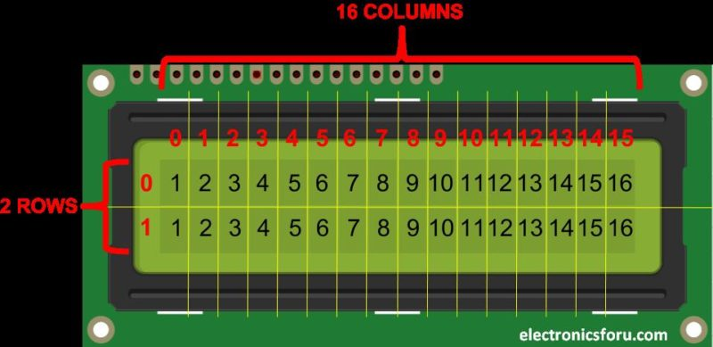

# บทที่ 11: LCD Display และการแสดงผล

## วัตถุประสงค์
- เข้าใจการทำงานของจอ LCD 16x2 I2C
- ใช้ LiquidCrystal_PCF8574 Library
- แสดงข้อความและตัวเลข
- แก้ปัญหาตัวอักษรค้าง

---

## อุปกรณ์ที่ใช้
- ESP32 Development Board
- LCD 16x2 I2C
- Potentiometer 10kΩ
- ปุ่มกด
- สายจัมเปอร์

---

## ทฤษฎี: LCD 16x2 I2C

### LCD คืออะไร?

**LCD (Liquid Crystal Display)** = จอแสดงผลตัวอักษรและตัวเลข

**ขนาด 16x2:**
- **16 คอลัมน์** (0-15)
- **2 แถว** (0-1)



### I2C คืออะไร?

**I2C** = โปรโตคอลสื่อสารที่ใช้สาย **2 เส้น** (SDA, SCL)

**ข้อดี:**
- ลดสายที่ต้องต่อ (จาก 16 เส้น → 4 เส้น)
- ต่ออุปกรณ์หลายตัวได้บนสายเดียวกัน

**การต่อ:**
```
ESP32        LCD I2C
GPIO 21 ───── SDA
GPIO 22 ───── SCL
3.3V   ───── VCC
GND    ───── GND
```


**I2C Address:** โดยทั่วไปเป็น `0x27` หรือ `0x3F`

---

## ติดตั้ง Library

1. เปิด Arduino IDE
2. **Sketch → Include Library → Manage Libraries**
3. ค้นหา **"LiquidCrystal PCF8574"**
4. ติดตั้ง **by Matthias Hertel**
5. คลิก **Install**

---

## ตัวอย่าง 1: Hello World (Run ครั้งเดียว)

### วงจร

```
ESP32        LCD I2C
GPIO 21 ───── SDA
GPIO 22 ───── SCL
3.3V   ───── VCC
GND    ───── GND
```

### โค้ด

```cpp
#include <Wire.h>
#include <LiquidCrystal_PCF8574.h>

// LCD Address
LiquidCrystal_PCF8574 lcd(0x27);

void setup() {
  lcd.begin(16, 2);    // เริ่มต้น LCD (16 คอลัมน์, 2 แถว)
  lcd.setBacklight(255); // เปิดไฟ Backlight
  
  lcd.setCursor(0, 0); // คอลัมน์ 0, แถว 0
  lcd.print("Hello");
  
  lcd.setCursor(0, 1); // คอลัมน์ 0, แถว 1
  lcd.print("World!");
}

void loop() {
  // ไม่ทำอะไร
}
```

### ผลลัพธ์

```
┌────────────────┐
│Hello           │
│World!          │
└────────────────┘
```

**หมายเหตุ:** ข้อความแสดงครั้งเดียวใน `setup()` → **ลองรูดนิ้วดูว่าจอเพี้ยนหรือไม่**

---

## ตัวอย่าง 2: แสดงค่า Potentiometer (Loop)

### วงจร

```
ESP32        LCD I2C
GPIO 21 ───── SDA
GPIO 22 ───── SCL
3.3V   ───── VCC
GND    ───── GND

Potentiometer
GPIO 34 ───── OUT (ขากลาง)
3.3V   ───── ขาขวา
GND    ───── ขาซ้าย
```

### โค้ด

```cpp
#include <Wire.h>
#include <LiquidCrystal_PCF8574.h>

LiquidCrystal_PCF8574 lcd(0x27);

const int POT_PIN = 34;

void setup() {
  lcd.begin(16, 2);
  lcd.setBacklight(255);
  
  lcd.setCursor(0, 0);
  lcd.print("Pot Value:");
}

void loop() {
  int value = analogRead(POT_PIN);
  
  lcd.setCursor(0, 1);
  lcd.print("      ");  // ลบค่าเก่า
  lcd.setCursor(0, 1);
  lcd.print(value);
  
  delay(100);
}
```

### ผลลัพธ์

```
┌────────────────┐
│Pot Value:      │
│2048            │
└────────────────┘
```

---

## ⚠️ ปัญหา: ตัวอักษรค้าง

### สาเหตุ

เมื่อแสดงตัวเลขใหม่ ตัวอักษรเก่าจะ**ไม่หาย**

**ตัวอย่าง:**
```
4095 → เปลี่ยนเป็น → 512 → แสดงเป็น "5125"
```

### วิธีแก้

#### วิธีที่ 1: ใช้ `lcd.clear()`

```cpp
lcd.clear();  // ลบทั้งหมด
lcd.setCursor(0, 0);
lcd.print("New Text");
```

**ข้อเสีย:** จอกะพริบ (ลบทั้งหมด)

#### วิธีที่ 2: เติมช่องว่าง

```cpp
lcd.setCursor(0, 1);
lcd.print("      ");  // เติม 6 ช่องว่าง
lcd.setCursor(0, 1);
lcd.print(value);
```

**ข้อดี:** ไม่กะพริบ, ลบเฉพาะส่วนที่เปลี่ยน

---

## ตัวอย่าง 3: แสดงสถานะปุ่มกด

### โจทย์

แสดง **"PRESSING: 1"** เมื่อกดปุ่ม, **"PRESSING: 0"** เมื่อไม่กด

### วงจร

```
ESP32
GPIO 19 ────┬───╮
            │ SW│
           GND ╰─╯

GPIO 21 ───── SDA (LCD)
GPIO 22 ───── SCL (LCD)
```

### โค้ด

```cpp
#include <Wire.h>
#include <LiquidCrystal_PCF8574.h>

LiquidCrystal_PCF8574 lcd(0x27);

const int BUTTON_PIN = 19;

void setup() {
  pinMode(BUTTON_PIN, INPUT_PULLUP);
  
  lcd.begin(16, 2);
  lcd.setBacklight(255);
  
  lcd.setCursor(0, 0);
  lcd.print("PRESSING:");
}

void loop() {
  int state = digitalRead(BUTTON_PIN);
  int pressing = (state == LOW) ? 1 : 0;
  
  lcd.setCursor(10, 0);
  lcd.print(pressing);
  
  delay(100);
}
```

### ผลลัพธ์

```
┌────────────────┐
│PRESSING: 0     │  ← ไม่กด
│                │
└────────────────┘

┌────────────────┐
│PRESSING: 1     │  ← กดปุ่ม
│                │
└────────────────┘
```

---

## โจทย์สำหรับนักเรียน 1: แสดง YES/NO

### เป้าหมาย

แปลงจาก **"PRESSING: 1/0"** → **"PRESSING: YES/NO"**

### Template

```cpp
void loop() {
  int state = digitalRead(BUTTON_PIN);
  
  lcd.setCursor(10, 0);
  
  if(state == LOW) {
    // TODO: แสดง "YES  " (เติมช่องว่างเพื่อลบ NO)
    
  }
  else {
    // TODO: แสดง "NO   "
    
  }
  
  delay(100);
}
```

<details>
<summary>เฉลย</summary>

```cpp
if(state == LOW) {
  lcd.print("YES ");
}
else {
  lcd.print("NO  ");
}
```

</details>

---

## ⚠️ ปัญหา: ตัวอักษรค้าง (YES/NO)

### สถานการณ์

เมื่อเปลี่ยนจาก **"YES"** → **"NO"** → แสดงเป็น **"NOS"**

**สาเหตุ:** "YES" มี 3 ตัวอักษร, "NO" มี 2 ตัวอักษร → S ค้างอยู่

### วิธีแก้

เติมช่องว่างหลังข้อความ:

```cpp
if(state == LOW) {
  lcd.print("YES ");  // 3 ตัว + 1 ช่องว่าง
}
else {
  lcd.print("NO  ");  // 2 ตัว + 2 ช่องว่าง
}
```

---

## โจทย์สำหรับนักเรียน 2: Potentiometer + Button

### เป้าหมาย

แสดงทั้ง **ค่า Potentiometer** และ **สถานะปุ่ม** บนจอเดียวกัน

```
┌────────────────┐
│Pot: 2048       │
│Button: YES     │
└────────────────┘
```

### Template

```cpp
void loop() {
  int potValue = analogRead(POT_PIN);
  int buttonState = digitalRead(BUTTON_PIN);
  
  // TODO: แสดงค่า Potentiometer บนแถว 0
  lcd.setCursor(0, 0);
  lcd.print("Pot:      ");  // ลบค่าเก่า
  lcd.setCursor(5, 0);
  lcd.print(potValue);
  
  // TODO: แสดงสถานะปุ่มบนแถว 1
  lcd.setCursor(0, 1);
  lcd.print("Button: ");
  lcd.setCursor(8, 1);
  
  if(buttonState == LOW) {
    lcd.print("YES ");
  }
  else {
    lcd.print("NO  ");
  }
  
  delay(100);
}
```

---

## โปรเจคพิเศษ: ESP32 Dino Run Game 🦖

### ทฤษฎี

เกม **Dino Run** สไตล์ Chrome Dinosaur แต่รันบน LCD!

**การทำงาน:**
- กดปุ่ม → Dino กระโดด
- หลบ Cactus
- คะแนนเพิ่มทุกครั้งที่หลบได้
- ความเร็วเพิ่มทุก 10 คะแนน

**เทคนิคที่ใช้:**
- Custom Characters (กราฟิก Dino และ Cactus)
- State Machine (START → GAME → GAME_OVER)
- Animation (สลับ Frame A/B)
- Collision Detection

---

### วงจร

```
ESP32        LCD I2C (PCF8574)
GPIO 21 ───── SDA
GPIO 22 ───── SCL
3.3V   ───── VCC
GND    ───── GND

GPIO 12 ────┬───╮
            │ SW│  ← ปุ่มกด (กระโดด)
           GND ╰─╯
```

**หมายเหตุ:** โค้ดใช้ `INPUT_PULLDOWN` (ESP32 มี Internal Pull-down)

---

### โค้ดเต็ม

```cpp
#include <Wire.h>
#include <LiquidCrystal_PCF8574.h>

/////// DEFINES ////////////////////////////////////

#define BASE_SPEED          70
#define INPUT_BUTTON_PIN    12  // Button at GPIO 12
#define LCD_ADDR            0x27
#define LCD_COLS            16
#define LCD_ROWS            2
#define LCD_TOP_ROW         0,0
#define LCD_BOTTOM_ROW      0,1
#define LCD_SCORE_POS       6,0
#define LCD_SDSCORE_OFFSET  14,0
#define START_STATE         0
#define GAME_STATE          1
#define GAME_OVER_STATE     2
#define DINO_FRAME_A_LCD    0
#define DINO_FRAME_B_LCD    1
#define CACTUS_LCD          2
#define DINO_AIR_TIME       20
#define INPUT_HOLD_TIME     25
#define SPEED_INCREASE_VAL  10

////////////////////////////////////////////////////

////// GLOBAL //////////////////////////////////////

LiquidCrystal_PCF8574 lcd(LCD_ADDR);
int currState = START_STATE;
int gameSpeed = BASE_SPEED;
int inputState = 0;
int inputHoldTimer = 0;
int score = 0;
int dinoY = 1;
int dinoCurrAirTime = 0;
char dinoCurrFrame = 'A';
int currCactusX = 16;
bool buttonPressed = false;  // Track button state

const char* startScreenTopStr = "ESP32 Dino Run";
const char* startScreenBottomStr = "Press To Start!";
const char* gameOverTopStr = "Game Over!";
const char* scoreText = "Score:";

// Graphics

byte dinoGfxFrameA[8] =
{
  0b00000,0b01110,0b10101,0b10001,
  0b10010,0b11110,0b10100,0b01100
};

byte dinoGfxFrameB[8] =
{
  0b00000,0b01110,0b10101,0b10001,
  0b10010,0b11110,0b10100,0b10010
};

byte cactusGfx[8] = 
{
  0b00100,0b10101,0b10101,0b10101,
  0b01110,0b01110,0b01110,0b01110
};

////////////////////////////////////////////////////

///// FUNCTIONS ////////////////////////////////////

void _initHardware()
{
  pinMode(INPUT_BUTTON_PIN, INPUT_PULLDOWN);  // Use internal pull-down resistor
  lcd.begin(LCD_COLS, LCD_ROWS);
  lcd.setBacklight(255);
  lcd.clear();
}

void _initGraphics()
{
  lcd.createChar(DINO_FRAME_A_LCD, dinoGfxFrameA);
  lcd.createChar(DINO_FRAME_B_LCD, dinoGfxFrameB);
  lcd.createChar(CACTUS_LCD, cactusGfx);
}

// Function to check button press with debounce
bool isButtonPressed() {
  if (digitalRead(INPUT_BUTTON_PIN) == HIGH) {
    delay(50); // Debounce delay
    if (digitalRead(INPUT_BUTTON_PIN) == HIGH) {
      return true;
    }
  }
  return false;
}

void _startStateProcess()
{
  if (isButtonPressed())
  {
    currState = GAME_STATE;
  }
}

void _gameStateProcess()
{
  // Check if button is pressed to jump
  if (isButtonPressed() && dinoCurrAirTime == 0 && inputHoldTimer <= 0)
  {
    dinoY = 0;  // Move dino to the air
    dinoCurrAirTime = DINO_AIR_TIME;
    inputHoldTimer = INPUT_HOLD_TIME;
  }
  
  // Move the cactus
  if(currCactusX > 1)
  {
    currCactusX--;
  }
  else
  {
    if(dinoY == 0)
    {
      score++;
      if(score % 10 == 0)
      {
        gameSpeed -= SPEED_INCREASE_VAL;
      }
      currCactusX = 16;
    }
    else
    {
      gameSpeed = BASE_SPEED;
      currState = GAME_OVER_STATE;
      return;
    }
  }

  if(dinoCurrAirTime == 1)
  {
    dinoY = 1;
  }

  if(dinoCurrAirTime > 0)
  {
    dinoCurrAirTime--;
  }

  if(inputHoldTimer > 0)
  {
    inputHoldTimer--;
  }
}

void _gameOverStateProcess()
{
  if (isButtonPressed())
  {
    delay(250);
    _resetGame();
  }
}

void _resetGame()
{
  score = 0;
  dinoY = 1;
  dinoCurrAirTime = 0;
  dinoCurrFrame = 'A';
  currCactusX = 16;
  currState = START_STATE;
}

// Graphics

void _drawStartScreen()
{
  lcd.clear();
  lcd.setCursor(LCD_TOP_ROW);
  lcd.print(startScreenTopStr);
  lcd.setCursor(LCD_BOTTOM_ROW);
  lcd.print(startScreenBottomStr);
}

void _drawGameOverScreen()
{
  lcd.clear();
  lcd.setCursor(LCD_TOP_ROW);
  lcd.print(gameOverTopStr);
  lcd.setCursor(LCD_BOTTOM_ROW);
  lcd.print(scoreText);
  lcd.print(score);
}

void _drawGameGraphics()
{
  lcd.clear();

  lcd.setCursor(0, dinoY);
  if(dinoCurrFrame == 'A')
  {
    lcd.write(DINO_FRAME_A_LCD);
    dinoCurrFrame = 'B';
  }
  else
  {
    lcd.write(DINO_FRAME_B_LCD);
    dinoCurrFrame = 'A';
  }

  lcd.setCursor(currCactusX, 1);
  lcd.write(CACTUS_LCD);

  lcd.setCursor(LCD_SCORE_POS);
  lcd.print(scoreText);
  if(score > 9)
  {
    lcd.print(score);
  }
  else
  {
    lcd.setCursor(LCD_SDSCORE_OFFSET);
    lcd.print(score);
  }
}

////////////////////////////////////////////////////

/////// MAIN CODE //////////////////////////////////

void setup() 
{
  _initHardware();
  _initGraphics();
}

void loop() 
{
  switch(currState)
  {
    case START_STATE:
      _startStateProcess();
      _drawStartScreen();
      break;
    case GAME_STATE:
      _gameStateProcess();
      _drawGameGraphics();
      break;
    case GAME_OVER_STATE:
      _gameOverStateProcess();
      _drawGameOverScreen();
      break;
    default:
      break;
  }
  delay(gameSpeed);
}
```

---

### การเล่น

1. **อัปโหลดโค้ด** ไปยัง ESP32
2. **จอแสดง "ESP32 Dino Run" และ "Press To Start!"**
3. **กดปุ่ม** → เริ่มเกม
4. **กดปุ่มให้ Dino กระโดด** หลบ Cactus
5. **Game Over** → กดปุ่มเพื่อเล่นใหม่

---

### คำอธิบายโค้ด

#### 1. Custom Characters

```cpp
byte dinoGfxFrameA[8] = {
  0b00000,0b01110,0b10101,0b10001,
  0b10010,0b11110,0b10100,0b01100
};
```

**อธิบาย:** สร้างกราฟิก Dino ขนาด 5x8 pixel (แต่ละแถว 5 bit)

```
  00000   →   
  01110   → ███   (หัว)
  10101   → █ █ █
  10001   → █   █
  10010   → █  █
  11110   → ████  (ตัว)
  10100   → █ █   (ขา Frame A)
  01100   →  ██
```

#### 2. State Machine

```cpp
#define START_STATE         0
#define GAME_STATE          1
#define GAME_OVER_STATE     2
```

**สถานะ:**
- **START_STATE** → แสดงหน้าจอเริ่มต้น
- **GAME_STATE** → กำลังเล่น
- **GAME_OVER_STATE** → จบเกม

#### 3. Animation

```cpp
if(dinoCurrFrame == 'A') {
  lcd.write(DINO_FRAME_A_LCD);
  dinoCurrFrame = 'B';
}
else {
  lcd.write(DINO_FRAME_B_LCD);
  dinoCurrFrame = 'A';
}
```

**อธิบาย:** สลับระหว่าง Frame A และ B → Dino วิ่ง

#### 4. Collision Detection

```cpp
if(currCactusX > 1) {
  currCactusX--;  // Cactus เคลื่อนที่มา
}
else {
  if(dinoY == 0) {
    score++;  // กระโดดผ่าน → ได้คะแนน
  }
  else {
    currState = GAME_OVER_STATE;  // ชน → จบเกม
  }
}
```

---

### 🎮 Challenge: ปรับปรุงเกม

1. **เพิ่มเสียง** - เพิ่ม Buzzer เล่นเสียงเมื่อกระโดด/ชน
2. **Random Cactus** - สุ่มระยะห่างของ Cactus
3. **High Score** - เก็บคะแนนสูงสุดไว้ใน EEPROM
4. **2 Player Mode** - เพิ่มปุ่มที่ 2 สำหรับผู้เล่นคนที่ 2
5. **Power-up** - เพิ่มไอเทมพิเศษ (เช่น ชะลอเวลา)

---

## สรุป

| หัวข้อ | รายละเอียด |
|--------|-----------|
| **LCD 16x2** | จอแสดงผล 16 คอลัมน์ x 2 แถว |
| **I2C** | สื่อสาร 2 สาย (SDA, SCL) |
| **Address** | 0x27 หรือ 0x3F |
| **lcd.print()** | แสดงข้อความ |
| **lcd.clear()** | ลบทั้งจอ (กะพริบ) |
| **lcd.createChar()** | สร้างกราฟิกแบบกำหนดเอง |
| **เติมช่องว่าง** | แก้ปัญหาตัวอักษรค้าง |
| **State Machine** | จัดการสถานะของโปรแกรม |
| **Custom Graphics** | สร้างตัวละครและวัตถุ 5x8 pixel |

---

## 📚 เนื้อหาบทถัดไป

ในบทถัดไป เราจะเรียนรู้:
- 🔌 Relay Module - ควบคุมอุปกรณ์ไฟฟ้า 220V
- ⚠️ ความปลอดภัยกับ High Voltage
- 🎮 ควบคุม Relay ด้วยปุ่มกด
- 📟 แสดงสถานะบน LCD + Potentiometer

[→ ไปบทที่ 14: Relay Module](14-relay-module.md)
