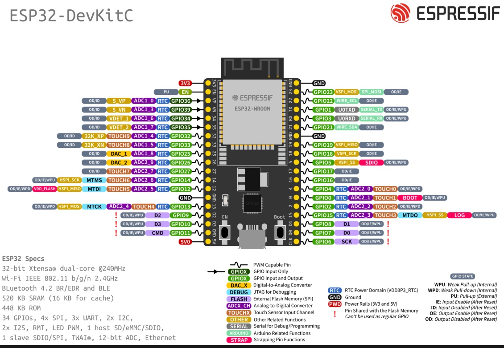

# ESP32 Pinout Reference

## ESP-WROOM-32U Development Board

คู่มือนี้จะช่วยให้คุณเลือกขาพินที่เหมาะสมกับงานของคุณ และหลีกเลี่ยงปัญหาที่อาจเกิดขึ่นจากการใช้ขาพินที่ไม่เหมาะสม

### ภาพ Pinout
 
 



---

## 📋 ตารางสรุปขาพิน

### ✅ ขาพินที่แนะนำให้ใช้

| GPIO | Input | Output | ADC | DAC | Touch | PWM | หมายเหตุ |
|------|-------|--------|-----|-----|-------|-----|----------|
| **GPIO4** | ✅ | ✅ | ✅ ADC2_0 | ❌ | ✅ T0 | ✅ | **เหมาะกับงานทั่วไป** |
| **GPIO5** | ✅ | ✅ | ❌ | ❌ | ❌ | ✅ | เหมาะสำหรับ SPI CS |
| **GPIO12** | ✅ | ✅ | ✅ ADC2_5 | ❌ | ✅ T5 | ✅ | ⚠️ Boot Voltage |
| **GPIO13** | ✅ | ✅ | ✅ ADC2_4 | ❌ | ✅ T4 | ✅ | **เหมาะกับงานทั่วไป** |
| **GPIO14** | ✅ | ✅ | ✅ ADC2_6 | ❌ | ✅ T6 | ✅ | **เหมาะกับงานทั่วไป** |
| **GPIO15** | ✅ | ✅ | ✅ ADC2_3 | ❌ | ✅ T3 | ✅ | **เหมาะกับงานทั่วไป** |
| **GPIO16** | ✅ | ✅ | ❌ | ❌ | ❌ | ✅ | เหมาะสำหรับ UART2 RX |
| **GPIO17** | ✅ | ✅ | ❌ | ❌ | ❌ | ✅ | เหมาะสำหรับ UART2 TX |
| **GPIO18** | ✅ | ✅ | ❌ | ❌ | ❌ | ✅ | SPI SCK |
| **GPIO19** | ✅ | ✅ | ❌ | ❌ | ❌ | ✅ | SPI MISO |
| **GPIO21** | ✅ | ✅ | ❌ | ❌ | ❌ | ✅ | I2C SDA (แนะนำ) |
| **GPIO22** | ✅ | ✅ | ❌ | ❌ | ❌ | ✅ | I2C SCL (แนะนำ) |
| **GPIO23** | ✅ | ✅ | ❌ | ❌ | ❌ | ✅ | SPI MOSI |
| **GPIO25** | ✅ | ✅ | ✅ ADC2_8 | ✅ DAC1 | ❌ | ✅ | มี DAC ออกสัญญาณ Analog |
| **GPIO26** | ✅ | ✅ | ✅ ADC2_9 | ✅ DAC2 | ❌ | ✅ | มี DAC ออกสัญญาณ Analog |
| **GPIO27** | ✅ | ✅ | ✅ ADC2_7 | ❌ | ✅ T7 | ✅ | **เหมาะกับงานทั่วไป** |
| **GPIO32** | ✅ | ✅ | ✅ ADC1_4 | ❌ | ✅ T9 | ✅ | **เหมาะสำหรับ ADC** |
| **GPIO33** | ✅ | ✅ | ✅ ADC1_5 | ❌ | ✅ T8 | ✅ | **เหมาะสำหรับ ADC** |

### ⚠️ ขาพินที่ใช้ได้แต่มีข้อจำกัด

| GPIO | Input | Output | ADC | หมายเหตุ |
|------|-------|--------|-----|----------|
| **GPIO0** | ✅ | ✅ | ✅ ADC2_1 | ⚠️ **BOOT Button** - ต้องเป็น HIGH เมื่อ Boot<br>จะถูก Pull-up ตลอดเวลา |
| **GPIO2** | ✅ | ✅ | ✅ ADC2_2 | ⚠️ **Built-in LED** - ต้องเป็น LOW เมื่อ Boot<br>เชื่อมต่อกับ LED บนบอร์ด |
| **GPIO34** | ✅ | ❌ | ✅ ADC1_6 | ⚠️ **Input Only** - ไม่มี Pull-up/Pull-down |
| **GPIO35** | ✅ | ❌ | ✅ ADC1_7 | ⚠️ **Input Only** - ไม่มี Pull-up/Pull-down |
| **GPIO36 (VP)** | ✅ | ❌ | ✅ ADC1_0 | ⚠️ **Input Only** - ไม่มี Pull-up/Pull-down |
| **GPIO39 (VN)** | ✅ | ❌ | ✅ ADC1_3 | ⚠️ **Input Only** - ไม่มี Pull-up/Pull-down |

### ❌ ขาพินที่ไม่แนะนำให้ใช้

| GPIO | หมายเหตุ |
|------|----------|
| **GPIO1 (TX)** | ❌ **UART0 TX** - ใช้สำหรับ Serial Monitor<br>จะทำให้ Serial.print() ไม่ทำงาน |
| **GPIO3 (RX)** | ❌ **UART0 RX** - ใช้สำหรับ Serial Monitor<br>จะรับข้อมูลจาก USB ตลอดเวลา |
| **GPIO6-11** | ❌ **เชื่อมต่อกับ Flash Memory**<br>ห้ามใช้โดยเด็ดขาด - จะทำให้บอร์ดพัง |

---

## 🔌 การใช้งานตามฟังก์ชัน

### 1. Digital Input/Output ทั่วไป

**ขาที่แนะนำ:** GPIO4, 13, 14, 15, 27

```cpp
#define LED_PIN 13
#define BUTTON_PIN 14

void setup() {
  pinMode(LED_PIN, OUTPUT);
  pinMode(BUTTON_PIN, INPUT_PULLUP);
}
```

### 2. Analog Input (ADC)

ESP32 มี 2 ADC:
- **ADC1** (8 channels): GPIO32-39 - ใช้ได้ตลอดเวลา ⭐ แนะนำ
- **ADC2** (10 channels): GPIO0, 2, 4, 12-15, 25-27 - ⚠️ ใช้ไม่ได้เมื่อเปิด WiFi

**ขาที่แนะนำสำหรับ ADC:**
- **GPIO32, 33** - ADC1 ใช้ได้ดีที่สุด
- **GPIO34, 35, 36, 39** - ADC1 แต่เป็น Input Only

```cpp
#define SENSOR_PIN 32  // ADC1_4 - แนะนำ

void setup() {
  Serial.begin(115200);
}

void loop() {
  int value = analogRead(SENSOR_PIN);
  Serial.println(value);
  delay(100);
}
```

### 3. Analog Output (DAC)

ESP32 มี DAC 2 ช่อง สามารถส่งสัญญาณ Analog จริงๆ (0-3.3V):
- **GPIO25** - DAC1
- **GPIO26** - DAC2

```cpp
#define DAC_PIN 25

void setup() {
  // ไม่ต้อง pinMode
}

void loop() {
  // ส่งค่า 0-255
  dacWrite(DAC_PIN, 128);  // ออก 1.65V
}
```

### 4. PWM Output

**ทุกขา Output ได้** ใช้ PWM ได้ (ยกเว้น Input Only)

```cpp
#define LED_PIN 13

void setup() {
  ledcAttach(LED_PIN, 5000, 8);  // 5000 Hz, 8-bit
}

void loop() {
  ledcWrite(LED_PIN, 128);  // 50% duty cycle
}
```

### 5. Touch Sensor

ESP32 มี 10 Touch Pins สามารถรับสัญญาณสัมผัสโดยไม่ต้องใช้วงจรเพิ่ม:

| Touch | GPIO | หมายเหตุ |
|-------|------|----------|
| T0 | GPIO4 | ✅ แนะนำ |
| T3 | GPIO15 | ✅ แนะนำ |
| T4 | GPIO13 | ✅ แนะนำ |
| T5 | GPIO12 | ⚠️ Boot Voltage |
| T6 | GPIO14 | ✅ แนะนำ |
| T7 | GPIO27 | ✅ แนะนำ |
| T8 | GPIO33 | ✅ แนะนำ |
| T9 | GPIO32 | ✅ แนะนำ |

```cpp
#define TOUCH_PIN T0  // GPIO4

void setup() {
  Serial.begin(115200);
}

void loop() {
  int touchValue = touchRead(TOUCH_PIN);
  Serial.println(touchValue);
  
  if (touchValue < 20) {  // ถูกสัมผัส
    Serial.println("Touched!");
  }
  delay(100);
}
```

### 6. I2C Communication

**ขาเริ่มต้น:**
- **SDA**: GPIO21
- **SCL**: GPIO22

สามารถเปลี่ยนเป็นขาอื่นได้

```cpp
#include <Wire.h>

void setup() {
  Wire.begin(21, 22);  // SDA, SCL
  // หรือ
  Wire.begin();  // ใช้ค่าเริ่มต้น
}
```

### 7. SPI Communication

**ขาเริ่มต้น (VSPI):**
- **MOSI**: GPIO23
- **MISO**: GPIO19
- **SCK**: GPIO18
- **CS**: GPIO5

```cpp
#include <SPI.h>

#define CS_PIN 5

void setup() {
  SPI.begin();
  pinMode(CS_PIN, OUTPUT);
  digitalWrite(CS_PIN, HIGH);
}
```

**HSPI (SPI ชุดที่ 2):**
- **MOSI**: GPIO13
- **MISO**: GPIO12
- **SCK**: GPIO14
- **CS**: GPIO15

### 8. UART (Serial)

**UART0** (USB):
- **TX**: GPIO1
- **RX**: GPIO3
- ❌ ไม่แนะนำให้ใช้กับอุปกรณ์อื่น เพราะใช้กับ Serial Monitor

**UART2** (แนะนำ):
- **TX**: GPIO17
- **RX**: GPIO16

```cpp
void setup() {
  Serial2.begin(9600, SERIAL_8N1, 16, 17);  // baud, config, RX, TX
}

void loop() {
  if (Serial2.available()) {
    char c = Serial2.read();
    Serial.println(c);
  }
}
```

---

## ⚡ Power Pins

| Pin | แรงดัน | กระแส | หมายเหตุ |
|-----|--------|-------|----------|
| **3V3** | 3.3V | ~600mA | แหล่งจ่ายจาก Regulator<br>ใช้กับเซ็นเซอร์/โมดูล |
| **VIN** | 5V | ตามแหล่งจ่าย | จาก USB หรือ External<br>สามารถจ่าย 5V ให้อุปกรณ์ได้ |
| **GND** | 0V | - | ต้องต่อร่วมกับอุปกรณ์ทุกตัว |

---

## 💡 คำแนะนำการใช้งาน

### ✅ DO (ควรทำ)

1. **ใช้ GPIO4, 13-15, 27** สำหรับงานทั่วไป
2. **ใช้ GPIO32, 33** สำหรับอ่าน ADC (ใช้ได้แม้เปิด WiFi)
3. **ใช้ GPIO21, 22** สำหรับ I2C
4. **ใช้ GPIO16, 17** สำหรับ UART2
5. **ต่อ Pull-up/Pull-down** สำหรับปุ่มกด
6. **ต่อ Resistor** กับ LED เสมอ (220Ω-1kΩ)

### ❌ DON'T (ไม่ควรทำ)

1. **อย่าใช้ GPIO1, 3** ถ้ายังต้องใช้ Serial Monitor
2. **อย่าใช้ GPIO6-11** โดยเด็ดขาด
3. **อย่าใช้ ADC2** ถ้าเปิด WiFi
4. **อย่าต่อ 5V** เข้าขา GPIO โดยตรง (ทนได้แค่ 3.3V)
5. **อย่าใช้ GPIO12** ถ้าต้องการ Boot ปกติ (ยกเว้นมี pull-down)
6. **อย่าใช้ Output Only pins** สำหรับปุ่มกด

---

## 🔧 ตัวอย่างการเลือกขาพิน

### โปรเจค: ระบบควบคุม LED RGB + เซ็นเซอร์อุณหภูมิ + ปุ่ม

```cpp
// RGB LED (PWM)
#define RED_PIN   25
#define GREEN_PIN 26
#define BLUE_PIN  27

// Temperature Sensor (ADC)
#define TEMP_SENSOR_PIN 32  // ADC1_4

// Button (Digital Input)
#define BUTTON_PIN 14

// Status LED
#define STATUS_LED 13

void setup() {
  // RGB LED
  ledcAttach(RED_PIN, 5000, 8);
  ledcAttach(GREEN_PIN, 5000, 8);
  ledcAttach(BLUE_PIN, 5000, 8);
  
  // Button
  pinMode(BUTTON_PIN, INPUT_PULLUP);
  
  // Status LED
  pinMode(STATUS_LED, OUTPUT);
  
  Serial.begin(115200);
}

void loop() {
  // Read temperature
  int tempRaw = analogRead(TEMP_SENSOR_PIN);
  
  // Check button
  bool pressed = digitalRead(BUTTON_PIN) == LOW;
  
  // Update status
  digitalWrite(STATUS_LED, pressed);
  
  // Control RGB based on temperature
  int red = map(tempRaw, 0, 4095, 0, 255);
  ledcWrite(RED_PIN, red);
  ledcWrite(GREEN_PIN, 255 - red);
  ledcWrite(BLUE_PIN, 128);
}
```

---

## 📚 อ้างอิง

- [ESP32 Datasheet](https://www.espressif.com/sites/default/files/documentation/esp32_datasheet_en.pdf)
- [ESP32 Pinout Reference (Random Nerd Tutorials)](https://randomnerdtutorials.com/esp32-pinout-reference-gpios/)
- [ESP32 Arduino Core Documentation](https://docs.espressif.com/projects/arduino-esp32/en/latest/)

---

**เคล็ดลับ:** บันทึกตารางนี้ไว้ให้พร้อม จะช่วยประหยัดเวลาในการเลือกขาพินได้มาก! 🎯


